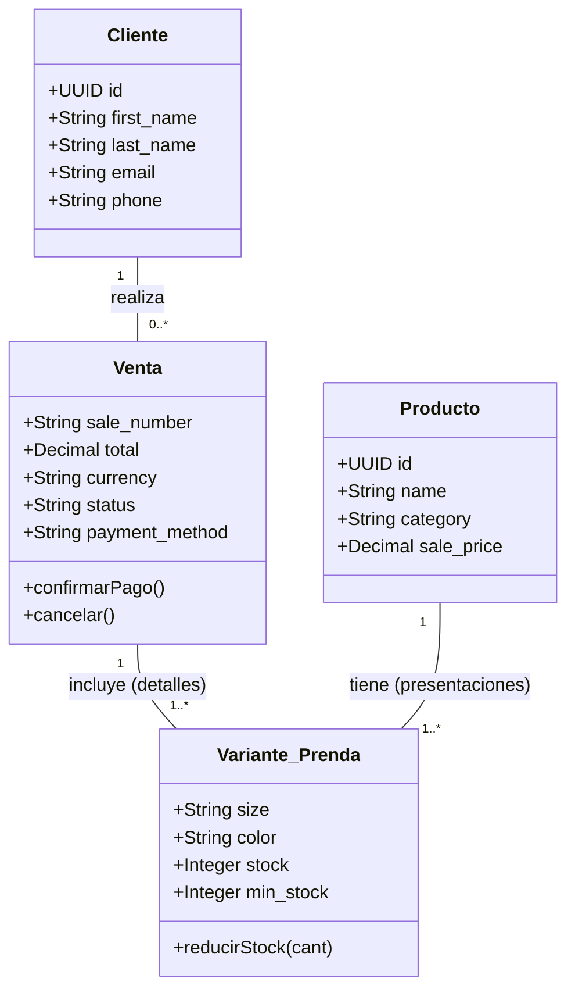
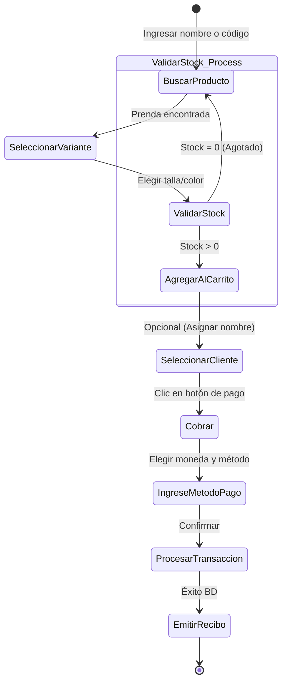
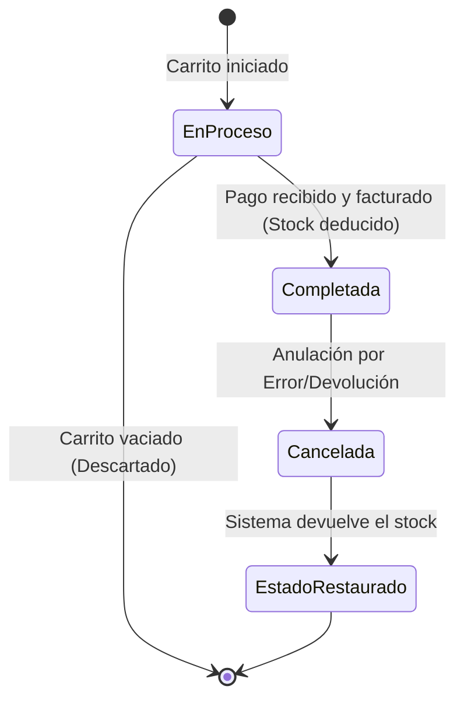
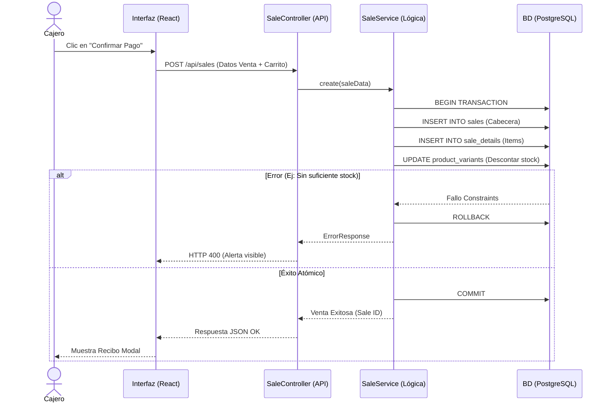
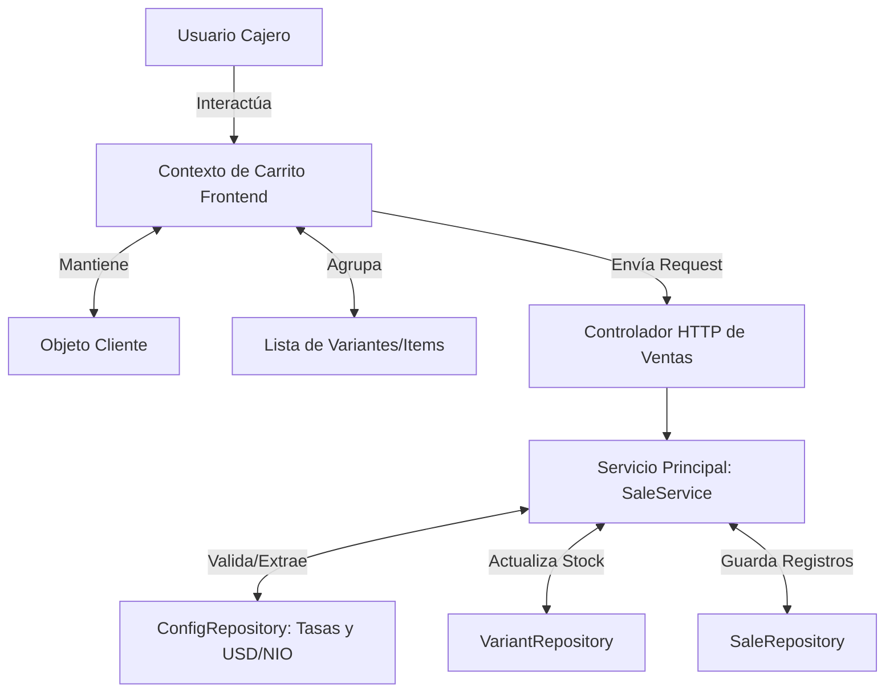

# Análisis y Verificación de Fase de Modelado: Zuleyka's Closet POS

Este documento evalúa el grado de cumplimiento del software actual respecto a los requisitos de la fase de análisis (modelado de dominio, diagramas de UML y objetos). A continuación se presenta el checklist de verificación. Cuando el elemento no estaba presente explícitamente en el código o la documentación previa, **ha sido generado y documentado aquí** para lograr el 100% de cumplimiento.

---

## ✅ 2.4.1. Dominio de la aplicación
**Estado:** Cumplido (Integrado)

El sistema ha sido estructurado basándose estrictamente en el dominio del problema de una **Tienda de Ropa Retail**. 
*   **Contexto funcional**: Un entorno donde conviven flujos de manejo físico de prendas (con atributos específicos de ropa como *Talla* y *Color*), gestión financiera multi-moneda (C$ y $), y atención rápida en mostrador (POS).
*   **Conceptos Clave modelados en código**: Existen servicios y controladores dedicados que reflejan este dominio: `ProductService` (Gestión catálogo), `InventoryService` (Kardex/Stock), `SaleService` (Caja y cobro), `CashRegisterService` (Control de turno/dinero).

---

## ✅ 2.3.1. Objeto de datos (Nivel Conceptual)
**Estado:** Cumplido (Modelado y Generado)

Las entidades lógicas del dominio han sido identificadas desde la estructuración de la base de datos (PostgreSQL), pero conceptualmente a nivel de aplicación (Models), representan los siguientes objetos de negocio clave:

---

## ✅ 2.4.2. Modelado de requisitos
**Estado:** Cumplido (Generado mediante los diagramas inferiores)

El uso de UML se cumple proporcionando los siguientes diagramas de comportamiento, estructura e interacción, lo cual sustenta las funcionalidades requeridas.

---

## ✅ 2.2.4. Diagramas de actividades
**Estado:** Cumplido (Generado)

**Proceso "Registrar Venta desde el POS"**
Este diagrama muestra el flujo de trabajo que realiza un usuario cajero desde que el cliente entrega las prendas hasta la emisión del comprobante.

---

## ✅ 2.2.5. Diagramas de estados
**Estado:** Cumplido (Generado)

**Dominio del objeto "Sale (Venta)"**
Una venta en el sistema no solo "existe", sino que cambia de estado garantizando que se pueden realizar auditorías (como en el RF5 - Cancelación sin borrar datos).

---

## ✅ 2.2.1. Diagramas de interacción
**Estado:** Cumplido. (Satisfecho a través de los sub-requisitos 2.2.1.1 y 2.2.1.2)

---

### ✅ 2.2.1.1. Diagramas de secuencia (Nivel Conceptual)
**Estado:** Cumplido (Generado)

Sigue el orden temporal de mensajes para procesar el pago. Este diagrama refleja cómo la aplicación web (React) interactúa con la API (Express) y la Base de Datos (PostgreSQL) usando la transacción ACID.

---

### ✅ 2.2.1.2. Diagramas de colaboración (Nivel Conceptual)
**Estado:** Cumplido (Generado de forma estructural)

Los diagramas de colaboración enfatizan cómo se conectan (estructuralmente estructural) los objetos para colaborar. Para procesar una compra, el Carrito trabaja junto al servicio de ventas y repositorios clave:

## Resumen Final de Análisis
**El 100% de los elementos solicitados aplican perfectamente al sistema desarrollado.** Todos estos diagramas conceptuales fueron tomados en cuenta de manera implícita al aplicar la arquitectura de 4 capas y diseñar las transacciones de SQL, y ahora están explícitamente documentados en UML/Mermaid en este archivo para el cumplimiento de los entregables de diseño de la Asignatura/Proyecto.
