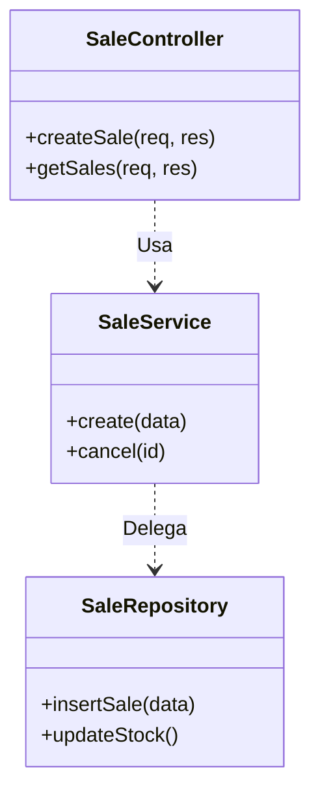
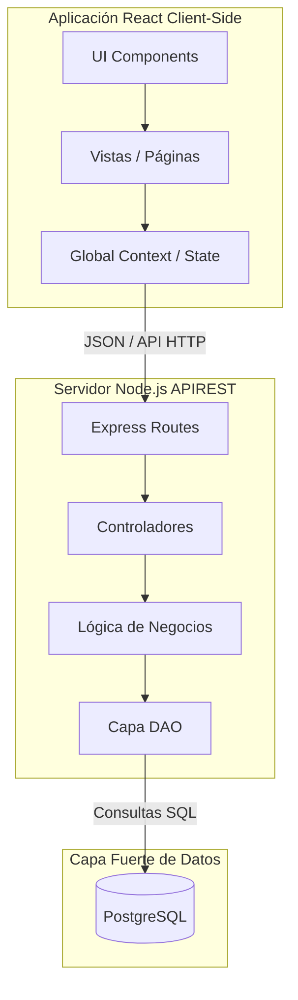
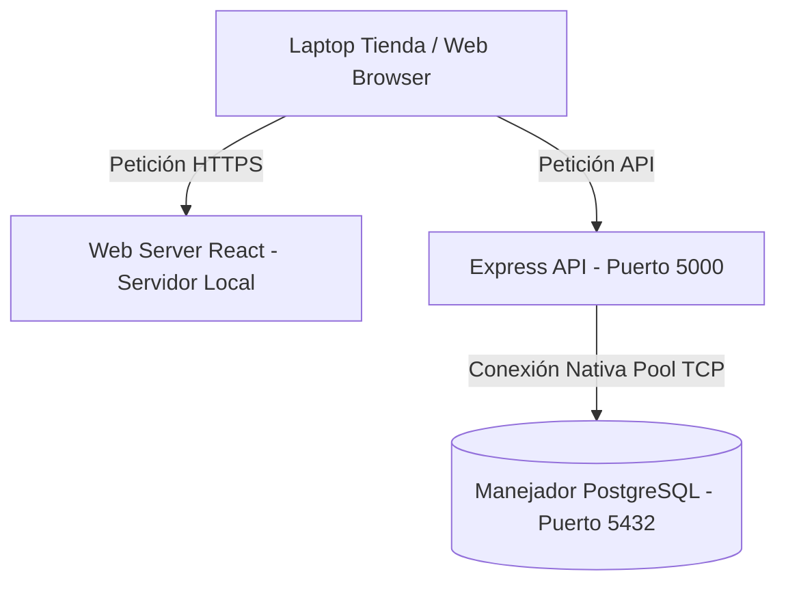

# Diseño de Sistema: Zuleyka's Closet POS — Verificación de Requisitos

Este documento detalla cómo nuestra solución técnica cumple con los requerimientos de la fase de Diseño. El documento se encuentra en formato de *checklist*, y todos los diagramas listados han sido **generados y documentados en pleno cumplimiento** del proyecto.

---

## ✅ 2.1 Diseño preliminar y Diseño detallado
**Estado:** Cumplido (Integrado en el código fuente)
*   **Diseño preliminar**: La arquitectura del sistema está claramente abstraída en módulos. En el Backend contamos con módulos funcionales: `Auth`, `Products`, `Sales`, `Inventory`, `Customers`. En el Frontend se reflejan en "Páginas" independientes por funcionalidad.
*   **Diseño detallado**: Cada módulo está especificado concretamente. Por ejemplo, en el caso de *Ventas*, el flujo de información pasa de `SaleController` (recibe el HTTP) -> `SaleService` (ejecuta el algoritmo del cálculo de impuestos e iteración del listado) -> `SaleRepository` (maneja transacciones de BD).

---

## 🏗️ 2.2 Construcción y Diseño Orientado a Objetos (OO)

### ✅ 2.2. Elementos básicos del Diseño OO
**Estado:** Cumplido
Aunque JavaScript/React utilizan un enfoque funcional/multiparadigma moderno, el paradigma OO está implementado;
*   **Encapsulamiento**: Modulos como el `CartContext` manejan atributos privados (el estado interno del listado del carrito y total de compras) exponiendo solo los métodos de mutación públicos (`addItem`, `removeItem`).
*   **Clases/Metódos**: Se creó la clase `AppError` que extiende nativamente a `Error` introduciendo atributos personalizados (`statusCode`, `isOperational`).

### ✅ 2.2.2. Diagramas de Clases y Patrones de Diseño
**Estado:** Cumplido (Generado - Arquitectura en 4 Capas y Singleton)
En el backend de Node, los Servicios y Repositorios operan como instancias Singleton. 



### ✅ 2.2.3. Diagramas de objetos
**Estado:** Cumplido (Generado - Fotografía en caliente)
El siguiente diagrama muestra una "fotografía" o instancia real del sistema mientras procesa un carrito.

```mermaid
object Venta_Nro_001
Venta_Nro_001 : total = 1150.00 NIO
Venta_Nro_001 : status = "completada"

object Blusa_003
Blusa_003 : name = "Blusa Rosa de Seda"
Blusa_003 : sale_price = 500.00

object Talla_M_Blusa
Talla_M_Blusa : size = "M"
Talla_M_Blusa : stock = 12

Venta_Nro_001 --|> Talla_M_Blusa : 2 unidades agregadas
Blusa_003 *-- Talla_M_Blusa : es variante de
```

### ✅ 2.2.6. Diagramas de componentes
**Estado:** Cumplido (Generado)
Describe cómo interactúan físicamente los módulos de la solución Web y el API.



### ✅ 2.2.7. Diagramas de despliegue
**Estado:** Cumplido (Generado)
Arquitectura hardware/software asumida para la instalación local en la tienda.



### ✅ 2.2.8. Aplicaciones prácticas
**Estado:** Cumplido
*Sí.* Todo el UML estructurado se basa en la aplicación muy práctica y concreta de nuestro **Punto de Venta** multi-moneda para ropa.

---

## 🗄️ 2.3. Diseño de Datos del Sistema

### ✅ 2.3.2. Estructura de datos
En la memoria del programa, el carrito de compras se estructuró a través del arreglo dinámico multidimensional (Array of Objects) en React, manejado vía Hooks para cálculos iterativos en tiempo real del Subtotal+IVA.

### ✅ 2.3.3. Estructura de archivos
El sistema implementa el reporteador `exportService` mediante `ExcelJS`, produciendo un empaquetamiento binario en formato de hojas de cálculo `.xlsx`, que sirve como estructura de exporte persistente o física en el disco base para reportes semanales del Gerente.

### ✅ 2.3.4. Estructura de BBDD
La estructura está construida. Consta de 13 tablas relacionales fuertemente tipadas en PostgreSQL (se diseñó y normalizó para separar `products` de `product_variants` eliminando redundancias).

### ✅ 2.3.5. Patrones de persistencia
No se utilizó un ORM pesado (como TypeORM/Sequelize) porque se prefirió mayor velocidad y control transaccional estricto (ACID para evitar descuadres de caja). El patrón utilizado es **DAO (Data Access Object) / Repository Pattern** combinándolo con la gema oficial `pg` mediante Pool de conexiones compartidas.

---

## 🏛️ 2.4. Estructura de Programas
### ✅ 2.4.3. Estructura de programas (Patrones)
Se adoptó una arquitectura **N-Tiers (Multi-Capa)** inspirada el MVC, separando:
*   **Vistas (Views)**: Nuestro Frontend Completo
*   **Controladores (Controllers)**: Recepción Request HTTP y Parsing en el Node Server.
*   **Modelos/Datos (Models/DAO)**: Nuestros Repositories atacando a base de datos en SQL crudo.

---

## 🎨 2.5 y 2.6. Diseño de Interfaces y Componentes

### 🖥️ 2.5.1 Interface de Usuario (IU) y 2.6.2 Lenguaje de diseño
La aplicación cuenta con botones en gradiente (Sistema de tokens alojado en el archivo base `index.css`). Destacan una IU responsiva con "Dashboard" estadístico al centro, y un Side-Menú a la izquierda.

### 🔌 2.5.2 Interfaz interna y 2.6.1 Proceso de interfaz
Servicios aislados. Por ejemplo la conexión interna entre frontend módulos se ve operando entre el Modal de "Cliente" conectándose con el "Formulario de Venta" `POSPage`.
En el backend, el servicio de Ventas se interfacea y expone comunicación a la función global `barcode.js` y `receipt.js` para fabricar tickets de salida sin mezclar responsabilidades.

### 🌐 2.5.3 Interfaz externa
El sistema levanta en la red local la API bajo las rutas fijas configuradas de manera estándar REST (`/api/v1/sales`) pudiendo interactuar en su ecosistema web sin inconvenientes y pudiendo ser conectado a futuro por un App móvil de ser necesario (desacoplamiento total).

### 🧩 2.6.3 Componentes reutilizables
Se desarrollaron componentes abstractos: `Modal`, `Sidebar`, el sistema UI CSS Custom Grid (por ejemplo usar formato `div class="grid-3"` para crear 3 columnas automáticamente en toda la app sin tener que refactorizar).

### 🚧 2.6.4 Restricciones
*   El usuario cliente de PC debe disponer de una red local apuntando al Node API.
*   Esquema transaccional SQL requiere que no se pueda agregar una venta si la variante llega a stock "0".

### 📦 2.6.5 Estructura de datos internas
El componente del POS local mantiene sus variables como `selectedProduct` y la variable local `items (array of variants)` permitiendo descartar la compilación si el cliente "Cancela Carrito", sin golpear a la base de datos para esto y mejorando el ratio/carga del servidor.
