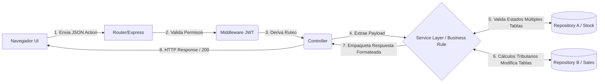
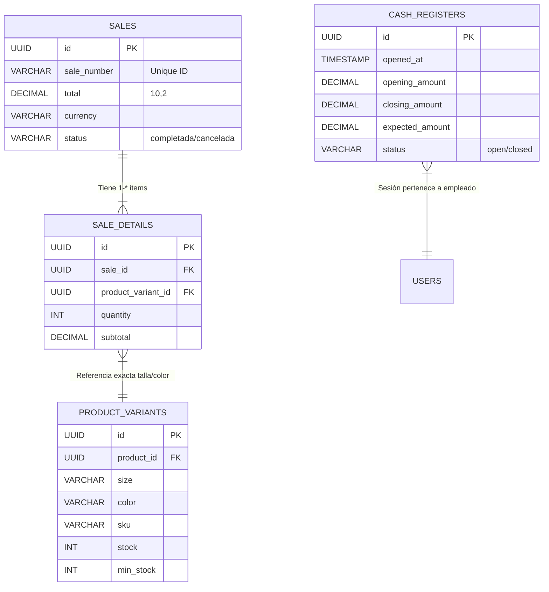

# Documentación Técnica Global y Manual de Arquitectura
**Proyecto:** Zuleyka's Closet POS
**Versión:** 1.0.0
**Fecha:** Abril 2026

---

## Índice
1. [Visión General del Sistema](#1-visión-general-del-sistema)
2. [Manual de Arquitectura](#2-manual-de-arquitectura)
3. [Estructura del Proyecto](#3-estructura-del-proyecto)
4. [Especificación de la API REST](#4-especificación-de-la-api-rest)
5. [Diagramas Técnicos](#5-diagramas-técnicos)
6. [Guías de Mantenimiento y Troubleshooting](#6-guías-de-mantenimiento-y-troubleshooting)

---

## 1. Visión General del Sistema
Zuleyka's Closet POS es un sistema integral de Punto de Venta diseñado para una tienda de ropa retail. El sistema maneja ventas presenciales en caja multi-moneda, control absoluto del inventario estructurado por variantes físicas (Talla/Color), control de roles y accesos para empleados, y reportería.

---

## 2. Manual de Arquitectura

El sistema ha sido estructurado utilizando el paradigma **Multicapa (N-Tier Architecture)** para mantener el bajo acoplamiento y asegurar la escalabilidad.

### 2.1 Stack Tecnológico
*   **Frontend**: React 18, Vite, React Router, Recharts, CSS puro estructurado con variables.
*   **Backend**: Node.js v20+, Express.js, JSON Web Tokens (JWT) para autenticación.
*   **Base de Datos**: PostgreSQL 15+ y driver crudo `pg` (Arquitectura Repository/DAO sin ORM pesado).

### 2.2 Principios de Diseño Aplicados
1.  **Repository Pattern**: Todo el código SQL está estrictamente marginado a la capa `/repositories`. Los servicios llaman a los repositorios. Si en el futuro PostgreSQL es reemplazado por MySQL, solo cambia la capa repository.
2.  **Singleton Pattern**: Los contextos de React (`AuthContext`, `CartContext`) funcionan operativamente proveyendo un estado global único para la sesión actual del sistema.
3.  **Transacciones ACID**: Los flujos monetarios (ventas, anulación, cobros, stock iterativo) bloquean la base de datos a nivel de tabla utilizando `BEGIN`, `COMMIT` y `ROLLBACK`.

### 2.3 Seguridad
*   **Contraseñas**: Hasheadas vía un salt de 10-rounds con la librería `bcrypt`. Nunca se guardan passwords en texto plano.
*   **Sesiones (Stateless)**: Autenticación gestionada vía Bearer JWT en los headers HTTP HTTP. Tiempo de vida expuesto por variables de entorno.
*   **RBAC (Control de Acceso basado en Roles)**: Rutas Middleware bloquean o liberan sub-módulos (`/admin/*`) dependiendo si el JWT Payload incluye `"admin"`, `"gerente"` o `"vendedor"`.

---

## 3. Estructura del Proyecto

### 3.1 Servidor Backend (`/backend`)
```text
/src
 ├── /config       # Inicializadores (Conexión BD bd.js, Carga de variables .env)
 ├── /controllers  # (Capa de presentacion de API). Recibe request, llama servicio, devuelve JSON.
 ├── /middleware   # Interceptores paralelos. Chequeo de JWT (authMiddleware), RBAC (roleMiddleware), Log de errores.
 ├── /repositories # (Capa de persistencia SQL). Queries parametrizadas estáticas de inserción/consulta.
 ├── /routes       # Archivos de sub-dominio (Ej: userRoutes.js). Conectan un Verbo HTTP -> Middleware -> Controlador.
 ├── /services     # (Capa de Negocio). Validan reglas de negocio. (Ej: Check_stock -> Save_invoice).
 └── /utils        # Clases de error (AppError), Helpers de recibos y códigos de barras.
```

### 3.2 Cliente Frontend (`/frontend/src`)
```text
/src
 ├── /components   # Fragments de IU abstractos (Buttons, Tables, Modals genéricos aislados).
 ├── /context      # Centralización del State Management asíncrono.
 ├── /hooks        # Reactivity lógica custom (Si las hay en el futuro).
 ├── /pages        # Renderizado de "Screens/Rutas", donde se ensamblan múltiples Components.
 ├── /services     # Axios clients parametrizados. Archivos como DataService encapsulan endpoints.
 └── /styles       # CSS System Tokens divididos granularmente por responsabilidad visual (pos.css vs index.css).
```

---

## 4. Especificación de la API REST

Base URL: `http://localhost:5000/api`

La API sigue los principios RESTful, usando HTTP HTTP verbs (`GET`, `POST`, `PUT`, `DELETE`) de manera idiomática y devolviendo códigos semánticos (`200 OK`, `201 Created`, `400 Bad Req`, `401 Unauthorized`).

### 4.1 Autenticación (Auth)
| Método | Endpoint | Requiere Auth | Descripción |
| :--- | :--- | :---: | :--- |
| `POST` | `/auth/login` | No | Retorna el objeto `Usuario` y un `token Bearer JWT`. Payload: `{username, password}` |
| `GET` | `/auth/profile` | Sí | Re-valida el token JWT actual y devuelve las credenciales refrescadas en caso de reload de pantalla. |

### 4.2 Ventas y Punto de Venta
| Método | Endpoint | Requiere Auth | Descripción |
| :--- | :--- | :---: | :--- |
| `POST` | `/sales` | Sí | Envía una transacción de compra. **Payload:** Detalles del carrito, customer_id, moneda_pago, taxes. Registra atómicamente la compra y deduce inventory. |
| `GET` | `/sales` | Sí | Lista todas las ventas con paginación/búsqueda. |
| `PUT` | `/sales/:id/cancel` | Sí (Admin) | Anula una venta. Requiere rollback logico de los items vendidos incrementando el stock nuevamente (`product_variants`). |
| `GET` | `/sales/:id/receipt` | Sí | Compila e imprime el ticket/recibo JSON crudo para la visual modal o formato ticketeadora térmica. |

### 4.3 Productos e Inventario
| Método | Endpoint | Requiere Auth | Descripción |
| :--- | :--- | :---: | :--- |
| `GET` | `/products` | Sí | Devuelve el array de catálogo incluyendo el stock sumado virtual de todas las variantes hijas de cada prenda. |
| `GET` | `/products/barcode/:bc` | Sí | Hace full-scan query en base al `sku` exacto de una variante para inyectarla instantáneamente en `CartContext`. |
| `POST` | `/inventory/entries` | Sí (Gerente) | Registra en la bitácora (`inventory_entries`) la llegada de stock de proveedor o "merma/daños" por salidas. |

---

## 5. Diagramas Técnicos

### 5.1 Diagrama de Procesamiento Arquitectónico y Datos (Data Flow)



### 5.2 Estructura ERD (Entity Relationship Database) Expandida



---

## 6. Guías de Mantenimiento y Troubleshooting

### 6.1 Backups de la Base de Datos
Se recomienda establecer una tarea de `pg_dump` semanalmente. El comando bash estándar:
```bash
pg_dump -U postgres -W -F t zuleykas_closet > zuleykas_backup_fecha.tar
```

### 6.2 Escalabilidad y Deployment (Paso a Producción)
Si la red de tiendas de sucursales comienza a escalar (más de un nodo físico en diferentes ciudades compartiendo datos):
1.  **Backend**: Debe removerse el `.env` hosteado fijo en 'localhost' y apuntar el Express a un proveedor de Database Cloud como Supabase, AWS RDS PostgreSQL o Digital Ocean Managed Databases.
2.  **Frontend**: Vite necesita compilar estáticos. Se debe correr el comando:
    ```bash
    npm run build
    ```
    Lo que devolverá una carpeta `dist/`. Esta carpeta debe ser arrastrada al hosteado de Vercel, Netlify o carpeta Nginx final. Es un SPA (Single Page Application) estático.
3.  **Cross-Origin (CORS)**: El archivo `app.js` maneja la gema `cors()`. Si el backend va a la Nube, se deben configurar estrictamente la IP Estática de acceso o el DOMINIO de la UI como el único AllowedOrigin permitido operativamente.

### 6.3 Manejo de Errores Comunes
*   `401 Unauthorized` repetitivo: Causado comúnmente porque la hora del servidor y del cliente/laptop de caja está desfasada. Modificar que el TTL (TimeToLive) del JWT Token en `.env` pase de de `1h` (restringido) a `24h` para evitar expulsiones continuas del turno en la computadora.
*   Error de "Conexión a la BD" o Crash BackEnd (`ECONNREFUSED`): Asegúrese de que el servicio de Base de datos / demonio nativo de PostgreSQL Windows Service en "Servicios Locales" se esté ejecutando tras recuperar energía si se apagó bruscamente el nodo.
*   Problemas cruzando "Dinero / Monedas": La base de datos guarda nativamente como `NUMERIC (10,2)`. El JS nativo tiene el problema de precisión en Floating Math (ej. 0.1+0.2=0.30004). Todo el backend ya posee pre-cast generalizado forzando validación de 2 decimales y parse en `saleService.js`, por favor evitar quitar las validaciones crudas `parseFloat()` impuestas de forma local.

---
*Manual Generado Exclusivamente para "Zuleyka's Closet"*
