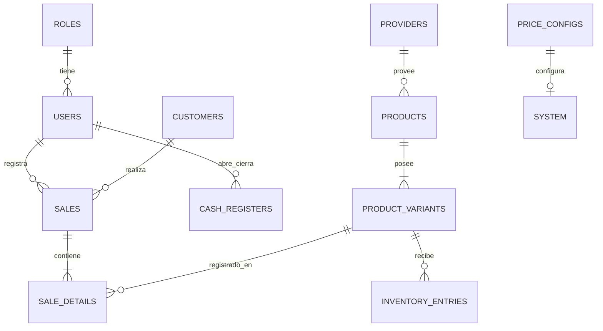

# Documentación Técnica y Diseño del Sistema: Zuleyka's Closet POS

Este documento detalla la arquitectura del sistema, el diseño relacional de la base de datos y provee ejemplos de las consultas SQL fundamentales (queries) utilizadas para la implementación de la lógica de negocio del Punto de Venta.

---

## 1. Arquitectura del Sistema

El sistema utiliza una arquitectura cliente-servidor basada en capas y sigue estrictamente los principios SOLID para garantizar escalabilidad y mantenibilidad.

### 1.1. Stack Tecnológico
*   **Frontend**: React.js + Vite.
*   **Backend**: Node.js + Express.
*   **Base de Datos**: PostgreSQL.
*   **Autenticación**: JSON Web Tokens (JWT) con encriptación bcrypt.

### 1.2. Patrón Arquitectónico del Backend (Capas)
El backend está dividido en 4 capas principales:
1.  **Controllers**: Manejan las solicitudes HTTP, extraen parámetros y devuelven respuestas.
2.  **Services**: Alojan toda la lógica de negocio (por ejemplo, validaciones de stock, cálculos de impuestos). Suelen orquestar múltiples repositorios.
3.  **Repositories**: Abstracción de la capa de datos. Contienen directamente el código SQL para interactuar con PostgreSQL.
4.  **Database / Models**: Estructuras de datos relacionales subyacentes.

---

## 2. Diseño Detallado de la Base de Datos

La base de datos está completamente normalizada y diseñada para manejar transacciones seguras (ACID) especialmente para el control de inventario y ventas.

### 2.1. Diagrama Entidad-Relación (ERD)



### 2.2. Diccionario de Datos (Tablas Principales)

#### Gestión de Productos e Inventario
*   **`products`**: Almacena información general del producto (nombre, categoría, precio_costo, precio_venta).
*   **`product_variants`**: Almacena las variaciones físicas de un producto (talla, color, stock_actual, stock_minimo, SKU, código de barras temporal). *El stock se maneja a este nivel, no a nivel de producto.*
*   **`inventory_entries`**: Registro histórico de todas las entradas (compras), salidas (mermas) o ajustes de inventario. Garantiza la trazabilidad.

#### Gestión de Ventas (Punto de Venta)
*   **`sales`**: Cabecera de la factura. Almacena totales, impuesto aplicado, moneda de la transacción, método de pago, quién registró la venta y qué cliente la hizo.
*   **`sale_details`**: Detalle o cuerpo de la factura. Relaciona una venta específica con la variante del producto vendido, cantidad, precio unitario aplicado en ese momento y subtotal.

#### Gestión de Usuarios y Caja
*   **`users` & `roles`**: Manejo de RBAC (Role-Based Access Control). Los usuarios (empleados/administradores) se validan contra sus contraseñas encriptadas.
*   **`cash_registers`**: Historial de aperturas y cierres de caja por usuario. Permite auditorías diarias cruzando las ventas realizadas contra el dinero declarado al cerrar.

#### Configuración Regional/Precios
*   **`price_configs`**: Permite cambiar dinámicamente la moneda operativa (NIO o USD), el tipo de cambio del momento y la tasa de impuestos (ej. 15% IVA).

---

## 3. Consultas (Queries) Críticas de la Implementación

A continuación, se muestran las consultas SQL puras (vía el paquete `pg` de Node) que los repositorios utilizan para las operativas más complejas del sistema.

### 3.1. Flujo de Transacción de Venta (ACID)
**Objetivo**: Registrar una venta y descontar el inventario de manera atómica (si falla una, se revierte todo).
*Uso en: `saleRepository.js`*

```sql
-- 1. Iniciar Transacción
BEGIN;

-- 2. Insertar Cabecera de Venta (Devuelve el ID generado)
INSERT INTO sales (
    sale_number, customer_id, user_id, subtotal, 
    tax_amount, discount_amount, total, 
    currency, exchange_rate, payment_method, status
) VALUES (
    'VTA-202611250001', 5, 2, 1000.00, 
    150.00, 0, 1150.00, 
    'NIO', 36.62, 'efectivo', 'completada'
) RETURNING id;

-- 3. Insertar Detalle de Venta (Bucle iterativo por cada producto del carrito)
INSERT INTO sale_details (
    sale_id, product_variant_id, quantity, 
    unit_price, discount, subtotal
) VALUES (
    [ID_VENTA], 14, 2, 
    500.00, 0, 1000.00
);

-- 4. Actualizar / Reducir Inventario
UPDATE product_variants 
SET stock = stock - 2 
WHERE id = 14 AND stock >= 2; -- (Falla si no hay stock)

-- 5. Confirmar transacción
COMMIT; 
-- (Si ocurre algún error en los pasos 2, 3 o 4 se ejecuta ROLLBACK;)
```

### 3.2. Consulta del Dashboard (Reporte General de Ventas Diarias)
**Objetivo**: Obtener el consolidado de las estadísticas diarias de la tienda de forma eficiente.
*Uso en: `reportRepository.js`*

```sql
SELECT 
    COUNT(id) as total_sales_count,
    COALESCE(SUM(total), 0) as total_revenue,
    (SELECT COUNT(*) FROM customers WHERE created_at::date = CURRENT_DATE) as new_customers,
    (SELECT COUNT(*) FROM product_variants WHERE stock <= min_stock) as low_stock_alerts
FROM sales
WHERE DATE(created_at) = CURRENT_DATE AND status = 'completada';
```

### 3.3. Cancelación de Venta (Restauración de Stock)
**Objetivo**: Cuando se anula una factura, devolver físicamente el producto a la estantería de BD.
*Uso en: `saleRepository.js`*

```sql
BEGIN;

-- 1. Marcar venta como anulada
UPDATE sales 
SET status = 'cancelada' 
WHERE id = $1 RETURNING id;

-- 2. Recuperar items para devolver
SELECT product_variant_id, quantity 
FROM sale_details 
WHERE sale_id = $1;

-- 3. Devolver al inventario (Por cada item)
UPDATE product_variants 
SET stock = stock + $quantity 
WHERE id = $product_variant_id;

COMMIT;
```

### 3.4. Obtener Catálogo Completo (Con suma de Stock y filtro)
**Objetivo**: Listado de productos combinando sus variantes para obtener el precio, stock total acumulado y saber si tiene variaciones (Tallas/Color).
*Uso en: `productRepository.js`*

```sql
SELECT 
    p.*,
    pr.company_name as provider_name,
    COALESCE(SUM(v.stock), 0) as total_stock,
    COUNT(v.id) as variant_count
FROM products p
LEFT JOIN providers pr ON p.provider_id = pr.id
LEFT JOIN product_variants v ON p.id = v.product_id
WHERE p.is_active = true 
  AND p.name ILIKE '%[PARAMETRO_BUSQUEDA]%'
GROUP BY p.id, pr.company_name
ORDER BY p.created_at DESC;
```

### 3.5. Arqueo / Cierre de Caja
**Objetivo**: Comparar cuánto efectivo espera el sistema basado en ventas desde que se abrió, versus lo declarado al cerrar.
*Uso en: `cashRegisterRepository.js`*

```sql
-- Obtener dinero esperado (Apertura + Suma de Ventas en Efectivo - Cancelaciones completadas en efectivo)
SELECT 
    c.id, 
    c.opening_amount,
    c.currency,
    (
        c.opening_amount + COALESCE((
            SELECT SUM(s.total) 
            FROM sales s 
            WHERE s.user_id = c.user_id 
              AND s.created_at >= c.opened_at 
              AND s.payment_method = 'efectivo' 
              AND s.status = 'completada'
              AND s.currency = c.currency -- Asegurar cruce por moneda correcta
        ), 0)
    ) as expected_amount
FROM cash_registers c
WHERE c.id = [ID_CAJA_ABIERTA] AND c.status = 'open';
```

---

*Documento generado para Zuleyka's Closet — 2026*
