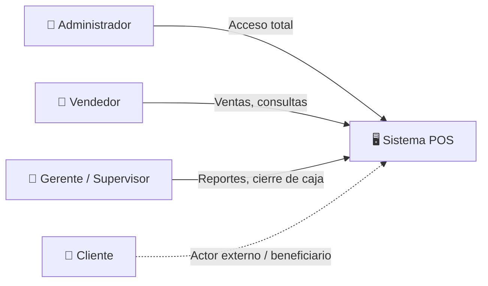
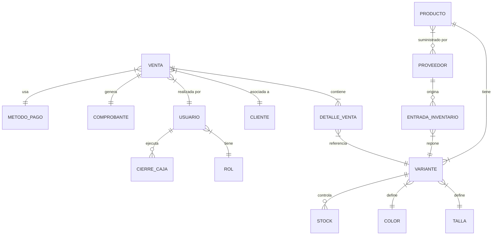

# Análisis de Requerimientos — Sistema de Ventas e Inventario

---

## 1. Descripción General del Sistema

El sistema es una **plataforma de punto de venta (POS) e inventario** orientada a un negocio de comercio minorista de ropa o productos con variantes (tallas y colores). Permite gestionar el ciclo completo de ventas —desde el registro de productos y proveedores hasta la emisión de comprobantes y cierre de caja—, controlar el inventario con alertas automatizadas, administrar clientes y su historial, generar reportes gerenciales, y manejar usuarios con control de acceso basado en roles.

---

## 2. Módulos Funcionales

Los 33 requerimientos se agrupan en **8 módulos funcionales**:

### Módulo 1 — Punto de Venta (POS)
| RF | Descripción |
|----|-------------|
| RF1 | Registrar ventas |
| RF2 | Calcular total con impuestos |
| RF3 | Métodos de pago (efectivo, tarjeta, etc.) |
| RF4 | Generar comprobante de venta |
| RF5 | Cancelar ventas |
| RF27 | Configuración de precios |
| RF28 | Descuentos (aplicación sobre productos o ventas) |
| RF29 | Registro de fecha y hora de cada transacción |
| RF30 | Cierre de caja |
| RF32 | Códigos de barras (lectura/escaneo para agilizar venta) |

> **Descripción**: Módulo central del sistema. Gestiona el flujo operativo de una venta: selección de productos (por búsqueda o escaneo de código de barras), aplicación de precios y descuentos, cálculo de totales con impuestos, selección de método de pago, emisión de comprobante y cierre de caja al final del turno.

---

### Módulo 2 — Gestión de Inventario
| RF | Descripción |
|----|-------------|
| RF6 | Actualizar inventario (automáticamente al vender) |
| RF10 | Mostrar stock actual |
| RF11 | Alertas de stock bajo |
| RF12 | Registrar entradas de inventario (compras/reposición) |
| RF20 | Inventario actual (reporte) |

> **Descripción**: Controla las existencias del negocio. El stock se actualiza automáticamente con cada venta y se incrementa al registrar entradas (reposiciones). Genera alertas cuando un producto alcanza un umbral mínimo definido.

---

### Módulo 3 — Catálogo de Productos
| RF | Descripción |
|----|-------------|
| RF7 | Registrar productos |
| RF8 | Editar productos |
| RF9 | Eliminar productos |
| RF13 | Manejo de tallas |
| RF14 | Manejo de colores |
| RF15 | Stock por variante (talla + color) |

> **Descripción**: Administra el catálogo maestro de productos. Cada producto puede tener múltiples **variantes** definidas por combinaciones de talla y color, y el stock se controla a nivel de cada variante individual.

---

### Módulo 4 — Gestión de Clientes
| RF | Descripción |
|----|-------------|
| RF16 | Registrar clientes |
| RF17 | Historial de compras por cliente |

> **Descripción**: Permite registrar datos de clientes y consultar su historial de compras para fidelización y seguimiento.

---

### Módulo 5 — Reportes y Consultas
| RF | Descripción |
|----|-------------|
| RF18 | Reportes de ventas |
| RF19 | Productos más vendidos |
| RF25 | Historial de ventas |
| RF26 | Consulta de ventas por fecha |
| RF31 | Exportar datos a Excel |

> **Descripción**: Módulo analítico y gerencial. Genera reportes de ventas (por período, por producto), identifica los productos más vendidos, permite consultar el historial completo de ventas con filtros por fecha, y ofrece exportación a formato de hoja de cálculo.

---

### Módulo 6 — Gestión de Usuarios y Seguridad
| RF | Descripción |
|----|-------------|
| RF21 | Registro de usuarios |
| RF22 | Autenticación (inicio de sesión) |
| RF23 | Roles (administrador, vendedor, etc.) |
| RF24 | Restricción de acceso por roles |

> **Descripción**: Gestiona las cuentas de usuario del sistema, su autenticación y la autorización basada en roles para controlar qué funciones puede ejecutar cada perfil.

---

### Módulo 7 — Gestión de Proveedores
| RF | Descripción |
|----|-------------|
| RF33 | Gestión de proveedores |

> **Descripción**: Registro y administración de proveedores. Se relaciona directamente con las entradas de inventario (RF12) y el catálogo de productos.

---

## 3. Actores del Sistema

| Actor | Tipo | Funciones Principales |
|-------|------|----------------------|
| **Administrador** | Primario | Gestión total: usuarios, productos, inventario, proveedores, configuración de precios, roles |
| **Vendedor** | Primario | Registrar ventas, consultar stock, registrar clientes, escanear códigos, generar comprobantes |
| **Gerente / Supervisor** | Primario | Consultar reportes, ver historial, exportar datos, cierre de caja, ver alertas de stock |
| **Cliente** | Externo | Recibe comprobantes. No interactúa directamente con el sistema |
| **Proveedor** | Externo | Es registrado en el sistema. No interactúa directamente |

> [!NOTE]
> Los roles concretos dependerán del diseño final (RF23). Los actores descritos aquí representan los **perfiles funcionales** detectados en los requerimientos.

---

## 4. Dominio del Problema — Conceptos Clave

### Glosario de Conceptos

| Concepto | Definición |
|----------|-----------|
| **Producto** | Artículo general del catálogo (ej: "Camisa Polo") |
| **Variante** | Combinación específica de un producto con talla y color (ej: "Camisa Polo — M — Azul") |
| **Stock** | Cantidad disponible de una variante en un momento dado |
| **Venta** | Transacción comercial que registra la entrega de productos a un cliente |
| **Detalle de Venta** | Cada línea dentro de una venta (variante, cantidad, precio unitario, subtotal) |
| **Comprobante** | Documento generado como prueba de la venta |
| **Método de Pago** | Forma en que el cliente liquida la venta (efectivo, tarjeta, transferencia, etc.) |
| **Descuento** | Reducción aplicada al precio de un producto o al total de una venta |
| **Entrada de Inventario** | Registro de ingreso de mercadería al almacén (reposición) |
| **Cierre de Caja** | Proceso de conciliación de efectivo y ventas al final de un turno |
| **Proveedor** | Entidad externa que suministra productos al negocio |
| **Cliente** | Persona que adquiere productos |
| **Usuario** | Persona que opera el sistema |
| **Rol** | Perfil de permisos asignado a un usuario |

---

## 5. Inconsistencias, Redundancias y Mejoras Detectadas

### 🔴 Redundancias

| Hallazgo | RFs involucrados | Recomendación |
|----------|-------------------|---------------|
| **RF20 y RF10 son equivalentes.** "Inventario actual" (RF20) y "Mostrar stock" (RF10) describen la misma funcionalidad. | RF10, RF20 | **Unificar** como un solo requerimiento: "Consultar inventario actual" (puede ser funcionalidad del módulo y también un reporte). |
| **RF18, RF25 y RF26 se solapan.** "Reportes de ventas", "Historial de ventas" y "Consulta por fecha" son aspectos del mismo requerimiento. | RF18, RF25, RF26 | **Consolidar** en un solo requerimiento: "Consultar historial de ventas con filtros (por fecha, por vendedor, por cliente, etc.)" con sub-funcionalidad de reportes agregados. |

### 🟡 Ambigüedades e Información Faltante

| Hallazgo | RF | Recomendación |
|----------|-----|---------------|
| **RF5 — Cancelar ventas**: no especifica si se permite cancelación parcial (devolver un producto de la venta) o solo total. | RF5 | Definir: ¿se permiten **devoluciones parciales**? ¿Hay un plazo máximo para cancelar? ¿Se genera nota de crédito? |
| **RF28 — Descuentos**: no se define el alcance. | RF28 | Aclarar: ¿descuento por producto, por venta total, por cliente, por promoción temporizada? ¿Quién puede autorizar descuentos? |
| **RF30 — Cierre de caja**: no detalla el proceso. | RF30 | Definir: ¿incluye arqueo (conteo de efectivo vs. sistema)? ¿Se genera un reporte de cierre? ¿Quién puede ejecutarlo? |
| **RF32 — Códigos de barras**: no especifica si es solo lectura o también generación/impresión. | RF32 | Aclarar: ¿el sistema debe **generar e imprimir** etiquetas con código de barras o solo **leer/escanear** códigos existentes? |
| **RF4 — Comprobante**: no especifica formato ni tipo fiscal. | RF4 | Definir: ¿factura fiscal, recibo simple, ticket térmico? ¿Debe cumplir normativa fiscal del país? |
| **RF33 — Proveedores**: es muy genérico. | RF33 | Desglosar en: registrar, editar, eliminar proveedores. ¿Se asocia proveedor a producto? ¿Se registran órdenes de compra? |

### 🟢 Mejoras Sugeridas

| Mejora | Justificación |
|--------|---------------|
| **Agregar RF: Devoluciones y notas de crédito** | RF5 solo dice "cancelar ventas". Un sistema real necesita gestionar devoluciones parciales y generar notas de crédito o reembolsos. |
| **Agregar RF: Órdenes de compra a proveedores** | Si se gestionan proveedores (RF33) y entradas de inventario (RF12), tiene sentido vincularlos mediante órdenes de compra formales. |
| **Agregar RF: Auditoría / bitácora de acciones** | Para un sistema multiusuario con roles, es importante registrar quién hizo qué y cuándo (trazabilidad). |
| **Agregar RF: Configuración de impuestos** | RF2 menciona impuestos pero no hay un RF para configurar tasas impositivas (IVA, etc.). |
| **Agregar RF: Categorías de productos** | Los productos deberían poder clasificarse en categorías (camisas, pantalones, accesorios) para facilitar búsquedas y reportes. |
| **Agregar RF: Notificaciones** | Complementar RF11 (alertas de stock) con un sistema general de notificaciones (stock bajo, ventas del día, metas, etc.). |
| **Agregar RF: Múltiples puntos de venta / cajas** | Si el negocio crece, ¿se contemplan múltiples cajas simultáneas? Esto impacta el diseño del cierre de caja (RF30). |

---

## 6. Matriz de Trazabilidad — Módulos vs. Actores

| Módulo | Administrador | Vendedor | Gerente/Supervisor |
|--------|:---:|:---:|:---:|
| Punto de Venta | ✅ | ✅ | ⚠️ (solo consulta) |
| Gestión de Inventario | ✅ | 👁️ (solo consulta stock) | ✅ |
| Catálogo de Productos | ✅ | 👁️ (solo consulta) | 👁️ (solo consulta) |
| Gestión de Clientes | ✅ | ✅ | 👁️ (solo consulta) |
| Reportes y Consultas | ✅ | ⚠️ (limitado) | ✅ |
| Usuarios y Seguridad | ✅ | ❌ | ❌ |
| Gestión de Proveedores | ✅ | ❌ | ✅ |

> [!TIP]
> Esta matriz es una **propuesta inicial** basada en el análisis de los requerimientos. Los permisos exactos deben validarse con el cliente/stakeholder.

---

## 7. Resumen Ejecutivo

| Aspecto | Detalle |
|---------|---------|
| **Total de RFs originales** | 33 |
| **Módulos identificados** | 7 |
| **Actores primarios** | 3 (Administrador, Vendedor, Gerente) |
| **Actores externos** | 2 (Cliente, Proveedor) |
| **Redundancias detectadas** | 2 (RF10/RF20 y RF18/RF25/RF26) |
| **Ambigüedades por resolver** | 6 |
| **Mejoras sugeridas** | 7 nuevos requerimientos |
| **RFs después de consolidación** | ~30 originales + 7 nuevos = **~37 RFs consolidados** |
