# Modelado UML Conceptual — Sistema de Ventas e Inventario

---

## 1. Diagramas de Actividades

Los diagramas de actividades modelan el **flujo de trabajo** de los procesos clave del negocio, mostrando las acciones, decisiones y bifurcaciones que ocurren durante cada operación.

---

### 1.1 Proceso de Registro de Venta

> Proceso central del sistema. Describe el flujo completo desde que el vendedor inicia una venta hasta la generación del comprobante.

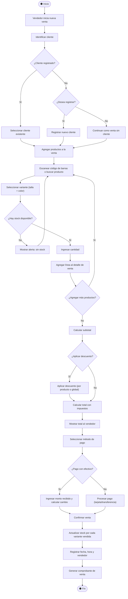

**Actores involucrados**: Vendedor (primario), Cliente (externo)
**RFs cubiertos**: RF1, RF2, RF3, RF4, RF6, RF13, RF14, RF15, RF16, RF27, RF28, RF29, RF32

---

### 1.2 Proceso de Entrada de Inventario (Reposición)

> Describe el flujo cuando se recibe mercadería de un proveedor y se actualiza el stock del sistema.

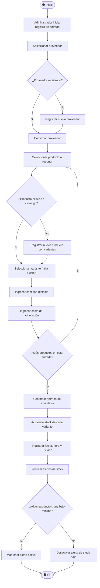

**Actores involucrados**: Administrador (primario), Proveedor (externo)
**RFs cubiertos**: RF6, RF7, RF10, RF11, RF12, RF13, RF14, RF15, RF33

---

### 1.3 Proceso de Cierre de Caja

> Describe el flujo de conciliación al final de un turno de trabajo.

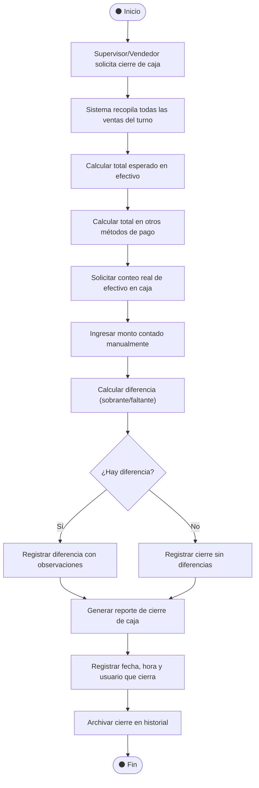

**Actores involucrados**: Vendedor o Supervisor (primario)
**RFs cubiertos**: RF3, RF25, RF26, RF29, RF30

---

### 1.4 Proceso de Cancelación de Venta

> Describe el flujo de cancelación/devolución, incluyendo la reposición de inventario.

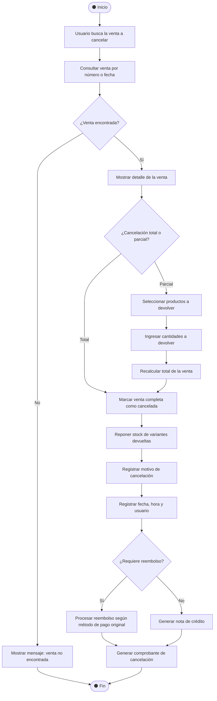

**Actores involucrados**: Vendedor o Administrador (primario)
**RFs cubiertos**: RF5, RF6, RF4, RF25, RF29

---

## 2. Diagramas de Estado

Los diagramas de estado modelan el **ciclo de vida** de las entidades más importantes, mostrando los estados posibles y las transiciones entre ellos.

---

### 2.1 Estados de una Venta

> Una venta pasa por múltiples estados desde su creación hasta su cierre definitivo.

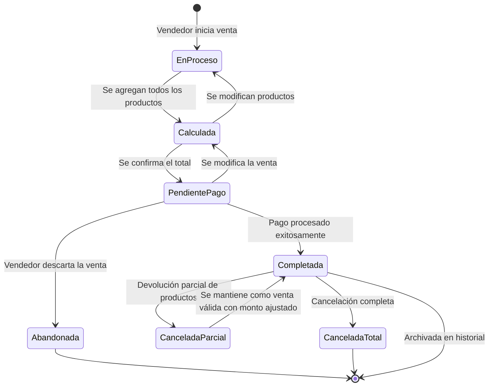

| Estado | Descripción |
|--------|-------------|
| **En Proceso** | La venta se está construyendo, se agregan/quitan productos |
| **Calculada** | El total con impuestos y descuentos ha sido calculado |
| **Pendiente de Pago** | El total está firme, se espera que el cliente pague |
| **Completada** | El pago fue recibido, el stock actualizado y el comprobante generado |
| **Cancelada Parcial** | Se devolvieron algunos productos, el monto fue ajustado |
| **Cancelada Total** | Toda la venta fue revertida |
| **Abandonada** | La venta fue descartada antes de completar el pago |

---

### 2.2 Estados de un Producto (Variante)

> Modela el ciclo de vida de una variante de producto en el catálogo e inventario.

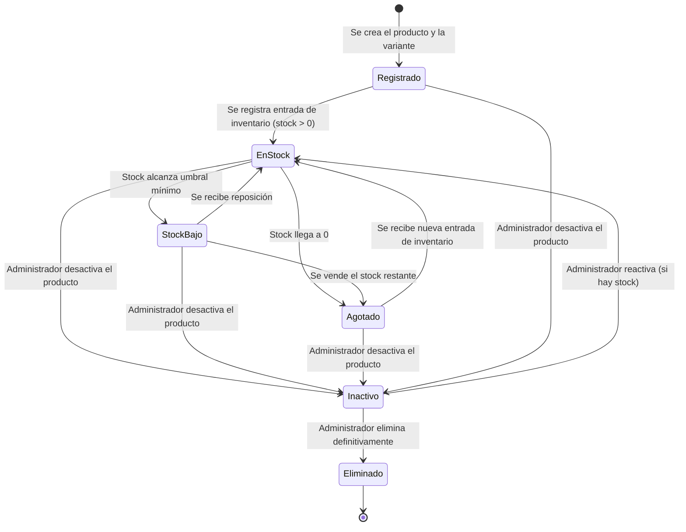

| Estado | Descripción |
|--------|-------------|
| **Registrado** | La variante fue creada pero aún no tiene stock |
| **En Stock** | Stock disponible por encima del umbral mínimo |
| **Stock Bajo** | Stock por debajo del umbral, se genera alerta (RF11) |
| **Agotado** | Stock en cero, no se puede vender |
| **Inactivo** | Desactivado por el administrador (no aparece en ventas) |
| **Eliminado** | Eliminado definitivamente del catálogo |

---

### 2.3 Estados de un Cierre de Caja

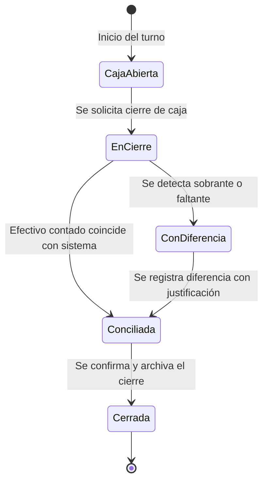

---

## 3. Diagramas de Interacción (Comunicación)

Los diagramas de interacción muestran **cómo colaboran los objetos** del sistema para cumplir un caso de uso, enfocándose en los mensajes intercambiados.

---

### 3.1 Interacción: Registrar una Venta

> Muestra la colaboración entre los objetos principales durante el registro de una venta.

```
┌──────────┐      ┌──────────┐      ┌──────────┐      ┌───────────┐      ┌──────────┐      ┌──────────┐
│ Vendedor │      │  Venta   │      │ Detalle  │      │ Variante  │      │  Stock   │      │Comprobante│
└────┬─────┘      └────┬─────┘      └────┬─────┘      └─────┬─────┘      └────┬─────┘      └─────┬────┘
     │                 │                 │                   │                 │                   │
     │ 1: crearVenta() │                 │                   │                 │                   │
     │────────────────>│                 │                   │                 │                   │
     │                 │                 │                   │                 │                   │
     │ 2: agregarProducto(variante, qty) │                   │                 │                   │
     │────────────────────────────────-->│                   │                 │                   │
     │                 │                 │ 3: verificarStock()│                 │                   │
     │                 │                 │──────────────────>│                 │                   │
     │                 │                 │                   │ 4: consultarQty()│                   │
     │                 │                 │                   │────────────────>│                   │
     │                 │                 │                   │  5: qty OK      │                   │
     │                 │                 │                   │<────────────────│                   │
     │                 │                 │  6: stock válido  │                 │                   │
     │                 │                 │<──────────────────│                 │                   │
     │                 │                 │                   │                 │                   │
     │ 7: calcularTotal()                │                   │                 │                   │
     │────────────────>│                 │                   │                 │                   │
     │                 │ 8: sumarLineas()│                   │                 │                   │
     │                 │───────────────>│                   │                 │                   │
     │                 │ 9: aplicarImpuesto()                │                 │                   │
     │                 │─────────┐       │                   │                 │                   │
     │                 │<────────┘       │                   │                 │                   │
     │                 │                 │                   │                 │                   │
     │ 10: confirmarPago(método, monto)  │                   │                 │                   │
     │────────────────>│                 │                   │                 │                   │
     │                 │                 │                   │ 11: reducirStock()                   │
     │                 │                 │                   │────────────────>│                   │
     │                 │                 │                   │                 │                   │
     │                 │ 12: generarComprobante()             │                 │                   │
     │                 │──────────────────────────────────────────────────────────────────────────>│
     │                 │                 │                   │                 │  13: comprobante   │
     │<──────────────────────────────────────────────────────────────────────────────────────────── │
     │                 │                 │                   │                 │                   │
```

**Mensajes clave**:
1. El Vendedor crea una nueva venta
2-6. Se agregan productos verificando disponibilidad de stock
7-9. Se calcula el total con impuestos
10. Se confirma el pago
11. Se reduce el stock de cada variante
12-13. Se genera y entrega el comprobante

---

### 3.2 Interacción: Alerta de Stock Bajo

```
┌──────────┐      ┌──────────┐      ┌───────────┐      ┌──────────────┐
│  Venta   │      │  Stock   │      │ Variante  │      │ Notificación │
└────┬─────┘      └────┬─────┘      └─────┬─────┘      └──────┬───────┘
     │                 │                   │                    │
     │ 1: reducirStock()                   │                    │
     │────────────────>│                   │                    │
     │                 │ 2: obtenerUmbral()│                    │
     │                 │──────────────────>│                    │
     │                 │  3: umbral=5      │                    │
     │                 │<──────────────────│                    │
     │                 │                   │                    │
     │                 │── 4: ¿stock < umbral? ──┐             │
     │                 │                         │ Sí           │
     │                 │   5: generarAlerta()     │             │
     │                 │───────────────────────────────────────>│
     │                 │                         │              │
     │                 │                   6: Notificar a       │
     │                 │                   Administrador/Gerente│
     │                 │                         │              │
```

---

## 4. Diagramas de Secuencia

Los diagramas de secuencia muestran la **interacción temporal** entre actores y objetos, enfocándose en el **orden cronológico** de los mensajes.

---

### 4.1 Secuencia: Proceso Completo de Venta

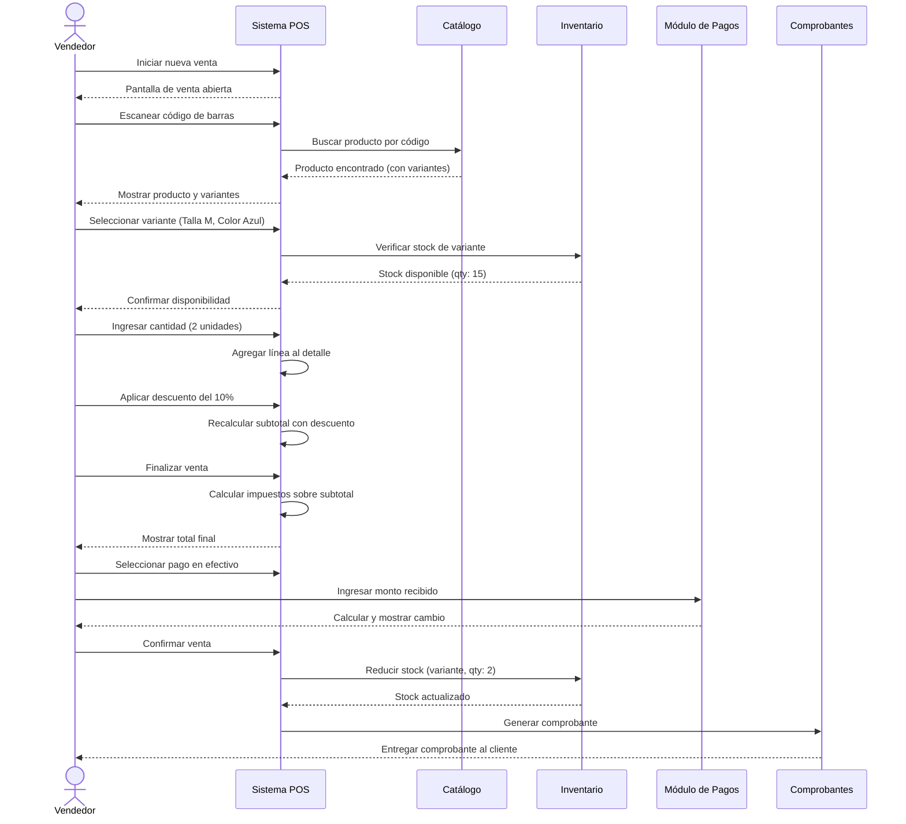

---

### 4.2 Secuencia: Cancelación de Venta

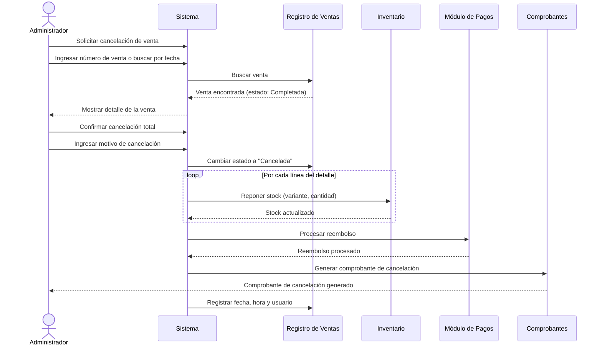

---

### 4.3 Secuencia: Autenticación y Control de Acceso

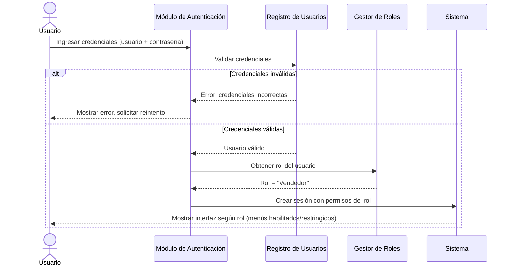

---

## 5. Diagramas de Colaboración

Los diagramas de colaboración muestran las **relaciones estructurales** entre objetos y los mensajes numerados que intercambian. A diferencia de la secuencia, el enfoque está en **quién se comunica con quién**.

---

### 5.1 Colaboración: Registrar Venta

```
                        1: iniciarVenta()
            ┌─────────────────────────────────┐
            │                                 ▼
       ┌─────────┐                      ┌──────────┐
       │Vendedor │                      │  :Venta  │
       └─────────┘                      └──────────┘
            │                             │       │
            │                             │       │
            │ 2: buscarProducto()         │       │ 5: calcularTotal()
            │                             │       │
            ▼                             │       ▼
       ┌──────────┐                       │  ┌──────────────┐
       │:Catálogo │                       │  │:Impuesto     │
       └──────────┘                       │  └──────────────┘
            │                             │
            │ 3: obtenerVariante()        │ 6: confirmarPago()
            │                             │
            ▼                             ▼
       ┌───────────┐               ┌──────────────┐
       │:Variante  │◄──────────────│ :DetallVenta │
       └───────────┘  4: agregarLinea()  └──────────────┘
            │
            │ 7: actualizarStock()
            ▼
       ┌──────────┐        8: generarComprobante()     ┌─────────────┐
       │  :Stock  │        ┌──────────────────────────>│:Comprobante │
       └──────────┘        │                           └─────────────┘
                      ┌──────────┐
                      │  :Venta  │
                      └──────────┘
```

**Flujo de mensajes**:
1. Vendedor → Venta: iniciar nueva venta
2. Vendedor → Catálogo: buscar producto (por código de barras o nombre)
3. Catálogo → Variante: obtener variante específica (talla + color)
4. Detalle de Venta → Variante: crear línea con referencia a variante
5. Venta → Impuesto: calcular total con impuestos
6. Venta: confirmar pago con método seleccionado
7. Variante → Stock: reducir cantidad disponible
8. Venta → Comprobante: generar documento de la transacción

---

### 5.2 Colaboración: Entrada de Inventario

```
                     1: iniciarEntrada()
           ┌──────────────────────────────────┐
           │                                  ▼
      ┌────────────┐                  ┌────────────────┐
      │Administrador│                 │:EntradaInvent. │
      └────────────┘                  └────────────────┘
           │                                  │
           │ 2: seleccionarProveedor()        │ 5: confirmarEntrada()
           ▼                                  │
      ┌────────────┐                          ▼
      │:Proveedor  │                  ┌──────────────┐
      └────────────┘                  │:DetalleEntrada│
                                      └──────────────┘
           3: seleccionarProducto()          │
           ┌──────────────────┐              │ 6: actualizarStock()
           ▼                  │              ▼
      ┌──────────┐     ┌───────────┐   ┌──────────┐
      │:Producto │────>│:Variante  │──>│  :Stock  │
      └──────────┘     └───────────┘   └──────────┘
                  4: ingresarCantidad()       │
                                              │ 7: verificarUmbral()
                                              ▼
                                      ┌──────────────┐
                                      │:Notificación │
                                      └──────────────┘
```

---

## 6. Modelo del Dominio

El modelo del dominio representa los **conceptos fundamentales del negocio** y sus relaciones, sin entrar en detalles de implementación. Es el mapa conceptual del problema que el sistema debe resolver.

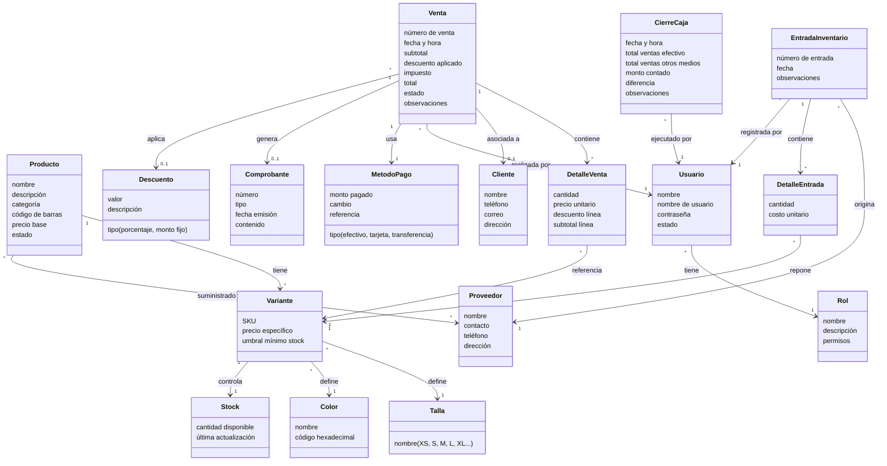

### Explicación del Modelo del Dominio

| Relación | Descripción |
|----------|-------------|
| **Producto → Variante** | Un producto tiene múltiples variantes (combinaciones de talla y color) |
| **Variante → Stock** | Cada variante controla su propio nivel de inventario |
| **Venta → DetalleVenta → Variante** | Cada venta tiene líneas de detalle, cada una referenciando una variante específica |
| **Venta → Cliente** | Una venta puede o no estar asociada a un cliente registrado |
| **Venta → Usuario** | Toda venta registra quién la realizó (trazabilidad) |
| **EntradaInventario → Proveedor** | Cada entrada de mercadería está vinculada a un proveedor |
| **EntradaInventario → DetalleEntrada → Variante** | Las entradas detallan qué variantes y cantidades se recibieron |
| **Usuario → Rol** | Cada usuario tiene un rol que define sus permisos en el sistema |
| **CierreCaja → Usuario** | Cada cierre registra quién lo ejecutó |

---

## 7. Objetos de Datos (Entidades con Atributos)

Descripción detallada de cada entidad del dominio con sus atributos, tipo conceptual y observaciones.

---

### 7.1 Producto

| Atributo | Tipo Conceptual | Obligatorio | Descripción |
|----------|----------------|:-----------:|-------------|
| ID Producto | Identificador único | ✅ | Clave interna del sistema |
| Nombre | Texto | ✅ | Nombre del producto ("Camisa Polo") |
| Descripción | Texto largo | ❌ | Descripción detallada |
| Categoría | Texto/Catálogo | ✅ | Clasificación (camisas, pantalones, etc.) |
| Código de barras | Texto | ❌ | Código para escaneo (RF32) |
| Precio base | Moneda | ✅ | Precio de referencia antes de variantes |
| Estado | Enumerado | ✅ | Activo / Inactivo / Eliminado |
| Fecha de registro | Fecha y hora | ✅ | Cuándo fue creado |

---

### 7.2 Variante

| Atributo | Tipo Conceptual | Obligatorio | Descripción |
|----------|----------------|:-----------:|-------------|
| ID Variante | Identificador único | ✅ | Clave interna |
| ID Producto | Referencia | ✅ | Producto al que pertenece |
| Talla | Referencia | ✅ | Talla asignada (S, M, L, XL...) |
| Color | Referencia | ✅ | Color asignado |
| SKU | Texto único | ✅ | Código único de la variante |
| Precio específico | Moneda | ❌ | Si difiere del precio base del producto |
| Umbral mínimo | Número entero | ✅ | Cantidad mínima antes de generar alerta |
| Estado | Enumerado | ✅ | Registrado / En Stock / Stock Bajo / Agotado / Inactivo |

---

### 7.3 Stock

| Atributo | Tipo Conceptual | Obligatorio | Descripción |
|----------|----------------|:-----------:|-------------|
| ID Stock | Identificador único | ✅ | Clave interna |
| ID Variante | Referencia | ✅ | Variante a la que pertenece |
| Cantidad disponible | Número entero | ✅ | Unidades disponibles para venta |
| Última actualización | Fecha y hora | ✅ | Última modificación del stock |

---

### 7.4 Venta

| Atributo | Tipo Conceptual | Obligatorio | Descripción |
|----------|----------------|:-----------:|-------------|
| ID Venta | Identificador único | ✅ | Clave interna |
| Número de venta | Texto secuencial | ✅ | Número visible (VTA-00001) |
| Fecha y hora | Fecha y hora | ✅ | Momento de la transacción (RF29) |
| ID Cliente | Referencia | ❌ | Cliente asociado (puede ser nulo) |
| ID Usuario | Referencia | ✅ | Vendedor que registró la venta |
| Subtotal | Moneda | ✅ | Suma antes de impuestos |
| Descuento global | Moneda | ❌ | Descuento aplicado a toda la venta |
| Impuesto | Moneda | ✅ | Monto de impuesto calculado |
| Total | Moneda | ✅ | Monto final a cobrar |
| Estado | Enumerado | ✅ | En Proceso / Completada / Cancelada / Cancelada Parcial |
| Motivo cancelación | Texto | ❌ | Si la venta fue cancelada |

---

### 7.5 Detalle de Venta

| Atributo | Tipo Conceptual | Obligatorio | Descripción |
|----------|----------------|:-----------:|-------------|
| ID Detalle | Identificador único | ✅ | Clave interna |
| ID Venta | Referencia | ✅ | Venta a la que pertenece |
| ID Variante | Referencia | ✅ | Variante vendida |
| Cantidad | Número entero | ✅ | Unidades vendidas |
| Precio unitario | Moneda | ✅ | Precio al momento de la venta |
| Descuento línea | Moneda | ❌ | Descuento aplicado a esta línea |
| Subtotal línea | Moneda | ✅ | (Precio × Cantidad) − Descuento |

---

### 7.6 Cliente

| Atributo | Tipo Conceptual | Obligatorio | Descripción |
|----------|----------------|:-----------:|-------------|
| ID Cliente | Identificador único | ✅ | Clave interna |
| Nombre completo | Texto | ✅ | Nombre del cliente |
| Teléfono | Texto | ❌ | Número de contacto |
| Correo electrónico | Texto | ❌ | Email del cliente |
| Dirección | Texto | ❌ | Dirección física |
| Fecha de registro | Fecha y hora | ✅ | Cuándo fue registrado |

---

### 7.7 Usuario

| Atributo | Tipo Conceptual | Obligatorio | Descripción |
|----------|----------------|:-----------:|-------------|
| ID Usuario | Identificador único | ✅ | Clave interna |
| Nombre completo | Texto | ✅ | Nombre real del usuario |
| Nombre de usuario | Texto único | ✅ | Login del sistema |
| Contraseña | Texto cifrado | ✅ | Credencial de acceso |
| ID Rol | Referencia | ✅ | Rol asignado |
| Estado | Enumerado | ✅ | Activo / Inactivo |
| Fecha de registro | Fecha y hora | ✅ | Cuándo fue creado |

---

### 7.8 Rol

| Atributo | Tipo Conceptual | Obligatorio | Descripción |
|----------|----------------|:-----------:|-------------|
| ID Rol | Identificador único | ✅ | Clave interna |
| Nombre | Texto | ✅ | Administrador, Vendedor, Gerente |
| Descripción | Texto | ❌ | Descripción del rol |
| Permisos | Lista | ✅ | Funciones habilitadas para este rol |

---

### 7.9 Proveedor

| Atributo | Tipo Conceptual | Obligatorio | Descripción |
|----------|----------------|:-----------:|-------------|
| ID Proveedor | Identificador único | ✅ | Clave interna |
| Nombre / Razón social | Texto | ✅ | Nombre del proveedor |
| Contacto | Texto | ❌ | Persona de contacto |
| Teléfono | Texto | ❌ | Número de contacto |
| Correo | Texto | ❌ | Email |
| Dirección | Texto | ❌ | Ubicación del proveedor |

---

### 7.10 Entrada de Inventario

| Atributo | Tipo Conceptual | Obligatorio | Descripción |
|----------|----------------|:-----------:|-------------|
| ID Entrada | Identificador único | ✅ | Clave interna |
| Número de entrada | Texto secuencial | ✅ | Número visible (ENT-00001) |
| ID Proveedor | Referencia | ✅ | Proveedor que suministra |
| ID Usuario | Referencia | ✅ | Quien registra la entrada |
| Fecha | Fecha y hora | ✅ | Momento del registro |
| Observaciones | Texto | ❌ | Notas adicionales |

---

### 7.11 Cierre de Caja

| Atributo | Tipo Conceptual | Obligatorio | Descripción |
|----------|----------------|:-----------:|-------------|
| ID Cierre | Identificador único | ✅ | Clave interna |
| ID Usuario | Referencia | ✅ | Quien ejecuta el cierre |
| Fecha y hora | Fecha y hora | ✅ | Momento del cierre |
| Total ventas efectivo | Moneda | ✅ | Suma de ventas en efectivo del turno |
| Total ventas otros | Moneda | ✅ | Suma de ventas por otros medios |
| Total cancelaciones | Moneda | ✅ | Monto de ventas canceladas |
| Monto contado | Moneda | ✅ | Efectivo contado manualmente |
| Diferencia | Moneda | ✅ | Contado − Esperado (sobrante/faltante) |
| Observaciones | Texto | ❌ | Justificación si hay diferencia |

---

## Resumen del Modelado

| Elemento | Cantidad |
|----------|:--------:|
| Diagramas de Actividades | 4 |
| Diagramas de Estado | 3 |
| Diagramas de Interacción | 2 |
| Diagramas de Secuencia | 3 |
| Diagramas de Colaboración | 2 |
| Entidades del Dominio | 11 |
| Total de Atributos definidos | 85+ |
| Relaciones del modelo | 13 |

> [!NOTE]
> Todo el modelado se mantiene a **nivel conceptual**, sin referencias a tecnologías, frameworks o lenguajes de programación específicos. Estos artefactos sirven como base para las fases posteriores de diseño lógico y diseño físico.
