# Diseño de Base de Datos — Sistema de Ventas e Inventario

**Motor**: PostgreSQL 16
**Esquema**: `pos_system`
**Codificación**: UTF-8
**Zona horaria**: America/Managua

---

## 1. Modelo Conceptual de Datos

### 1.1 Entidades Principales del Dominio

El sistema modela un negocio de **comercio minorista de ropa** donde los productos tienen variantes por talla y color. El ciclo de negocio fluye así:

```
Proveedor → suministra → Producto → tiene → Variantes (talla+color) → controlan → Stock
                                                    ↓
Cliente ← compra ← Venta → contiene → Detalle de Venta → referencia → Variante
                     ↓                                                      ↓
               genera → Comprobante                                 actualiza → Stock
                     ↓
               usa → Método de Pago
                     ↓
               registrada por → Usuario → tiene → Rol
```

### 1.2 Entidades y su Significado

| # | Entidad | Descripción en el Dominio | Regla de Negocio |
|---|---------|--------------------------|------------------|
| 1 | **Producto** | Artículo general del catálogo (ej: "Camisa Polo") | Un producto puede tener múltiples variantes. Tiene un precio base de referencia. Se elimina lógicamente (nunca se pierde). |
| 2 | **Categoría** | Clasificación de productos (ej: "Camisas", "Pantalones") | Normalizada como tabla propia para evitar inconsistencias de texto libre. Un producto pertenece a exactamente una categoría. |
| 3 | **Talla** | Atributo dimensional (ej: XS, S, M, L, XL) | Catálogo fijo con orden de presentación. Compartido entre todos los productos. |
| 4 | **Color** | Atributo visual (ej: "Azul", "#2563EB") | Catálogo fijo con código hexadecimal para representación visual en la UI. |
| 5 | **Variante** | Combinación única de Producto + Talla + Color | Es la unidad real de venta e inventario. Tiene su propio SKU, puede tener precio diferente al base, y define el umbral mínimo de stock. |
| 6 | **Venta** | Transacción comercial con un cliente | Registra quién vendió, a quién, cuándo, y por cuánto. Pasa por estados (en proceso → completada → cancelada). Nunca se elimina. |
| 7 | **Cliente** | Comprador registrado | Opcional en una venta (se permite venta sin cliente). Acumula historial de compras. |
| 8 | **Usuario** | Operador del sistema | Tiene credenciales de acceso y un rol asignado. Toda acción en el sistema queda vinculada a un usuario. |
| 9 | **Rol** | Perfil de permisos | Define qué puede hacer cada tipo de usuario. Los permisos se almacenan como JSON para flexibilidad. |
| 10 | **Proveedor** | Suministrador de mercadería | Se vincula a productos y a entradas de inventario. |
| 11 | **Entrada de Inventario** | Recepción de mercadería | Documenta cada reposición: qué variantes, cuántas unidades, a qué costo, de qué proveedor. |
| 12 | **Cierre de Caja** | Conciliación de turno | Registra el efectivo esperado vs. contado, detecta diferencias, y cierra el período contable del turno. |

### 1.3 Relaciones entre Entidades

| Relación | Cardinalidad | Descripción |
|----------|:------------:|-------------|
| Categoría → Producto | 1:N | Una categoría agrupa muchos productos |
| Producto → Variante | 1:N | Un producto tiene múltiples variantes (combinaciones talla+color) |
| Talla → Variante | 1:N | Una talla se usa en muchas variantes |
| Color → Variante | 1:N | Un color se usa en muchas variantes |
| Variante → Stock | 1:1 | Cada variante tiene exactamente un registro de stock |
| Venta → Detalle de Venta | 1:N | Una venta tiene múltiples líneas de detalle |
| Detalle de Venta → Variante | N:1 | Cada línea referencia una variante específica |
| Venta → Pago | 1:1 | Cada venta tiene un registro de pago |
| Venta → Comprobante | 1:0..1 | Una venta puede generar un comprobante (o no, si fue abandonada) |
| Venta → Cliente | N:0..1 | Muchas ventas pueden ser del mismo cliente; una venta puede no tener cliente |
| Venta → Usuario | N:1 | Muchas ventas las registra un mismo vendedor |
| Usuario → Rol | N:1 | Muchos usuarios comparten el mismo rol |
| Producto ↔ Proveedor | N:M | Un producto puede ser suministrado por varios proveedores y viceversa |
| Entrada Inventario → Proveedor | N:1 | Cada entrada viene de un proveedor |
| Entrada Inventario → Detalle Entrada | 1:N | Una entrada tiene múltiples líneas |
| Detalle Entrada → Variante | N:1 | Cada línea repone una variante |
| Cierre de Caja → Usuario | N:1 | Un usuario ejecuta muchos cierres a lo largo del tiempo |
| Venta → Descuento | N:0..1 | Una venta puede tener un descuento aplicado |
| Auditoría → Usuario | N:1 | Cada registro de auditoría pertenece a un usuario |

---

## 2. Modelo Lógico (Relacional)

### 2.1 Tabla: `categories`

> **RF asociados**: RF7 (clasificar productos), RF-S5 (mejora: categorías normalizadas)

| Campo | Tipo | PK | FK | NOT NULL | UNIQUE | Default | Descripción |
|-------|------|:--:|:--:|:--------:|:------:|---------|-------------|
| id | SERIAL | ✅ | | ✅ | ✅ | auto | Identificador |
| name | VARCHAR(100) | | | ✅ | ✅ | | Nombre de la categoría |
| description | TEXT | | | | | NULL | Descripción opcional |
| is_active | BOOLEAN | | | ✅ | | TRUE | Activa o inactiva |
| created_at | TIMESTAMPTZ | | | ✅ | | NOW() | Fecha de creación |

---

### 2.2 Tabla: `products`

> **RF asociados**: RF7, RF8, RF9, RF27, RF32

| Campo | Tipo | PK | FK | NOT NULL | UNIQUE | Default | Descripción |
|-------|------|:--:|:--:|:--------:|:------:|---------|-------------|
| id | SERIAL | ✅ | | ✅ | ✅ | auto | Identificador |
| name | VARCHAR(200) | | | ✅ | | | Nombre del producto |
| description | TEXT | | | | | NULL | Descripción detallada |
| category_id | INT | | ✅→categories | ✅ | | | Categoría del producto |
| barcode | VARCHAR(50) | | | | ✅ | NULL | Código de barras (EAN/UPC) |
| base_price | DECIMAL(10,2) | | | ✅ | | | Precio base de referencia |
| status | VARCHAR(20) | | | ✅ | | 'ACTIVE' | ACTIVE, INACTIVE |
| created_at | TIMESTAMPTZ | | | ✅ | | NOW() | Fecha de creación |
| updated_at | TIMESTAMPTZ | | | ✅ | | NOW() | Última modificación |

**Decisión**: `status` es VARCHAR en lugar de ENUM de PostgreSQL para facilitar migraciones. Se controla con CHECK constraint.

---

### 2.3 Tabla: `sizes`

> **RF asociados**: RF13

| Campo | Tipo | PK | FK | NOT NULL | UNIQUE | Default | Descripción |
|-------|------|:--:|:--:|:--------:|:------:|---------|-------------|
| id | SERIAL | ✅ | | ✅ | ✅ | auto | Identificador |
| name | VARCHAR(20) | | | ✅ | ✅ | | Nombre (XS, S, M, L, XL, XXL) |
| sort_order | INT | | | ✅ | | 0 | Orden de presentación |

**Decisión**: Tabla de catálogo separada para mantener consistencia. `sort_order` permite ordenar tallas lógicamente (XS=1, S=2, M=3...) en vez de alfabéticamente.

---

### 2.4 Tabla: `colors`

> **RF asociados**: RF14

| Campo | Tipo | PK | FK | NOT NULL | UNIQUE | Default | Descripción |
|-------|------|:--:|:--:|:--------:|:------:|---------|-------------|
| id | SERIAL | ✅ | | ✅ | ✅ | auto | Identificador |
| name | VARCHAR(50) | | | ✅ | ✅ | | Nombre del color |
| hex_code | CHAR(7) | | | ✅ | | '#000000' | Código hexadecimal (#RRGGBB) |

---

### 2.5 Tabla: `variants`

> **RF asociados**: RF13, RF14, RF15, RF27

| Campo | Tipo | PK | FK | NOT NULL | UNIQUE | Default | Descripción |
|-------|------|:--:|:--:|:--------:|:------:|---------|-------------|
| id | SERIAL | ✅ | | ✅ | ✅ | auto | Identificador |
| product_id | INT | | ✅→products | ✅ | | | Producto padre |
| size_id | INT | | ✅→sizes | ✅ | | | Talla |
| color_id | INT | | ✅→colors | ✅ | | | Color |
| sku | VARCHAR(50) | | | ✅ | ✅ | | Código único de la variante |
| specific_price | DECIMAL(10,2) | | | | | NULL | Precio si difiere del base |
| min_threshold | INT | | | ✅ | | 5 | Umbral para alerta stock bajo |
| is_active | BOOLEAN | | | ✅ | | TRUE | Activa o no |
| created_at | TIMESTAMPTZ | | | ✅ | | NOW() | Fecha de creación |

**Constraint compuesto**: `UNIQUE(product_id, size_id, color_id)` — Previene duplicar la misma combinación.

**Decisión**: `specific_price` es nullable. Si es NULL, se usa `products.base_price`. Esto evita duplicar precios cuando la mayoría de variantes comparten el precio base.

---

### 2.6 Tabla: `stock`

> **RF asociados**: RF6, RF10, RF11, RF15

| Campo | Tipo | PK | FK | NOT NULL | UNIQUE | Default | Descripción |
|-------|------|:--:|:--:|:--------:|:------:|---------|-------------|
| id | SERIAL | ✅ | | ✅ | ✅ | auto | Identificador |
| variant_id | INT | | ✅→variants | ✅ | ✅ | | Variante (relación 1:1) |
| quantity | INT | | | ✅ | | 0 | Cantidad disponible |
| last_updated | TIMESTAMPTZ | | | ✅ | | NOW() | Última actualización |

**Constraint**: `CHECK(quantity >= 0)` — El stock **nunca** puede ser negativo.

**Decisión**: Tabla separada de `variants` en lugar de un campo `quantity` en `variants` porque:
1. Separa datos de catálogo (variante) de datos operativos (stock)
2. Permite indexar y consultar stock independientemente
3. Facilita futuras extensiones (stock por bodega, reservas)

---

### 2.7 Tabla: `customers`

> **RF asociados**: RF16, RF17

| Campo | Tipo | PK | FK | NOT NULL | UNIQUE | Default | Descripción |
|-------|------|:--:|:--:|:--------:|:------:|---------|-------------|
| id | SERIAL | ✅ | | ✅ | ✅ | auto | Identificador |
| full_name | VARCHAR(200) | | | ✅ | | | Nombre completo |
| phone | VARCHAR(20) | | | | | NULL | Teléfono |
| email | VARCHAR(150) | | | | ✅ | NULL | Correo (único si se proporciona) |
| address | TEXT | | | | | NULL | Dirección |
| is_active | BOOLEAN | | | ✅ | | TRUE | Activo o inactivo |
| created_at | TIMESTAMPTZ | | | ✅ | | NOW() | Fecha de registro |

**Decisión**: `email` es UNIQUE pero nullable. PostgreSQL permite múltiples NULLs en columnas UNIQUE, así que los clientes sin email no generan conflicto.

---

### 2.8 Tabla: `roles`

> **RF asociados**: RF23, RF24

| Campo | Tipo | PK | FK | NOT NULL | UNIQUE | Default | Descripción |
|-------|------|:--:|:--:|:--------:|:------:|---------|-------------|
| id | SERIAL | ✅ | | ✅ | ✅ | auto | Identificador |
| name | VARCHAR(50) | | | ✅ | ✅ | | Nombre del rol |
| description | TEXT | | | | | NULL | Descripción |
| permissions | JSONB | | | ✅ | | '{}' | Permisos en formato JSON |

**Decisión**: `permissions` como JSONB en lugar de tabla separada de permisos. Justificación:
- Los permisos son un conjunto fijo y pequeño (~15 operaciones)
- JSONB permite consultas eficientes con operadores `@>`, `?`, `?|`
- Evita complejidad de tablas N:M para un caso simple
- Ejemplo: `{"sales.create": true, "sales.cancel": false, "reports.view": true}`

---

### 2.9 Tabla: `users`

> **RF asociados**: RF21, RF22, RF23, RF24, RF29

| Campo | Tipo | PK | FK | NOT NULL | UNIQUE | Default | Descripción |
|-------|------|:--:|:--:|:--------:|:------:|---------|-------------|
| id | SERIAL | ✅ | | ✅ | ✅ | auto | Identificador |
| full_name | VARCHAR(200) | | | ✅ | | | Nombre completo |
| username | VARCHAR(50) | | | ✅ | ✅ | | Nombre de usuario (login) |
| password_hash | VARCHAR(255) | | | ✅ | | | Hash bcrypt de la contraseña |
| role_id | INT | | ✅→roles | ✅ | | | Rol asignado |
| status | VARCHAR(20) | | | ✅ | | 'ACTIVE' | ACTIVE, INACTIVE |
| created_at | TIMESTAMPTZ | | | ✅ | | NOW() | Fecha de creación |
| last_login | TIMESTAMPTZ | | | | | NULL | Último inicio de sesión |

---

### 2.10 Tabla: `suppliers`

> **RF asociados**: RF33

| Campo | Tipo | PK | FK | NOT NULL | UNIQUE | Default | Descripción |
|-------|------|:--:|:--:|:--------:|:------:|---------|-------------|
| id | SERIAL | ✅ | | ✅ | ✅ | auto | Identificador |
| name | VARCHAR(200) | | | ✅ | | | Nombre o razón social |
| contact_person | VARCHAR(200) | | | | | NULL | Persona de contacto |
| phone | VARCHAR(20) | | | | | NULL | Teléfono |
| email | VARCHAR(150) | | | | | NULL | Correo electrónico |
| address | TEXT | | | | | NULL | Dirección |
| is_active | BOOLEAN | | | ✅ | | TRUE | Activo o inactivo |
| created_at | TIMESTAMPTZ | | | ✅ | | NOW() | Fecha de registro |

---

### 2.11 Tabla: `product_suppliers` (tabla de unión N:M)

> **RF asociados**: RF33 (relación producto ↔ proveedor)

| Campo | Tipo | PK | FK | NOT NULL | UNIQUE | Default | Descripción |
|-------|------|:--:|:--:|:--------:|:------:|---------|-------------|
| product_id | INT | ✅ | ✅→products | ✅ | | | Producto |
| supplier_id | INT | ✅ | ✅→suppliers | ✅ | | | Proveedor |

**PK compuesta**: `(product_id, supplier_id)` — Clave primaria compuesta que también actúa como UNIQUE.

---

### 2.12 Tabla: `discounts`

> **RF asociados**: RF28

| Campo | Tipo | PK | FK | NOT NULL | UNIQUE | Default | Descripción |
|-------|------|:--:|:--:|:--------:|:------:|---------|-------------|
| id | SERIAL | ✅ | | ✅ | ✅ | auto | Identificador |
| name | VARCHAR(100) | | | ✅ | | | Nombre descriptivo |
| type | VARCHAR(20) | | | ✅ | | | PERCENTAGE, FIXED_AMOUNT |
| value | DECIMAL(10,2) | | | ✅ | | | Valor (ej: 10 para 10%, o 50.00 para C$50) |
| is_active | BOOLEAN | | | ✅ | | TRUE | Activo o inactivo |
| created_at | TIMESTAMPTZ | | | ✅ | | NOW() | Fecha de creación |

**Constraint**: `CHECK(value > 0)` y para PERCENTAGE: `CHECK(value <= 100)`

---

### 2.13 Tabla: `sales`

> **RF asociados**: RF1, RF2, RF5, RF25, RF26, RF29

| Campo | Tipo | PK | FK | NOT NULL | UNIQUE | Default | Descripción |
|-------|------|:--:|:--:|:--------:|:------:|---------|-------------|
| id | SERIAL | ✅ | | ✅ | ✅ | auto | Identificador |
| sale_number | VARCHAR(20) | | | ✅ | ✅ | | Número secuencial (VTA-00001) |
| sale_date | TIMESTAMPTZ | | | ✅ | | NOW() | Fecha y hora de la venta |
| customer_id | INT | | ✅→customers | | | NULL | Cliente (opcional) |
| user_id | INT | | ✅→users | ✅ | | | Vendedor que registra |
| discount_id | INT | | ✅→discounts | | | NULL | Descuento aplicado (opcional) |
| subtotal | DECIMAL(12,2) | | | ✅ | | | Suma de líneas antes de impuesto |
| discount_amount | DECIMAL(12,2) | | | ✅ | | 0.00 | Monto de descuento aplicado |
| tax_rate | DECIMAL(5,4) | | | ✅ | | 0.1500 | Tasa de impuesto aplicada (15%) |
| tax_amount | DECIMAL(12,2) | | | ✅ | | | Monto de impuesto calculado |
| total | DECIMAL(12,2) | | | ✅ | | | Total final cobrado |
| status | VARCHAR(20) | | | ✅ | | 'IN_PROGRESS' | Estado de la venta |
| cancellation_reason | TEXT | | | | | NULL | Motivo si fue cancelada |
| created_at | TIMESTAMPTZ | | | ✅ | | NOW() | Timestamp de creación |

**Decisión**: `tax_rate` se almacena **en cada venta** (no solo en configuración). ¿Por qué? Porque si la tasa de impuesto cambia en el futuro, las ventas históricas deben conservar la tasa que se aplicó en su momento. Esto es un principio fundamental de integridad contable.

**Constraint**: `CHECK(status IN ('IN_PROGRESS', 'COMPLETED', 'CANCELLED', 'PARTIAL_CANCEL'))`

---

### 2.14 Tabla: `sale_details`

> **RF asociados**: RF1, RF2, RF28

| Campo | Tipo | PK | FK | NOT NULL | UNIQUE | Default | Descripción |
|-------|------|:--:|:--:|:--------:|:------:|---------|-------------|
| id | SERIAL | ✅ | | ✅ | ✅ | auto | Identificador |
| sale_id | INT | | ✅→sales | ✅ | | | Venta padre |
| variant_id | INT | | ✅→variants | ✅ | | | Variante vendida |
| quantity | INT | | | ✅ | | | Cantidad vendida |
| unit_price | DECIMAL(10,2) | | | ✅ | | | Precio unitario al momento de la venta |
| line_discount | DECIMAL(10,2) | | | ✅ | | 0.00 | Descuento en esta línea |
| line_subtotal | DECIMAL(12,2) | | | ✅ | | | (unit_price × quantity) − line_discount |

**Decisión**: `unit_price` se almacena **en el detalle**, no se referencia desde el producto. Razón: si el precio del producto cambia mañana, las ventas históricas deben mostrar el precio al que realmente se vendió. Este es el patrón de **"snapshot de precio"**.

**Constraint**: `CHECK(quantity > 0)`, `CHECK(unit_price >= 0)`, `CHECK(line_subtotal >= 0)`

---

### 2.15 Tabla: `payments`

> **RF asociados**: RF3

| Campo | Tipo | PK | FK | NOT NULL | UNIQUE | Default | Descripción |
|-------|------|:--:|:--:|:--------:|:------:|---------|-------------|
| id | SERIAL | ✅ | | ✅ | ✅ | auto | Identificador |
| sale_id | INT | | ✅→sales | ✅ | ✅ | | Venta (relación 1:1) |
| method | VARCHAR(20) | | | ✅ | | | CASH, CARD, TRANSFER, MIXED |
| amount_paid | DECIMAL(12,2) | | | ✅ | | | Monto entregado por el cliente |
| change_given | DECIMAL(12,2) | | | ✅ | | 0.00 | Cambio devuelto (solo efectivo) |
| reference | VARCHAR(100) | | | | | NULL | Referencia (# de transacción tarjeta/transferencia) |
| created_at | TIMESTAMPTZ | | | ✅ | | NOW() | Timestamp |

**Constraint**: `CHECK(method IN ('CASH', 'CARD', 'TRANSFER', 'MIXED'))`, `CHECK(amount_paid > 0)`

---

### 2.16 Tabla: `receipts`

> **RF asociados**: RF4

| Campo | Tipo | PK | FK | NOT NULL | UNIQUE | Default | Descripción |
|-------|------|:--:|:--:|:--------:|:------:|---------|-------------|
| id | SERIAL | ✅ | | ✅ | ✅ | auto | Identificador |
| sale_id | INT | | ✅→sales | ✅ | | | Venta asociada |
| receipt_number | VARCHAR(20) | | | ✅ | ✅ | | Número de comprobante |
| type | VARCHAR(20) | | | ✅ | | 'SALE' | SALE, CANCELLATION, CREDIT_NOTE |
| issued_at | TIMESTAMPTZ | | | ✅ | | NOW() | Fecha de emisión |
| content | TEXT | | | | | NULL | Contenido del comprobante (para reimpresión) |

**Decisión**: Una venta puede tener **múltiples comprobantes** (uno de venta + uno de cancelación), por eso la relación es 1:N (no 1:1).

---

### 2.17 Tabla: `inventory_entries`

> **RF asociados**: RF12, RF33

| Campo | Tipo | PK | FK | NOT NULL | UNIQUE | Default | Descripción |
|-------|------|:--:|:--:|:--------:|:------:|---------|-------------|
| id | SERIAL | ✅ | | ✅ | ✅ | auto | Identificador |
| entry_number | VARCHAR(20) | | | ✅ | ✅ | | Número secuencial (ENT-00001) |
| supplier_id | INT | | ✅→suppliers | ✅ | | | Proveedor |
| user_id | INT | | ✅→users | ✅ | | | Usuario que registra |
| entry_date | TIMESTAMPTZ | | | ✅ | | NOW() | Fecha de la entrada |
| notes | TEXT | | | | | NULL | Observaciones |
| total_cost | DECIMAL(12,2) | | | ✅ | | 0.00 | Costo total de la entrada |

---

### 2.18 Tabla: `entry_details`

> **RF asociados**: RF12, RF6

| Campo | Tipo | PK | FK | NOT NULL | UNIQUE | Default | Descripción |
|-------|------|:--:|:--:|:--------:|:------:|---------|-------------|
| id | SERIAL | ✅ | | ✅ | ✅ | auto | Identificador |
| entry_id | INT | | ✅→inventory_entries | ✅ | | | Entrada padre |
| variant_id | INT | | ✅→variants | ✅ | | | Variante repuesta |
| quantity | INT | | | ✅ | | | Cantidad recibida |
| unit_cost | DECIMAL(10,2) | | | ✅ | | | Costo unitario de adquisición |

**Constraint**: `CHECK(quantity > 0)`, `CHECK(unit_cost >= 0)`

---

### 2.19 Tabla: `cash_closings`

> **RF asociados**: RF30

| Campo | Tipo | PK | FK | NOT NULL | UNIQUE | Default | Descripción |
|-------|------|:--:|:--:|:--------:|:------:|---------|-------------|
| id | SERIAL | ✅ | | ✅ | ✅ | auto | Identificador |
| user_id | INT | | ✅→users | ✅ | | | Usuario que cierra |
| opening_date | TIMESTAMPTZ | | | ✅ | | | Inicio del turno |
| closing_date | TIMESTAMPTZ | | | ✅ | | NOW() | Momento del cierre |
| initial_amount | DECIMAL(12,2) | | | ✅ | | 0.00 | Fondo de caja inicial |
| total_cash_sales | DECIMAL(12,2) | | | ✅ | | 0.00 | Ventas en efectivo del turno |
| total_card_sales | DECIMAL(12,2) | | | ✅ | | 0.00 | Ventas con tarjeta |
| total_transfer_sales | DECIMAL(12,2) | | | ✅ | | 0.00 | Ventas por transferencia |
| total_cancellations | DECIMAL(12,2) | | | ✅ | | 0.00 | Monto de cancelaciones |
| expected_cash | DECIMAL(12,2) | | | ✅ | | 0.00 | Efectivo esperado (inicial + ventas efectivo − cancelaciones efectivo) |
| counted_amount | DECIMAL(12,2) | | | ✅ | | | Efectivo contado manualmente |
| difference | DECIMAL(12,2) | | | ✅ | | | Diferencia (contado − esperado) |
| notes | TEXT | | | | | NULL | Observaciones / justificación |

**Decisión**: Se desglosan las ventas por método de pago (efectivo, tarjeta, transferencia) en lugar de un solo `total_other_sales`, permitiendo conciliación más precisa. Esto es una **desnormalización controlada** justificada por la naturaleza de reporte del cierre de caja.

---

### 2.20 Tabla: `tax_config`

> **RF asociados**: RF2, RF-S4 (mejora: configuración dinámica de impuestos)

| Campo | Tipo | PK | FK | NOT NULL | UNIQUE | Default | Descripción |
|-------|------|:--:|:--:|:--------:|:------:|---------|-------------|
| id | SERIAL | ✅ | | ✅ | ✅ | auto | Identificador |
| name | VARCHAR(50) | | | ✅ | | | Nombre (ej: "IVA") |
| rate | DECIMAL(5,4) | | | ✅ | | | Tasa (0.1500 = 15%) |
| is_active | BOOLEAN | | | ✅ | | TRUE | Activa o no |
| updated_at | TIMESTAMPTZ | | | ✅ | | NOW() | Última modificación |
| updated_by | INT | | ✅→users | | | NULL | Quién la modificó |

---

### 2.21 Tabla: `audit_log`

> **RF asociados**: RF-S3 (mejora: bitácora de acciones)

| Campo | Tipo | PK | FK | NOT NULL | UNIQUE | Default | Descripción |
|-------|------|:--:|:--:|:--------:|:------:|---------|-------------|
| id | BIGSERIAL | ✅ | | ✅ | ✅ | auto | Identificador (BIGINT para alto volumen) |
| user_id | INT | | ✅→users | ✅ | | | Usuario que ejecutó la acción |
| action | VARCHAR(20) | | | ✅ | | | CREATE, UPDATE, DELETE, LOGIN, LOGOUT |
| entity | VARCHAR(50) | | | ✅ | | | Nombre de la entidad afectada |
| entity_id | INT | | | | | NULL | ID del registro afectado |
| details | JSONB | | | | | NULL | Datos adicionales (before/after) |
| ip_address | VARCHAR(45) | | | | | NULL | IP del cliente |
| created_at | TIMESTAMPTZ | | | ✅ | | NOW() | Timestamp |

**Decisión**: `BIGSERIAL` porque esta tabla crecerá rápidamente. `details` como JSONB para almacenar cambios flexiblemente sin esquema rígido.

---

## 3. Modelo Físico (SQL — PostgreSQL)

### 3.1 Creación del Esquema

```sql
-- ============================================================
-- Base de Datos: Sistema de Ventas e Inventario
-- Motor: PostgreSQL 16
-- Autor: Generado desde análisis de requerimientos RF1-RF33
-- Fecha: 2026-04-15
-- ============================================================

-- Crear esquema
CREATE SCHEMA IF NOT EXISTS pos_system;
SET search_path TO pos_system;

-- ============================================================
-- TABLAS DE CATÁLOGO (datos de referencia)
-- ============================================================

CREATE TABLE categories (
    id          SERIAL PRIMARY KEY,
    name        VARCHAR(100) NOT NULL UNIQUE,
    description TEXT,
    is_active   BOOLEAN NOT NULL DEFAULT TRUE,
    created_at  TIMESTAMPTZ NOT NULL DEFAULT NOW()
);

CREATE TABLE sizes (
    id          SERIAL PRIMARY KEY,
    name        VARCHAR(20) NOT NULL UNIQUE,
    sort_order  INT NOT NULL DEFAULT 0
);

CREATE TABLE colors (
    id          SERIAL PRIMARY KEY,
    name        VARCHAR(50) NOT NULL UNIQUE,
    hex_code    CHAR(7) NOT NULL DEFAULT '#000000'
        CHECK (hex_code ~ '^#[0-9A-Fa-f]{6}$')
);

-- ============================================================
-- TABLAS DE SEGURIDAD (usuarios, roles)
-- ============================================================

CREATE TABLE roles (
    id          SERIAL PRIMARY KEY,
    name        VARCHAR(50) NOT NULL UNIQUE,
    description TEXT,
    permissions JSONB NOT NULL DEFAULT '{}'
);

CREATE TABLE users (
    id              SERIAL PRIMARY KEY,
    full_name       VARCHAR(200) NOT NULL,
    username        VARCHAR(50) NOT NULL UNIQUE,
    password_hash   VARCHAR(255) NOT NULL,
    role_id         INT NOT NULL REFERENCES roles(id),
    status          VARCHAR(20) NOT NULL DEFAULT 'ACTIVE'
        CHECK (status IN ('ACTIVE', 'INACTIVE')),
    created_at      TIMESTAMPTZ NOT NULL DEFAULT NOW(),
    last_login      TIMESTAMPTZ
);

-- ============================================================
-- TABLAS DE CATÁLOGO DE PRODUCTOS
-- ============================================================

CREATE TABLE products (
    id          SERIAL PRIMARY KEY,
    name        VARCHAR(200) NOT NULL,
    description TEXT,
    category_id INT NOT NULL REFERENCES categories(id),
    barcode     VARCHAR(50) UNIQUE,
    base_price  DECIMAL(10,2) NOT NULL
        CHECK (base_price > 0),
    status      VARCHAR(20) NOT NULL DEFAULT 'ACTIVE'
        CHECK (status IN ('ACTIVE', 'INACTIVE')),
    created_at  TIMESTAMPTZ NOT NULL DEFAULT NOW(),
    updated_at  TIMESTAMPTZ NOT NULL DEFAULT NOW()
);

CREATE TABLE variants (
    id              SERIAL PRIMARY KEY,
    product_id      INT NOT NULL REFERENCES products(id) ON DELETE CASCADE,
    size_id         INT NOT NULL REFERENCES sizes(id),
    color_id        INT NOT NULL REFERENCES colors(id),
    sku             VARCHAR(50) NOT NULL UNIQUE,
    specific_price  DECIMAL(10,2)
        CHECK (specific_price IS NULL OR specific_price > 0),
    min_threshold   INT NOT NULL DEFAULT 5
        CHECK (min_threshold >= 0),
    is_active       BOOLEAN NOT NULL DEFAULT TRUE,
    created_at      TIMESTAMPTZ NOT NULL DEFAULT NOW(),

    -- Una combinación producto+talla+color no puede repetirse
    UNIQUE (product_id, size_id, color_id)
);

CREATE TABLE stock (
    id              SERIAL PRIMARY KEY,
    variant_id      INT NOT NULL UNIQUE REFERENCES variants(id) ON DELETE CASCADE,
    quantity        INT NOT NULL DEFAULT 0
        CHECK (quantity >= 0),
    last_updated    TIMESTAMPTZ NOT NULL DEFAULT NOW()
);

-- ============================================================
-- TABLAS DE PROVEEDORES
-- ============================================================

CREATE TABLE suppliers (
    id              SERIAL PRIMARY KEY,
    name            VARCHAR(200) NOT NULL,
    contact_person  VARCHAR(200),
    phone           VARCHAR(20),
    email           VARCHAR(150),
    address         TEXT,
    is_active       BOOLEAN NOT NULL DEFAULT TRUE,
    created_at      TIMESTAMPTZ NOT NULL DEFAULT NOW()
);

-- Relación N:M entre productos y proveedores
CREATE TABLE product_suppliers (
    product_id      INT NOT NULL REFERENCES products(id) ON DELETE CASCADE,
    supplier_id     INT NOT NULL REFERENCES suppliers(id) ON DELETE CASCADE,
    PRIMARY KEY (product_id, supplier_id)
);

-- ============================================================
-- TABLAS DE CLIENTES
-- ============================================================

CREATE TABLE customers (
    id          SERIAL PRIMARY KEY,
    full_name   VARCHAR(200) NOT NULL,
    phone       VARCHAR(20),
    email       VARCHAR(150) UNIQUE,
    address     TEXT,
    is_active   BOOLEAN NOT NULL DEFAULT TRUE,
    created_at  TIMESTAMPTZ NOT NULL DEFAULT NOW()
);

-- ============================================================
-- TABLAS DE DESCUENTOS
-- ============================================================

CREATE TABLE discounts (
    id          SERIAL PRIMARY KEY,
    name        VARCHAR(100) NOT NULL,
    type        VARCHAR(20) NOT NULL
        CHECK (type IN ('PERCENTAGE', 'FIXED_AMOUNT')),
    value       DECIMAL(10,2) NOT NULL
        CHECK (value > 0),
    is_active   BOOLEAN NOT NULL DEFAULT TRUE,
    created_at  TIMESTAMPTZ NOT NULL DEFAULT NOW(),

    -- Si es porcentaje, no puede superar 100
    CHECK (type != 'PERCENTAGE' OR value <= 100)
);

-- ============================================================
-- TABLAS DE VENTAS (núcleo transaccional)
-- ============================================================

CREATE TABLE sales (
    id                  SERIAL PRIMARY KEY,
    sale_number         VARCHAR(20) NOT NULL UNIQUE,
    sale_date           TIMESTAMPTZ NOT NULL DEFAULT NOW(),
    customer_id         INT REFERENCES customers(id) ON DELETE SET NULL,
    user_id             INT NOT NULL REFERENCES users(id),
    discount_id         INT REFERENCES discounts(id) ON DELETE SET NULL,
    subtotal            DECIMAL(12,2) NOT NULL
        CHECK (subtotal >= 0),
    discount_amount     DECIMAL(12,2) NOT NULL DEFAULT 0.00
        CHECK (discount_amount >= 0),
    tax_rate            DECIMAL(5,4) NOT NULL DEFAULT 0.1500,
    tax_amount          DECIMAL(12,2) NOT NULL
        CHECK (tax_amount >= 0),
    total               DECIMAL(12,2) NOT NULL
        CHECK (total >= 0),
    status              VARCHAR(20) NOT NULL DEFAULT 'IN_PROGRESS'
        CHECK (status IN ('IN_PROGRESS', 'COMPLETED', 'CANCELLED', 'PARTIAL_CANCEL')),
    cancellation_reason TEXT,
    created_at          TIMESTAMPTZ NOT NULL DEFAULT NOW()
);

CREATE TABLE sale_details (
    id              SERIAL PRIMARY KEY,
    sale_id         INT NOT NULL REFERENCES sales(id) ON DELETE CASCADE,
    variant_id      INT NOT NULL REFERENCES variants(id),
    quantity        INT NOT NULL
        CHECK (quantity > 0),
    unit_price      DECIMAL(10,2) NOT NULL
        CHECK (unit_price >= 0),
    line_discount   DECIMAL(10,2) NOT NULL DEFAULT 0.00
        CHECK (line_discount >= 0),
    line_subtotal   DECIMAL(12,2) NOT NULL
        CHECK (line_subtotal >= 0)
);

CREATE TABLE payments (
    id              SERIAL PRIMARY KEY,
    sale_id         INT NOT NULL UNIQUE REFERENCES sales(id) ON DELETE CASCADE,
    method          VARCHAR(20) NOT NULL
        CHECK (method IN ('CASH', 'CARD', 'TRANSFER', 'MIXED')),
    amount_paid     DECIMAL(12,2) NOT NULL
        CHECK (amount_paid > 0),
    change_given    DECIMAL(12,2) NOT NULL DEFAULT 0.00
        CHECK (change_given >= 0),
    reference       VARCHAR(100),
    created_at      TIMESTAMPTZ NOT NULL DEFAULT NOW()
);

CREATE TABLE receipts (
    id              SERIAL PRIMARY KEY,
    sale_id         INT NOT NULL REFERENCES sales(id) ON DELETE CASCADE,
    receipt_number  VARCHAR(20) NOT NULL UNIQUE,
    type            VARCHAR(20) NOT NULL DEFAULT 'SALE'
        CHECK (type IN ('SALE', 'CANCELLATION', 'CREDIT_NOTE')),
    issued_at       TIMESTAMPTZ NOT NULL DEFAULT NOW(),
    content         TEXT
);

-- ============================================================
-- TABLAS DE INVENTARIO
-- ============================================================

CREATE TABLE inventory_entries (
    id              SERIAL PRIMARY KEY,
    entry_number    VARCHAR(20) NOT NULL UNIQUE,
    supplier_id     INT NOT NULL REFERENCES suppliers(id),
    user_id         INT NOT NULL REFERENCES users(id),
    entry_date      TIMESTAMPTZ NOT NULL DEFAULT NOW(),
    notes           TEXT,
    total_cost      DECIMAL(12,2) NOT NULL DEFAULT 0.00
        CHECK (total_cost >= 0)
);

CREATE TABLE entry_details (
    id              SERIAL PRIMARY KEY,
    entry_id        INT NOT NULL REFERENCES inventory_entries(id) ON DELETE CASCADE,
    variant_id      INT NOT NULL REFERENCES variants(id),
    quantity        INT NOT NULL
        CHECK (quantity > 0),
    unit_cost       DECIMAL(10,2) NOT NULL
        CHECK (unit_cost >= 0)
);

-- ============================================================
-- TABLA DE CIERRE DE CAJA
-- ============================================================

CREATE TABLE cash_closings (
    id                      SERIAL PRIMARY KEY,
    user_id                 INT NOT NULL REFERENCES users(id),
    opening_date            TIMESTAMPTZ NOT NULL,
    closing_date            TIMESTAMPTZ NOT NULL DEFAULT NOW(),
    initial_amount          DECIMAL(12,2) NOT NULL DEFAULT 0.00,
    total_cash_sales        DECIMAL(12,2) NOT NULL DEFAULT 0.00,
    total_card_sales        DECIMAL(12,2) NOT NULL DEFAULT 0.00,
    total_transfer_sales    DECIMAL(12,2) NOT NULL DEFAULT 0.00,
    total_cancellations     DECIMAL(12,2) NOT NULL DEFAULT 0.00,
    expected_cash           DECIMAL(12,2) NOT NULL DEFAULT 0.00,
    counted_amount          DECIMAL(12,2) NOT NULL,
    difference              DECIMAL(12,2) NOT NULL,
    notes                   TEXT
);

-- ============================================================
-- TABLA DE CONFIGURACIÓN DE IMPUESTOS
-- ============================================================

CREATE TABLE tax_config (
    id          SERIAL PRIMARY KEY,
    name        VARCHAR(50) NOT NULL,
    rate        DECIMAL(5,4) NOT NULL
        CHECK (rate >= 0 AND rate <= 1),
    is_active   BOOLEAN NOT NULL DEFAULT TRUE,
    updated_at  TIMESTAMPTZ NOT NULL DEFAULT NOW(),
    updated_by  INT REFERENCES users(id)
);

-- ============================================================
-- TABLA DE AUDITORÍA
-- ============================================================

CREATE TABLE audit_log (
    id          BIGSERIAL PRIMARY KEY,
    user_id     INT NOT NULL REFERENCES users(id),
    action      VARCHAR(20) NOT NULL
        CHECK (action IN ('CREATE', 'UPDATE', 'DELETE', 'LOGIN', 'LOGOUT', 'CANCEL')),
    entity      VARCHAR(50) NOT NULL,
    entity_id   INT,
    details     JSONB,
    ip_address  VARCHAR(45),
    created_at  TIMESTAMPTZ NOT NULL DEFAULT NOW()
);
```

### 3.2 Índices

```sql
-- ============================================================
-- ÍNDICES PARA OPTIMIZACIÓN DE CONSULTAS
-- ============================================================

-- === Productos y Catálogo ===
-- Búsqueda rápida por código de barras (POS: escaneo)
CREATE INDEX idx_products_barcode ON products(barcode) WHERE barcode IS NOT NULL;

-- Filtrar productos por categoría
CREATE INDEX idx_products_category ON products(category_id);

-- Filtrar productos activos
CREATE INDEX idx_products_status ON products(status);

-- Búsqueda de variantes por producto
CREATE INDEX idx_variants_product ON variants(product_id);

-- Búsqueda de variante por SKU (POS: búsqueda manual)
CREATE INDEX idx_variants_sku ON variants(sku);

-- Stock: consulta por variante (relación 1:1, frecuente)
CREATE INDEX idx_stock_variant ON stock(variant_id);

-- Stock: alertas de stock bajo (consulta de inventario bajo)
CREATE INDEX idx_stock_low ON stock(quantity) WHERE quantity < 10;

-- === Ventas (consultas más frecuentes) ===
-- Filtrar por fecha (reportes, historial)
CREATE INDEX idx_sales_date ON sales(sale_date);

-- Filtrar por estado
CREATE INDEX idx_sales_status ON sales(status);

-- Ventas por cliente (historial de compras)
CREATE INDEX idx_sales_customer ON sales(customer_id) WHERE customer_id IS NOT NULL;

-- Ventas por vendedor
CREATE INDEX idx_sales_user ON sales(user_id);

-- Detalles de venta por venta padre
CREATE INDEX idx_sale_details_sale ON sale_details(sale_id);

-- Detalles por variante (reportes: productos más vendidos)
CREATE INDEX idx_sale_details_variant ON sale_details(variant_id);

-- === Clientes ===
-- Búsqueda por nombre (parcial)
CREATE INDEX idx_customers_name ON customers(full_name);

-- Búsqueda por teléfono
CREATE INDEX idx_customers_phone ON customers(phone) WHERE phone IS NOT NULL;

-- === Auditoría ===
-- Filtrar por fecha (las consultas de auditoría siempre filtran por fecha)
CREATE INDEX idx_audit_created ON audit_log(created_at);

-- Filtrar por usuario
CREATE INDEX idx_audit_user ON audit_log(user_id);

-- Filtrar por entidad
CREATE INDEX idx_audit_entity ON audit_log(entity, entity_id);
```

### 3.3 Trigger: Actualizar `updated_at` Automáticamente

```sql
-- Función genérica para actualizar timestamp
CREATE OR REPLACE FUNCTION update_timestamp()
RETURNS TRIGGER AS $$
BEGIN
    NEW.updated_at = NOW();
    RETURN NEW;
END;
$$ LANGUAGE plpgsql;

-- Aplicar a products
CREATE TRIGGER trg_products_updated
    BEFORE UPDATE ON products
    FOR EACH ROW
    EXECUTE FUNCTION update_timestamp();

-- Aplicar a stock
CREATE OR REPLACE FUNCTION update_stock_timestamp()
RETURNS TRIGGER AS $$
BEGIN
    NEW.last_updated = NOW();
    RETURN NEW;
END;
$$ LANGUAGE plpgsql;

CREATE TRIGGER trg_stock_updated
    BEFORE UPDATE ON stock
    FOR EACH ROW
    EXECUTE FUNCTION update_stock_timestamp();
```

### 3.4 Función: Generar Números Secuenciales

```sql
-- Generar número de venta secuencial (VTA-00001)
CREATE OR REPLACE FUNCTION generate_sale_number()
RETURNS TRIGGER AS $$
BEGIN
    IF NEW.sale_number IS NULL THEN
        NEW.sale_number := 'VTA-' || LPAD(
            NEXTVAL('sale_number_seq')::TEXT, 5, '0'
        );
    END IF;
    RETURN NEW;
END;
$$ LANGUAGE plpgsql;

CREATE SEQUENCE sale_number_seq START WITH 1;

CREATE TRIGGER trg_sale_number
    BEFORE INSERT ON sales
    FOR EACH ROW
    EXECUTE FUNCTION generate_sale_number();

-- Generar número de entrada de inventario (ENT-00001)
CREATE OR REPLACE FUNCTION generate_entry_number()
RETURNS TRIGGER AS $$
BEGIN
    IF NEW.entry_number IS NULL THEN
        NEW.entry_number := 'ENT-' || LPAD(
            NEXTVAL('entry_number_seq')::TEXT, 5, '0'
        );
    END IF;
    RETURN NEW;
END;
$$ LANGUAGE plpgsql;

CREATE SEQUENCE entry_number_seq START WITH 1;

CREATE TRIGGER trg_entry_number
    BEFORE INSERT ON inventory_entries
    FOR EACH ROW
    EXECUTE FUNCTION generate_entry_number();

-- Generar número de comprobante (REC-00001)
CREATE OR REPLACE FUNCTION generate_receipt_number()
RETURNS TRIGGER AS $$
BEGIN
    IF NEW.receipt_number IS NULL THEN
        NEW.receipt_number := 'REC-' || LPAD(
            NEXTVAL('receipt_number_seq')::TEXT, 5, '0'
        );
    END IF;
    RETURN NEW;
END;
$$ LANGUAGE plpgsql;

CREATE SEQUENCE receipt_number_seq START WITH 1;

CREATE TRIGGER trg_receipt_number
    BEFORE INSERT ON receipts
    FOR EACH ROW
    EXECUTE FUNCTION generate_receipt_number();
```

### 3.5 Vistas para Reportes

```sql
-- Vista: Stock actual con información completa del producto
CREATE VIEW vw_inventory_status AS
SELECT
    p.id AS product_id,
    p.name AS product_name,
    c.name AS category,
    v.id AS variant_id,
    v.sku,
    s2.name AS size_name,
    co.name AS color_name,
    COALESCE(v.specific_price, p.base_price) AS effective_price,
    st.quantity,
    v.min_threshold,
    CASE
        WHEN st.quantity = 0 THEN 'AGOTADO'
        WHEN st.quantity <= v.min_threshold THEN 'STOCK BAJO'
        ELSE 'DISPONIBLE'
    END AS stock_status,
    st.last_updated
FROM products p
JOIN categories c ON p.category_id = c.id
JOIN variants v ON v.product_id = p.id
JOIN sizes s2 ON v.size_id = s2.id
JOIN colors co ON v.color_id = co.id
JOIN stock st ON st.variant_id = v.id
WHERE p.status = 'ACTIVE' AND v.is_active = TRUE;

-- Vista: Productos más vendidos
CREATE VIEW vw_top_selling_products AS
SELECT
    p.id AS product_id,
    p.name AS product_name,
    c.name AS category,
    SUM(sd.quantity) AS total_units_sold,
    SUM(sd.line_subtotal) AS total_revenue,
    COUNT(DISTINCT s.id) AS total_transactions
FROM sale_details sd
JOIN sales s ON sd.sale_id = s.id
JOIN variants v ON sd.variant_id = v.id
JOIN products p ON v.product_id = p.id
JOIN categories c ON p.category_id = c.id
WHERE s.status IN ('COMPLETED', 'PARTIAL_CANCEL')
GROUP BY p.id, p.name, c.name
ORDER BY total_units_sold DESC;

-- Vista: Resumen de ventas diarias
CREATE VIEW vw_daily_sales_summary AS
SELECT
    DATE(s.sale_date) AS sale_day,
    COUNT(*) AS total_sales,
    SUM(CASE WHEN s.status = 'COMPLETED' THEN 1 ELSE 0 END) AS completed_sales,
    SUM(CASE WHEN s.status = 'CANCELLED' THEN 1 ELSE 0 END) AS cancelled_sales,
    SUM(CASE WHEN s.status = 'COMPLETED' THEN s.total ELSE 0 END) AS total_revenue,
    SUM(CASE WHEN s.status = 'COMPLETED' THEN s.discount_amount ELSE 0 END) AS total_discounts,
    SUM(CASE WHEN s.status = 'COMPLETED' THEN s.tax_amount ELSE 0 END) AS total_taxes
FROM sales s
GROUP BY DATE(s.sale_date)
ORDER BY sale_day DESC;

-- Vista: Alertas de stock bajo
CREATE VIEW vw_low_stock_alerts AS
SELECT
    p.name AS product_name,
    v.sku,
    s2.name AS size_name,
    co.name AS color_name,
    st.quantity AS current_stock,
    v.min_threshold,
    (v.min_threshold - st.quantity) AS units_needed
FROM stock st
JOIN variants v ON st.variant_id = v.id
JOIN products p ON v.product_id = p.id
JOIN sizes s2 ON v.size_id = s2.id
JOIN colors co ON v.color_id = co.id
WHERE st.quantity <= v.min_threshold
  AND p.status = 'ACTIVE'
  AND v.is_active = TRUE
ORDER BY st.quantity ASC;
```

---

## 4. Normalización

### 4.1 Análisis por Forma Normal

#### Primera Forma Normal (1FN) ✅

> **Requisito**: Todos los atributos contienen valores atómicos (indivisibles) y no hay grupos repetitivos.

| Verificación | Resultado | Ejemplo |
|-------------|:---------:|---------|
| ¿Todos los campos son atómicos? | ✅ | `full_name` es un solo campo, no se descompone en nombre/apellido (decisión intencional: en Nicaragua es común tener nombres compuestos irregulares) |
| ¿No hay columnas multivaluadas? | ✅ | Los colores y tallas de un producto NO se almacenan como lista en el producto, sino como registros separados en `variants` |
| ¿No hay grupos repetitivos? | ✅ | Los detalles de venta están en tabla separada (`sale_details`), no como columnas producto1, producto2... |
| ¿Todas las tablas tienen PK? | ✅ | Todas las tablas tienen `id SERIAL PRIMARY KEY` |

**Excepción controlada**: `roles.permissions` es JSONB, técnicamente no atómico. Sin embargo:
- Es un caso de uso específico donde la flexibilidad supera la rigidez relacional
- PostgreSQL trata JSONB como tipo nativo con operadores de consulta
- La alternativa (tabla permissions + role_permissions) agrega complejidad sin beneficio real para ~15 permisos

---

#### Segunda Forma Normal (2FN) ✅

> **Requisito**: Está en 1FN + todos los atributos no clave dependen de **toda** la clave primaria (no de una parte).

| Tabla | Clave Primaria | Verificación |
|-------|---------------|:------------:|
| `product_suppliers` | (product_id, supplier_id) | ✅ No hay otros atributos que dependan de solo una parte de la PK |
| `sale_details` | id | ✅ PK simple, 2FN automática |
| Todas las demás | id (simple) | ✅ PK simple → 2FN automática |

**La 2FN es relevante solo para tablas con PK compuesta**. Solo `product_suppliers` tiene PK compuesta, y no tiene atributos adicionales que pudieran violarla.

---

#### Tercera Forma Normal (3FN) ✅

> **Requisito**: Está en 2FN + no hay dependencias transitivas (un atributo no clave no depende de otro atributo no clave).

| Posible Violación | Análisis | Decisión |
|-------------------|----------|----------|
| `sales.discount_amount` ¿depende de `discount_id`? | No. `discount_amount` es el **monto calculado** al momento de la venta, no se deriva en tiempo real del descuento. Si el descuento cambia, la venta histórica no debe cambiar. | ✅ Correcto — snapshot intencional |
| `sales.tax_amount` ¿depende de `tax_rate`? | Podría calcularse como `(subtotal - discount_amount) × tax_rate`. Sin embargo, se almacena explícitamente para: (1) evitar recálculos, (2) manejar redondeos consistentemente, (3) integridad contable. | ✅ Desnormalización justificada |
| `sale_details.line_subtotal` ¿depende de `unit_price × quantity - line_discount`? | Sí, es calculable. Se almacena para: (1) evitar recálculos en reportes, (2) rendimiento en consultas agregadas. | ✅ Desnormalización justificada |
| `cash_closings.expected_cash` ¿depende de otros campos? | Es `initial_amount + total_cash_sales - cancelaciones_efectivo`. Se almacena como snapshot del cálculo al momento del cierre. | ✅ Desnormalización justificada |

---

#### Forma Normal de Boyce-Codd (BCNF) ✅

> **Requisito**: Está en 3FN + todo determinante es clave candidata.

| Tabla | Claves Candidatas | Determinantes | BCNF |
|-------|-------------------|---------------|:----:|
| `products` | {id}, {barcode} | id → todos los atributos, barcode → todos | ✅ |
| `variants` | {id}, {sku}, {product_id, size_id, color_id} | Todos los determinantes son claves candidatas | ✅ |
| `users` | {id}, {username} | id → todos, username → todos | ✅ |
| `sales` | {id}, {sale_number} | id → todos, sale_number → todos | ✅ |

Todas las tablas cumplen BCNF.

### 4.2 Resumen de Desnormalizaciones Controladas

| Campo Desnormalizado | Tabla | Justificación |
|---------------------|-------|---------------|
| `sale_details.unit_price` | sale_details | **Snapshot de precio**: el precio del producto puede cambiar, pero la venta debe recordar a qué precio se vendió |
| `sale_details.line_subtotal` | sale_details | **Rendimiento**: evita recálculos en reportes que agregan miles de líneas |
| `sales.tax_rate` | sales | **Integridad histórica**: la tasa de impuesto puede cambiar, pero las ventas pasadas deben conservar la tasa vigente al momento |
| `sales.tax_amount` | sales | **Consistencia de redondeo**: evita discrepancias por redondeo al recalcular |
| `cash_closings.expected_cash` | cash_closings | **Auditoría**: el monto esperado al cierre no debe recalcularse, es un dato congelado |
| `cash_closings.total_*_sales` | cash_closings | **Rendimiento de reporte**: evita JOINs con miles de ventas para cada consulta de cierre |

> [!IMPORTANT]
> Todas las desnormalizaciones siguen el principio de **"datos inmutables en contexto transaccional"**: una vez que una venta o cierre se registra, los valores numéricos son históricos y no deben recalcularse.

---

## 5. Diagrama Entidad-Relación (Textual)

```
CATEGORÍA (1) ────────────< (N) PRODUCTO
                                    │
                                   (1)
                                    │
                                   (N)
                                 VARIANTE ─────────── (1) TALLA
                                    │           └──── (1) COLOR
                                   (1)
                                    │
                                   (1)
                                  STOCK

PRODUCTO (N) >────────────< (M) PROVEEDOR
                                    │
                                   (1)
                                    │
                                   (N)
                            ENTRADA INVENTARIO ──── (1) USUARIO
                                    │
                                   (1)
                                    │
                                   (N)
                            DETALLE ENTRADA ──────── (N:1) VARIANTE

CLIENTE (0..1) ────────────< (N) VENTA ──── (N:1) USUARIO
                                    │
                     ┌──────────────┼──────────────┐
                    (1)            (1)             (1)
                     │              │               │
                    (N)           (0..1)           (N)
              DETALLE VENTA       PAGO         COMPROBANTE
                     │
                   (N:1)
                     │
                  VARIANTE

DESCUENTO (0..1) ────────────< (N) VENTA

ROL (1) ────────────< (N) USUARIO

USUARIO (1) ────────────< (N) CIERRE DE CAJA

USUARIO (1) ────────────< (N) AUDITORÍA
```

**Cardinalidades clave**:
- Un producto tiene **muchas** variantes (1:N)
- Una variante tiene **exactamente un** registro de stock (1:1)
- Una venta tiene **muchos** detalles (1:N) pero **un solo** pago (1:1)
- Una venta puede tener **cero o un** cliente (N:0..1)
- Un producto puede tener **muchos** proveedores y viceversa (N:M vía `product_suppliers`)

---

## 6. Diagrama ER Visual (Mermaid)

```mermaid
erDiagram
    categories {
        int id PK
        varchar name UK
        text description
        boolean is_active
        timestamptz created_at
    }

    products {
        int id PK
        varchar name
        text description
        int category_id FK
        varchar barcode UK
        decimal base_price
        varchar status
        timestamptz created_at
        timestamptz updated_at
    }

    sizes {
        int id PK
        varchar name UK
        int sort_order
    }

    colors {
        int id PK
        varchar name UK
        char hex_code
    }

    variants {
        int id PK
        int product_id FK
        int size_id FK
        int color_id FK
        varchar sku UK
        decimal specific_price
        int min_threshold
        boolean is_active
        timestamptz created_at
    }

    stock {
        int id PK
        int variant_id FK "UK"
        int quantity
        timestamptz last_updated
    }

    roles {
        int id PK
        varchar name UK
        text description
        jsonb permissions
    }

    users {
        int id PK
        varchar full_name
        varchar username UK
        varchar password_hash
        int role_id FK
        varchar status
        timestamptz created_at
        timestamptz last_login
    }

    customers {
        int id PK
        varchar full_name
        varchar phone
        varchar email UK
        text address
        boolean is_active
        timestamptz created_at
    }

    suppliers {
        int id PK
        varchar name
        varchar contact_person
        varchar phone
        varchar email
        text address
        boolean is_active
        timestamptz created_at
    }

    product_suppliers {
        int product_id FK "PK"
        int supplier_id FK "PK"
    }

    discounts {
        int id PK
        varchar name
        varchar type
        decimal value
        boolean is_active
        timestamptz created_at
    }

    sales {
        int id PK
        varchar sale_number UK
        timestamptz sale_date
        int customer_id FK
        int user_id FK
        int discount_id FK
        decimal subtotal
        decimal discount_amount
        decimal tax_rate
        decimal tax_amount
        decimal total
        varchar status
        text cancellation_reason
        timestamptz created_at
    }

    sale_details {
        int id PK
        int sale_id FK
        int variant_id FK
        int quantity
        decimal unit_price
        decimal line_discount
        decimal line_subtotal
    }

    payments {
        int id PK
        int sale_id FK "UK"
        varchar method
        decimal amount_paid
        decimal change_given
        varchar reference
        timestamptz created_at
    }

    receipts {
        int id PK
        int sale_id FK
        varchar receipt_number UK
        varchar type
        timestamptz issued_at
        text content
    }

    inventory_entries {
        int id PK
        varchar entry_number UK
        int supplier_id FK
        int user_id FK
        timestamptz entry_date
        text notes
        decimal total_cost
    }

    entry_details {
        int id PK
        int entry_id FK
        int variant_id FK
        int quantity
        decimal unit_cost
    }

    cash_closings {
        int id PK
        int user_id FK
        timestamptz opening_date
        timestamptz closing_date
        decimal initial_amount
        decimal total_cash_sales
        decimal total_card_sales
        decimal total_transfer_sales
        decimal total_cancellations
        decimal expected_cash
        decimal counted_amount
        decimal difference
        text notes
    }

    tax_config {
        int id PK
        varchar name
        decimal rate
        boolean is_active
        timestamptz updated_at
        int updated_by FK
    }

    audit_log {
        bigint id PK
        int user_id FK
        varchar action
        varchar entity
        int entity_id
        jsonb details
        varchar ip_address
        timestamptz created_at
    }

    categories ||--|{ products : "clasifica"
    products ||--|{ variants : "tiene"
    sizes ||--|{ variants : "define talla"
    colors ||--|{ variants : "define color"
    variants ||--|| stock : "controla"

    products }|--|{ suppliers : "suministra"
    products ||--o{ product_suppliers : ""
    suppliers ||--o{ product_suppliers : ""

    sales ||--|{ sale_details : "contiene"
    sale_details }|--|| variants : "referencia"
    sales }o--|| customers : "comprada por"
    sales }|--|| users : "registrada por"
    sales ||--|| payments : "pagada con"
    sales ||--o{ receipts : "genera"
    sales }o--o| discounts : "aplica"

    users }|--|| roles : "tiene"

    inventory_entries }|--|| suppliers : "recibida de"
    inventory_entries ||--|{ entry_details : "contiene"
    entry_details }|--|| variants : "repone"
    inventory_entries }|--|| users : "registrada por"

    cash_closings }|--|| users : "ejecutado por"

    tax_config }o--|| users : "modificado por"
    audit_log }|--|| users : "accion de"
```



---

## 7. Consideraciones Avanzadas

### 7.1 Inventario por Variantes (Tallas y Colores)

```
                    ┌─────────────────────────────────────────┐
                    │           PRODUCTO: "Camisa Polo"       │
                    │           base_price: C$350.00           │
                    └────────────────┬────────────────────────┘
                                     │ tiene variantes
          ┌──────────────────────────┼──────────────────────────┐
          ▼                          ▼                          ▼
┌─────────────────┐       ┌─────────────────┐       ┌─────────────────┐
│ Variante        │       │ Variante        │       │ Variante        │
│ SKU: POLO-S-AZL │       │ SKU: POLO-M-AZL │       │ SKU: POLO-M-NEG │
│ Talla: S        │       │ Talla: M        │       │ Talla: M        │
│ Color: Azul     │       │ Color: Azul     │       │ Color: Negro    │
│ Stock: 12       │       │ Stock: 23       │       │ Stock: 8        │
│ Umbral: 5       │       │ Umbral: 5       │       │ Umbral: 5       │
│ Estado: OK ✅   │       │ Estado: OK ✅   │       │ Estado: OK ✅   │
└─────────────────┘       └─────────────────┘       └─────────────────┘
```

**Decisiones clave**:

| Decisión | Justificación |
|----------|---------------|
| Stock a nivel de variante, no de producto | Permite saber que hay 23 "Polo M Azul" pero solo 3 "Polo XL Rojo" |
| UNIQUE(product_id, size_id, color_id) | Previene crear "Polo M Azul" dos veces |
| `specific_price` nullable | Si la variante cuesta lo mismo que el producto base, no se duplica el dato. Solo se especifica si difiere |
| `min_threshold` por variante | Cada variante puede tener umbral diferente (las tallas populares pueden necesitar más stock) |
| CHECK(quantity >= 0) | **Regla de negocio inviolable**: jamás stock negativo |

### 7.2 Historial de Ventas (Inmutabilidad)

El diseño garantiza que el historial de ventas sea **inmutable e íntegro**:

| Principio | Implementación |
|-----------|---------------|
| **Nunca se elimina una venta** | No hay endpoint DELETE para ventas. Se cancelan (cambian de estado) |
| **Snapshot de precios** | `sale_details.unit_price` captura el precio al momento de la venta, independiente de cambios futuros |
| **Snapshot de impuestos** | `sales.tax_rate` captura la tasa vigente al momento de la venta |
| **Trazabilidad completa** | Cada venta registra: quién (user_id), cuándo (sale_date), a quién (customer_id) |
| **Cancelación documentada** | Las cancelaciones preservan la venta original y registran motivo + timestamp |

**Consulta ejemplo — Historial de compras de un cliente**:
```sql
SELECT s.sale_number, s.sale_date, s.total, s.status,
       u.full_name AS vendedor
FROM sales s
JOIN users u ON s.user_id = u.id
WHERE s.customer_id = 12
ORDER BY s.sale_date DESC;
```

### 7.3 Usuarios y Roles (RBAC)

El sistema implementa **Role-Based Access Control** con permisos granulares en JSONB:

```sql
-- Ejemplo: Rol de Vendedor
INSERT INTO roles (name, description, permissions) VALUES (
    'Vendedor', 
    'Personal de ventas con acceso limitado',
    '{
        "sales.create": true,
        "sales.view": true,
        "sales.cancel": false,
        "products.view": true,
        "products.create": false,
        "products.edit": false,
        "products.delete": false,
        "inventory.view": true,
        "inventory.entry": false,
        "customers.create": true,
        "customers.view": true,
        "reports.view": false,
        "reports.export": false,
        "users.manage": false,
        "cash.close": true,
        "discounts.apply": true,
        "discounts.max_percentage": 10
    }'
);
```

**Consulta de verificación de permisos**:
```sql
-- ¿El usuario puede cancelar ventas?
SELECT r.permissions->>'sales.cancel' AS can_cancel
FROM users u
JOIN roles r ON u.role_id = r.id
WHERE u.id = 3;
```

### 7.4 Optimización para Consultas

#### Reportes de Ventas

```sql
-- Reporte de ventas por rango de fechas (usa idx_sales_date)
SELECT DATE(sale_date) AS dia,
       COUNT(*) AS num_ventas,
       SUM(total) AS total_dia
FROM sales
WHERE sale_date BETWEEN '2026-04-01' AND '2026-04-30'
  AND status = 'COMPLETED'
GROUP BY DATE(sale_date)
ORDER BY dia;
```

#### Top Productos (usa vw_top_selling_products)

```sql
-- Top 10 más vendidos del mes
SELECT * FROM vw_top_selling_products
LIMIT 10;
```

#### Alertas de Stock (usa idx_stock_low + vista)

```sql
-- Productos que necesitan reposición urgente
SELECT * FROM vw_low_stock_alerts
WHERE current_stock = 0;  -- Agotados primero
```

#### Estrategia de Particionamiento (Futuro)

Para sistemas con alto volumen (>100K ventas/año), se recomienda particionar:

```sql
-- Particionar sales por rango de fechas (ejemplo trimestral)
CREATE TABLE sales (
    id              SERIAL,
    sale_number     VARCHAR(20) NOT NULL,
    sale_date       TIMESTAMPTZ NOT NULL,
    -- ... demás campos
    PRIMARY KEY (id, sale_date)
) PARTITION BY RANGE (sale_date);

CREATE TABLE sales_2026_q1 PARTITION OF sales
    FOR VALUES FROM ('2026-01-01') TO ('2026-04-01');
CREATE TABLE sales_2026_q2 PARTITION OF sales
    FOR VALUES FROM ('2026-04-01') TO ('2026-07-01');
```

#### Estrategia de Respaldos

| Tipo | Frecuencia | Retención | Comando |
|------|-----------|-----------|---------|
| Full dump | Diario (madrugada) | 30 días | `pg_dump -Fc pos_db > backup_$(date +%Y%m%d).dump` |
| WAL archiving | Continuo | 7 días | Configurar `archive_mode = on` |
| Point-in-time | Según necesidad | — | `pg_restore -d pos_db_new backup.dump` |

---

## 8. Datos Semilla (Seed)

```sql
-- ============================================================
-- DATOS INICIALES DEL SISTEMA
-- ============================================================

-- Roles del sistema
INSERT INTO roles (name, description, permissions) VALUES
('Administrador', 'Acceso total al sistema', '{
    "sales.create": true, "sales.view": true, "sales.cancel": true,
    "products.view": true, "products.create": true, "products.edit": true, "products.delete": true,
    "inventory.view": true, "inventory.entry": true,
    "customers.create": true, "customers.view": true, "customers.delete": true,
    "reports.view": true, "reports.export": true,
    "users.manage": true,
    "cash.close": true,
    "suppliers.manage": true,
    "settings.manage": true,
    "discounts.apply": true, "discounts.max_percentage": 100
}'),
('Gerente', 'Acceso a reportes y operaciones supervisadas', '{
    "sales.create": true, "sales.view": true, "sales.cancel": true,
    "products.view": true, "products.create": true, "products.edit": true, "products.delete": false,
    "inventory.view": true, "inventory.entry": true,
    "customers.create": true, "customers.view": true, "customers.delete": false,
    "reports.view": true, "reports.export": true,
    "users.manage": false,
    "cash.close": true,
    "suppliers.manage": true,
    "settings.manage": false,
    "discounts.apply": true, "discounts.max_percentage": 50
}'),
('Vendedor', 'Acceso básico para punto de venta', '{
    "sales.create": true, "sales.view": true, "sales.cancel": false,
    "products.view": true, "products.create": false, "products.edit": false, "products.delete": false,
    "inventory.view": true, "inventory.entry": false,
    "customers.create": true, "customers.view": true, "customers.delete": false,
    "reports.view": false, "reports.export": false,
    "users.manage": false,
    "cash.close": true,
    "suppliers.manage": false,
    "settings.manage": false,
    "discounts.apply": true, "discounts.max_percentage": 10
}');

-- Tallas estándar
INSERT INTO sizes (name, sort_order) VALUES
('XS', 1), ('S', 2), ('M', 3), ('L', 4), ('XL', 5), ('XXL', 6);

-- Colores básicos
INSERT INTO colors (name, hex_code) VALUES
('Blanco', '#FFFFFF'),
('Negro', '#1A1A1A'),
('Gris', '#6B7280'),
('Azul', '#2563EB'),
('Rojo', '#DC2626'),
('Verde', '#16A34A'),
('Amarillo', '#EAB308'),
('Rosa', '#EC4899'),
('Morado', '#9333EA'),
('Naranja', '#F97316'),
('Beige', '#D4A574'),
('Café', '#8B4513');

-- Categorías iniciales
INSERT INTO categories (name, description) VALUES
('Camisas', 'Camisas, blusas y tops'),
('Pantalones', 'Pantalones, jeans y shorts'),
('Vestidos', 'Vestidos y faldas'),
('Accesorios', 'Bolsos, cinturones y accesorios'),
('Calzado', 'Zapatos y sandalias'),
('Ropa Interior', 'Ropa interior y calcetines');

-- Configuración de impuesto (IVA Nicaragua 15%)
INSERT INTO tax_config (name, rate, is_active) VALUES
('IVA', 0.1500, TRUE);

-- Usuario administrador por defecto
-- Contraseña: 'admin123' (hash bcrypt)
INSERT INTO users (full_name, username, password_hash, role_id) VALUES
('Administrador del Sistema', 'admin', 
 '$2b$10$XQxBGq1nPZ1nR1YFj.xGc.KzP7eV8N7xFwV5V7q5k8W3dJZ3VyxXm', 1);
```

---

## 9. Matriz de Cobertura RF → Tablas

| RF | Descripción | Tablas Involucradas |
|----|-------------|---------------------|
| RF1 | Registrar ventas | sales, sale_details |
| RF2 | Calcular total con impuestos | sales (tax_rate, tax_amount), tax_config |
| RF3 | Métodos de pago | payments |
| RF4 | Generar comprobante | receipts |
| RF5 | Cancelar ventas | sales (status, cancellation_reason) |
| RF6 | Actualizar inventario | stock |
| RF7 | Registrar productos | products, categories |
| RF8 | Editar productos | products |
| RF9 | Eliminar productos | products (status → INACTIVE) |
| RF10 | Mostrar stock | stock, vw_inventory_status |
| RF11 | Alertas stock bajo | stock, variants (min_threshold), vw_low_stock_alerts |
| RF12 | Registrar entradas | inventory_entries, entry_details |
| RF13 | Manejo de tallas | sizes, variants |
| RF14 | Manejo de colores | colors, variants |
| RF15 | Stock por variante | variants, stock |
| RF16 | Registrar clientes | customers |
| RF17 | Historial de compras | sales (customer_id FK) |
| RF18 | Reportes de ventas | sales, vw_daily_sales_summary |
| RF19 | Productos más vendidos | sale_details, vw_top_selling_products |
| RF20 | Inventario actual | stock, vw_inventory_status |
| RF21 | Registro de usuarios | users |
| RF22 | Autenticación | users (username, password_hash, last_login) |
| RF23 | Roles | roles |
| RF24 | Restricción por roles | roles (permissions JSONB) |
| RF25 | Historial de ventas | sales |
| RF26 | Consulta por fecha | sales (sale_date), idx_sales_date |
| RF27 | Configuración de precios | products (base_price), variants (specific_price) |
| RF28 | Descuentos | discounts, sales (discount_id, discount_amount) |
| RF29 | Registro fecha y hora | Todos los `created_at`, `sale_date`, `entry_date`, `closing_date` |
| RF30 | Cierre de caja | cash_closings |
| RF31 | Exportar a Excel | Todas (via vistas y consultas) |
| RF32 | Códigos de barras | products (barcode, idx_products_barcode) |
| RF33 | Gestión de proveedores | suppliers, product_suppliers |
| RF-S3 | Auditoría | audit_log |
| RF-S4 | Config. impuestos | tax_config |
| RF-S5 | Categorías | categories |

> [!TIP]
> **Los 33 requerimientos funcionales originales están cubiertos al 100% en el diseño de base de datos**, más 3 de las 7 mejoras sugeridas (auditoría, config. impuestos, categorías).

---

## Resumen del Diseño de Base de Datos

| Aspecto | Valor |
|---------|-------|
| **Motor** | PostgreSQL 16 |
| **Total de tablas** | 20 (18 de negocio + tax_config + audit_log) |
| **Tabla de unión N:M** | 1 (product_suppliers) |
| **Vistas** | 4 (inventario, top ventas, resumen diario, alertas stock) |
| **Índices** | 19 |
| **Triggers** | 5 (timestamps + secuenciales) |
| **Secuencias** | 3 (venta, entrada, comprobante) |
| **Normalización** | BCNF con 6 desnormalizaciones controladas y documentadas |
| **Constraints CHECK** | 18+ |
| **FKs** | 22 |
| **Cobertura RF** | 33/33 originales + 3/7 mejoras |
