# Diseño Técnico — Sistema de Ventas e Inventario

---

## 1. Diseño Preliminar (Arquitectura General)

### 1.1 Estilo Arquitectónico: Arquitectura en Capas + MVC

El sistema adopta una **arquitectura de 3 capas** (Presentación, Lógica de Negocio, Datos) implementada mediante el patrón **MVC** en el backend y una **SPA (Single Page Application)** en el frontend.

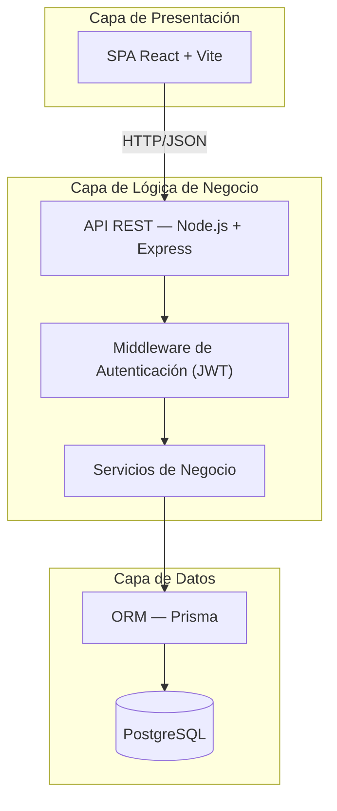

### 1.2 Justificación del Stack Tecnológico

| Tecnología | Capa | Justificación |
|------------|------|---------------|
| **React 18+** | Frontend | Ecosistema maduro, componentización, rendimiento con Virtual DOM, amplia comunidad |
| **Vite** | Build tool | Arranque instantáneo en desarrollo, HMR ultrarrápido, builds optimizados |
| **Node.js + Express** | Backend | JavaScript full-stack (un solo lenguaje), asincronía nativa, ideal para API REST |
| **PostgreSQL** | Base de datos | Robustez, integridad referencial, soporte de JSON, transacciones ACID, ideal para inventario y ventas |
| **Prisma** | ORM | Type-safe, migraciones automáticas, excelente DX, introspección de esquema |
| **JWT** | Autenticación | Stateless, escalable, estándar de la industria para SPAs |
| **bcrypt** | Seguridad | Hashing de contraseñas con salt, resistente a ataques de fuerza bruta |
| **ExcelJS** | Exportación | Generación de archivos Excel desde el servidor (RF31) |
| **React Router** | Navegación | Enrutamiento declarativo para SPA |
| **Zustand** | Estado global | Ligero, simple, sin boilerplate, ideal para carrito y sesión |
| **React Hot Toast** | Notificaciones | Notificaciones elegantes para alertas de stock y operaciones |

### 1.3 Arquitectura de Alto Nivel

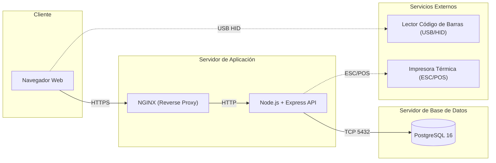

---

## 2. Diseño Detallado (Clases, Atributos, Métodos)

### 2.1 Capa de Servicios (Lógica de Negocio)

Cada módulo funcional se implementa como un **servicio** independiente con responsabilidades bien definidas.

---

#### ProductService

```
Clase: ProductService
Responsabilidad: Gestión del catálogo de productos y variantes
───────────────────────────────────────────────────────────────
Métodos:
  + createProduct(data)           → Product
  + updateProduct(id, data)       → Product
  + deleteProduct(id)             → void
  + getProductById(id)            → Product (con variantes)
  + listProducts(filters, page)   → PaginatedList<Product>
  + searchByBarcode(code)         → Product
  + createVariant(productId, data)→ Variant
  + updateVariant(id, data)       → Variant
  + deleteVariant(id)             → void
  + getVariantsByProduct(id)      → List<Variant>
```

---

#### InventoryService

```
Clase: InventoryService
Responsabilidad: Control de stock, entradas de inventario y alertas
───────────────────────────────────────────────────────────────
Métodos:
  + getStock(variantId)                    → StockInfo
  + getFullInventory(filters)              → List<StockInfo>
  + getLowStockAlerts()                    → List<Alert>
  + registerEntry(data)                    → InventoryEntry
  + getEntryById(id)                       → InventoryEntry
  + listEntries(filters, page)             → PaginatedList<InventoryEntry>
  - decreaseStock(variantId, qty)          → void  [interno]
  - increaseStock(variantId, qty)          → void  [interno]
  - checkStockThreshold(variantId)         → Alert | null
```

---

#### SaleService

```
Clase: SaleService
Responsabilidad: Proceso de venta, cálculos y operaciones transaccionales
───────────────────────────────────────────────────────────────
Métodos:
  + createSale(data)              → Sale
  + completeSale(id, paymentData) → Sale
  + cancelSale(id, reason)        → Sale
  + cancelSalePartial(id, items)  → Sale
  + getSaleById(id)               → Sale (con detalles)
  + listSales(filters, page)      → PaginatedList<Sale>
  + getSalesByDate(from, to)      → List<Sale>
  + getSalesByCustomer(customerId)→ List<Sale>
  + calculateTotals(items, discount) → TotalBreakdown
  - applyTax(subtotal)            → Decimal
  - applyDiscount(subtotal, discount) → Decimal
  - validateStock(items)          → ValidationResult
```

---

#### CustomerService

```
Clase: CustomerService
Responsabilidad: Gestión de clientes y su historial
───────────────────────────────────────────────────────────────
Métodos:
  + createCustomer(data)          → Customer
  + updateCustomer(id, data)      → Customer
  + deleteCustomer(id)            → void
  + getCustomerById(id)           → Customer
  + listCustomers(filters, page)  → PaginatedList<Customer>
  + searchCustomers(query)        → List<Customer>
  + getPurchaseHistory(customerId)→ List<Sale>
```

---

#### UserService

```
Clase: UserService
Responsabilidad: Gestión de usuarios, autenticación y autorización
───────────────────────────────────────────────────────────────
Métodos:
  + createUser(data)              → User
  + updateUser(id, data)          → User
  + deactivateUser(id)            → void
  + getUserById(id)               → User
  + listUsers(filters)            → List<User>
  + authenticate(username, password) → AuthToken
  + validateToken(token)          → UserSession
  + changePassword(id, oldPw, newPw) → void
  + getUserPermissions(userId)    → List<Permission>
```

---

#### ReportService

```
Clase: ReportService
Responsabilidad: Generación de reportes y exportación
───────────────────────────────────────────────────────────────
Métodos:
  + getSalesReport(dateRange)     → SalesReport
  + getTopSellingProducts(limit, dateRange) → List<ProductRanking>
  + getInventoryReport()          → InventoryReport
  + getCashRegisterReport(closingId) → CashReport
  + exportToExcel(reportType, params) → FileBuffer
```

---

#### CashRegisterService

```
Clase: CashRegisterService
Responsabilidad: Apertura, operación y cierre de caja
───────────────────────────────────────────────────────────────
Métodos:
  + openCashRegister(userId, initialAmount) → CashRegister
  + closeCashRegister(id, countedAmount, notes) → CashClosing
  + getCurrentRegister(userId)    → CashRegister
  + getCashClosingById(id)        → CashClosing
  + listClosings(filters, page)   → PaginatedList<CashClosing>
  + calculateExpectedCash(registerId) → ExpectedCash
```

---

#### SupplierService

```
Clase: SupplierService
Responsabilidad: Gestión de proveedores
───────────────────────────────────────────────────────────────
Métodos:
  + createSupplier(data)          → Supplier
  + updateSupplier(id, data)      → Supplier
  + deleteSupplier(id)            → void
  + getSupplierById(id)           → Supplier
  + listSuppliers(filters, page)  → PaginatedList<Supplier>
  + getSupplierProducts(id)       → List<Product>
```

---

## 3. Diagrama de Clases

### 3.1 Clases del Dominio (Modelo de Datos)

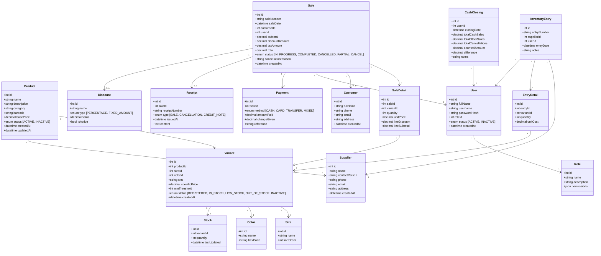

### 3.2 Clases de la Capa de Controladores (API)

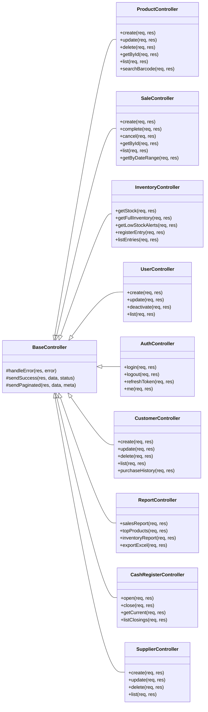

---

## 4. Diagrama de Objetos

> Muestra una **instantánea** del sistema en tiempo de ejecución con datos reales de ejemplo.

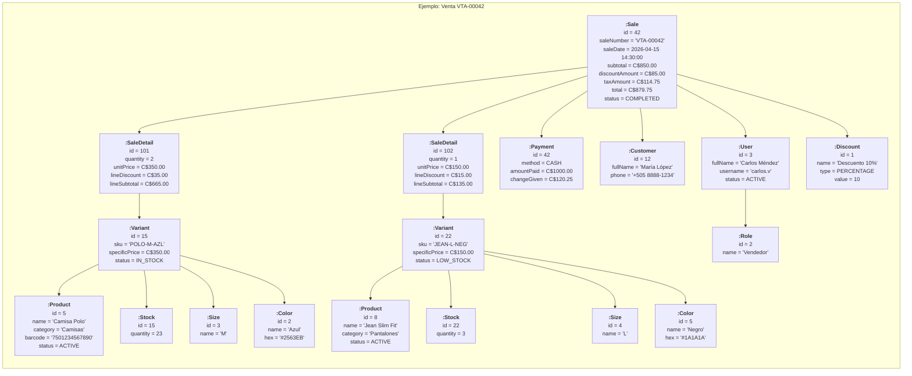

---

## 5. Diagrama de Componentes

> Muestra los **módulos de software** del sistema, sus dependencias y las interfaces que exponen.

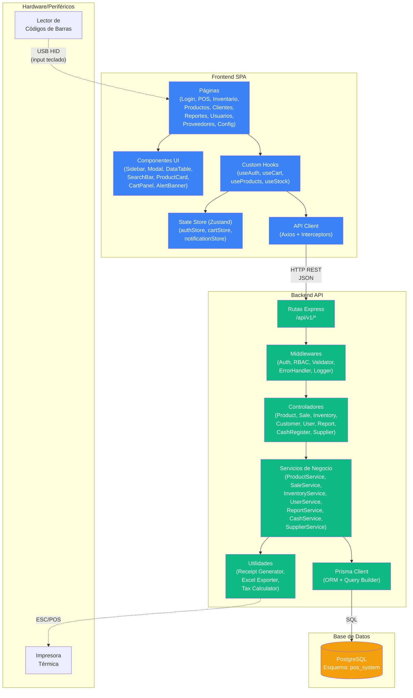

---

## 6. Diagrama de Despliegue

> Muestra la **topología física** del sistema: nodos, artefactos desplegados y conexiones.

### 6.1 Despliegue en Producción

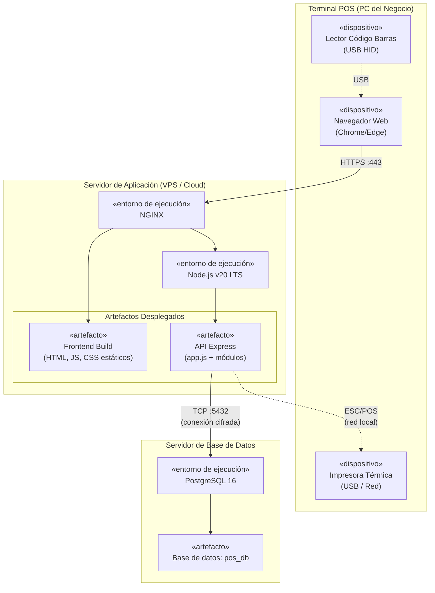

### 6.2 Despliegue en Desarrollo (Local)

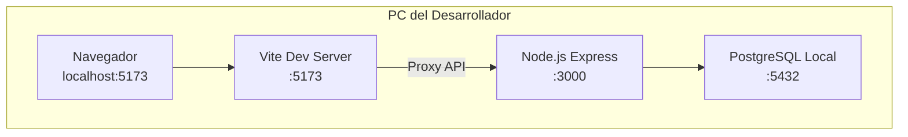

---

## 7. Diseño de Datos

### 7.1 Esquema de Base de Datos (PostgreSQL)

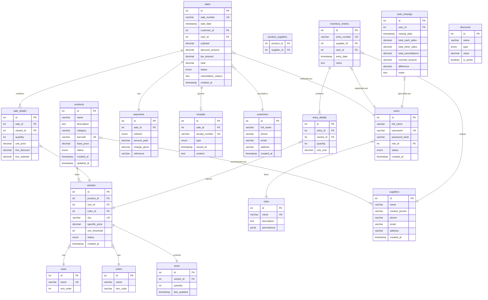

### 7.2 Definición de Tablas (DDL Conceptual)

#### Tabla: `products`

| Columna | Tipo | Restricción | Descripción |
|---------|------|-------------|-------------|
| id | SERIAL | PK | Identificador autoincremental |
| name | VARCHAR(200) | NOT NULL | Nombre del producto |
| description | TEXT | NULL | Descripción detallada |
| category | VARCHAR(100) | NOT NULL | Categoría del producto |
| barcode | VARCHAR(50) | UNIQUE, NULL | Código de barras |
| base_price | DECIMAL(10,2) | NOT NULL, CHECK > 0 | Precio base |
| status | ENUM | NOT NULL, DEFAULT 'ACTIVE' | ACTIVE, INACTIVE |
| created_at | TIMESTAMP | NOT NULL, DEFAULT NOW() | Fecha de creación |
| updated_at | TIMESTAMP | NOT NULL | Última modificación |

#### Tabla: `variants`

| Columna | Tipo | Restricción | Descripción |
|---------|------|-------------|-------------|
| id | SERIAL | PK | Identificador |
| product_id | INT | FK → products(id), NOT NULL | Producto padre |
| size_id | INT | FK → sizes(id), NOT NULL | Talla |
| color_id | INT | FK → colors(id), NOT NULL | Color |
| sku | VARCHAR(50) | UNIQUE, NOT NULL | Código único de variante |
| specific_price | DECIMAL(10,2) | NULL | Precio si difiere del base |
| min_threshold | INT | NOT NULL, DEFAULT 5 | Umbral para alerta |
| status | ENUM | NOT NULL | Estado del inventario |
| created_at | TIMESTAMP | NOT NULL | Fecha de creación |

> **Constraint**: UNIQUE(product_id, size_id, color_id) — No puede haber dos variantes iguales.

#### Tabla: `sales`

| Columna | Tipo | Restricción | Descripción |
|---------|------|-------------|-------------|
| id | SERIAL | PK | Identificador |
| sale_number | VARCHAR(20) | UNIQUE, NOT NULL | Número secuencial visible |
| sale_date | TIMESTAMP | NOT NULL | Fecha y hora de la venta |
| customer_id | INT | FK → customers(id), NULL | Cliente (opcional) |
| user_id | INT | FK → users(id), NOT NULL | Vendedor que registra |
| subtotal | DECIMAL(10,2) | NOT NULL | Subtotal antes de impuestos |
| discount_amount | DECIMAL(10,2) | DEFAULT 0 | Descuento aplicado |
| tax_amount | DECIMAL(10,2) | NOT NULL | Impuesto calculado |
| total | DECIMAL(10,2) | NOT NULL | Total final |
| status | ENUM | NOT NULL | Estado de la venta |
| cancellation_reason | TEXT | NULL | Motivo si fue cancelada |
| created_at | TIMESTAMP | NOT NULL | Timestamp del registro |

### 7.3 Índices Recomendados

```
-- Búsquedas frecuentes
CREATE INDEX idx_products_barcode ON products(barcode);
CREATE INDEX idx_products_category ON products(category);
CREATE INDEX idx_variants_sku ON variants(sku);
CREATE INDEX idx_variants_product ON variants(product_id);
CREATE INDEX idx_stock_variant ON stock(variant_id);

-- Consultas de ventas por fecha
CREATE INDEX idx_sales_date ON sales(sale_date);
CREATE INDEX idx_sales_customer ON sales(customer_id);
CREATE INDEX idx_sales_user ON sales(user_id);
CREATE INDEX idx_sales_status ON sales(status);

-- Búsqueda de clientes
CREATE INDEX idx_customers_name ON customers(full_name);
CREATE INDEX idx_customers_phone ON customers(phone);
```

### 7.4 Estructuras de Datos Internas (En Memoria)

Estructuras utilizadas en el frontend y backend durante la ejecución:

```
CartState (Zustand Store — Frontend)
├── items: Array<CartItem>
│   ├── variantId: number
│   ├── productName: string
│   ├── sku: string
│   ├── size: string
│   ├── color: string
│   ├── quantity: number
│   ├── unitPrice: decimal
│   ├── lineDiscount: decimal
│   └── lineSubtotal: decimal
├── customerId: number | null
├── globalDiscount: { type: enum, value: decimal }
├── subtotal: decimal (calculado)
├── taxAmount: decimal (calculado)
├── total: decimal (calculado)
└── paymentMethod: enum | null

AuthState (Zustand Store — Frontend)
├── user: { id, fullName, username, role }
├── token: string (JWT)
├── isAuthenticated: boolean
└── permissions: string[]

TotalBreakdown (Estructura interna — Backend)
├── lines: Array<{ variantId, qty, price, discount, subtotal }>
├── subtotal: decimal
├── discountTotal: decimal
├── taxableAmount: decimal
├── taxRate: decimal
├── taxAmount: decimal
└── grandTotal: decimal
```

---

## 8. Patrones de Diseño y Arquitectura

### 8.1 Patrones Utilizados

| Patrón | Tipo | Dónde se aplica | Propósito |
|--------|------|-----------------|-----------|
| **MVC** | Arquitectónico | Backend completo | Separación de responsabilidades: Rutas→Controladores→Servicios→Modelos |
| **Repository** | Estructural | Capa de datos (Prisma) | Abstraer el acceso a datos. Los servicios no conocen SQL, solo hablan con Prisma |
| **Service Layer** | Arquitectónico | Lógica de negocio | Encapsular reglas de negocio en servicios reutilizables, independientes de HTTP |
| **Middleware Chain** | Comportamiento | Express middlewares | Cadena de responsabilidad para auth, validación, logging, errores |
| **Singleton** | Creacional | Prisma Client, Stores | Una sola instancia de conexión a BD y una sola instancia de estado global |
| **Observer** | Comportamiento | Alertas de stock | Cuando el stock cambia, se notifica al módulo de alertas automáticamente |
| **Strategy** | Comportamiento | Cálculo de descuentos | Diferentes estrategias de descuento (porcentaje vs. monto fijo) intercambiables |
| **Facade** | Estructural | API Client (Axios) | Interfaz simplificada para todas las llamadas HTTP desde el frontend |
| **DTO** | Estructural | Request/Response | Objetos de transferencia para validar y transformar datos entre capas |
| **Factory** | Creacional | Generación de comprobantes | Crear diferentes tipos de comprobante (venta, cancelación, nota de crédito) |

### 8.2 Flujo Arquitectónico MVC Detallado

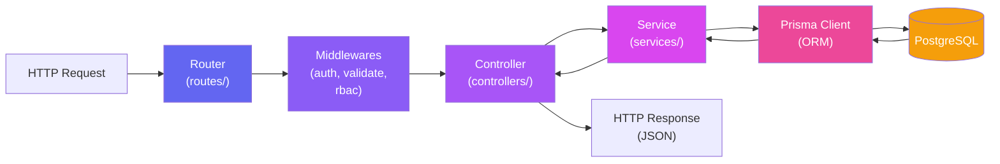

### 8.3 Estructura de Carpetas del Proyecto

```
/
├── backend/
│   ├── prisma/
│   │   ├── schema.prisma          ← Definición del esquema de BD
│   │   ├── migrations/            ← Migraciones versionadas
│   │   └── seed.js                ← Datos iniciales (roles, admin)
│   ├── src/
│   │   ├── app.js                 ← Configuración Express
│   │   ├── server.js              ← Punto de entrada
│   │   ├── config/
│   │   │   ├── database.js        ← Singleton Prisma Client
│   │   │   ├── auth.js            ← Config JWT (secret, expiry)
│   │   │   └── tax.js             ← Config impuestos (tasa IVA)
│   │   ├── middleware/
│   │   │   ├── authMiddleware.js   ← Verificar JWT
│   │   │   ├── rbacMiddleware.js   ← Verificar permisos por rol
│   │   │   ├── validator.js        ← Validación de request body
│   │   │   └── errorHandler.js     ← Manejo centralizado de errores
│   │   ├── routes/
│   │   │   ├── authRoutes.js
│   │   │   ├── productRoutes.js
│   │   │   ├── saleRoutes.js
│   │   │   ├── inventoryRoutes.js
│   │   │   ├── customerRoutes.js
│   │   │   ├── userRoutes.js
│   │   │   ├── reportRoutes.js
│   │   │   ├── cashRoutes.js
│   │   │   └── supplierRoutes.js
│   │   ├── controllers/            ← Un controller por módulo
│   │   ├── services/               ← Un service por módulo
│   │   └── utils/
│   │       ├── receiptGenerator.js ← Factory: genera comprobantes
│   │       ├── excelExporter.js    ← Generación de archivos Excel
│   │       ├── taxCalculator.js    ← Strategy: cálculo de impuestos
│   │       └── discountStrategy.js ← Strategy: tipos de descuento
│   ├── package.json
│   └── .env
│
├── frontend/
│   ├── public/
│   │   └── favicon.svg
│   ├── src/
│   │   ├── main.jsx               ← Punto de entrada React
│   │   ├── App.jsx                ← Router principal
│   │   ├── api/
│   │   │   └── client.js          ← Facade: Axios configurado
│   │   ├── stores/
│   │   │   ├── authStore.js       ← Zustand: sesión y permisos
│   │   │   ├── cartStore.js       ← Zustand: carrito de venta
│   │   │   └── notificationStore.js
│   │   ├── hooks/
│   │   │   ├── useAuth.js
│   │   │   ├── useProducts.js
│   │   │   ├── useInventory.js
│   │   │   └── useSales.js
│   │   ├── components/
│   │   │   ├── common/            ← Modal, Sidebar, DataTable...
│   │   │   ├── pos/               ← CartPanel, ProductSearch...
│   │   │   ├── inventory/         ← StockTable, AlertBanner...
│   │   │   └── reports/           ← ChartCard, ExportButton...
│   │   ├── pages/                 ← Una página por módulo
│   │   └── styles/
│   │       ├── index.css          ← Variables y reset
│   │       ├── components.css
│   │       ├── layout.css
│   │       └── pages.css
│   ├── index.html
│   ├── package.json
│   └── vite.config.js
```

---

## 9. Diseño de Interfaces

### 9.1 Interfaz de Usuario (UI)

#### Principios de Diseño

| Principio | Aplicación |
|-----------|-----------|
| **Consistencia** | Todos los módulos comparten el mismo layout (sidebar + contenido), paleta de colores y tipografía |
| **Accesibilidad** | Contraste mínimo AA, navegación por teclado, labels en formularios |
| **Eficiencia** | El POS está optimizado para flujo rápido: escaneo → cantidad → pago en mínimos clics |
| **Feedback inmediato** | Toasts de confirmación, estados de carga, validación en tiempo real |
| **Responsive** | Adaptable a pantallas de 1024px+ (terminales POS y monitores) |

#### Mapa de Pantallas

```mermaid
graph TB
    LOGIN["🔐 Login"] --> MAIN["🏠 Layout Principal"]

    MAIN --> DASH["📊 Dashboard"]
    MAIN --> POS["🛒 Punto de Venta"]
    MAIN --> PRODUCTS["📦 Productos"]
    MAIN --> INVENTORY["📋 Inventario"]
    MAIN --> CUSTOMERS["👥 Clientes"]
    MAIN --> SUPPLIERS["🏭 Proveedores"]
    MAIN --> REPORTS["📈 Reportes"]
    MAIN --> USERS["👤 Usuarios"]
    MAIN --> CONFIG["⚙️ Configuración"]

    POS --> POS_SEARCH["Búsqueda / Escaneo"]
    POS --> POS_CART["Carrito / Detalle"]
    POS --> POS_PAY["Pantalla de Pago"]
    POS --> POS_RECEIPT["Comprobante"]

    PRODUCTS --> PROD_LIST["Lista de Productos"]
    PRODUCTS --> PROD_FORM["Crear/Editar Producto"]
    PRODUCTS --> PROD_VARIANTS["Gestión de Variantes"]

    INVENTORY --> INV_STOCK["Stock Actual"]
    INVENTORY --> INV_ALERTS["Alertas de Stock Bajo"]
    INVENTORY --> INV_ENTRY["Registrar Entrada"]

    REPORTS --> REP_SALES["Reporte de Ventas"]
    REPORTS --> REP_TOP["Más Vendidos"]
    REPORTS --> REP_INV["Inventario Actual"]
    REPORTS --> REP_CASH["Cierres de Caja"]
    REPORTS --> REP_EXPORT["Exportar a Excel"]
```

#### Layout Principal

```
┌──────────────────────────────────────────────────────────┐
│  🏪 Zuleyka's Closet POS       [🔔 3]  [👤 Carlos v]  │  ← Header
├────────┬─────────────────────────────────────────────────┤
│        │                                                 │
│  📊    │   ┌─────────────────────────────────────────┐   │
│  🛒    │   │                                         │   │
│  📦    │   │          Contenido del Módulo            │   │
│  📋    │   │         (cambia según la ruta)           │   │
│  👥    │   │                                         │   │
│  🏭    │   │                                         │   │
│  📈    │   │                                         │   │
│  👤    │   │                                         │   │
│  ⚙️    │   └─────────────────────────────────────────┘   │
│        │                                                 │
├────────┴─────────────────────────────────────────────────┤
│  Sidebar        Área de contenido principal              │
└──────────────────────────────────────────────────────────┘
```

#### Pantalla POS (Punto de Venta)

```
┌─────────────────────────────────────────┬──────────────────────────┐
│  🔍 Buscar producto o escanear código   │  🛒  CARRITO  (3 items)  │
│  ┌───────────────────────────────────┐  │                          │
│  │ [____________________________🔎]  │  │  Camisa Polo M/Azul  x2 │
│  └───────────────────────────────────┘  │     C$350.00   C$700.00  │
│                                         │                          │
│  ┌──────┐ ┌──────┐ ┌──────┐ ┌──────┐  │  Jean Slim L/Negro   x1  │
│  │ 📷   │ │ 📷   │ │ 📷   │ │ 📷   │  │     C$150.00   C$150.00  │
│  │Camisa│ │ Jean │ │Vestid│ │Blusa │  │                          │
│  │Polo  │ │ Slim │ │  o   │ │      │  │  ─────────────────────── │
│  │C$350 │ │C$150 │ │C$450 │ │C$280 │  │  Subtotal:    C$850.00  │
│  └──────┘ └──────┘ └──────┘ └──────┘  │  Descuento:   -C$85.00  │
│                                         │  Impuesto:    C$114.75  │
│  Filtrar: [Categoría ▼] [Talla ▼]      │  ═══════════════════════ │
│           [Color ▼]                     │  TOTAL:       C$879.75  │
│                                         │                          │
│                                         │  [💳 Método de Pago  ▼]  │
│                                         │  [ ✅ COMPLETAR VENTA ]  │
└─────────────────────────────────────────┴──────────────────────────┘
```

### 9.2 Interfaz Interna (API REST)

#### Convenciones de la API

| Aspecto | Convención |
|---------|-----------|
| Base URL | `/api/v1/` |
| Formato | JSON |
| Auth Header | `Authorization: Bearer <JWT>` |
| Paginación | `?page=1&limit=20` |
| Filtros | Query params: `?status=ACTIVE&category=Camisas` |
| Ordenamiento | `?sortBy=created_at&order=desc` |
| Errores | `{ error: true, message: "...", code: "ERR_CODE" }` |
| Éxito | `{ data: {...}, message: "..." }` |

#### Endpoints Principales

```
AUTH
  POST   /api/v1/auth/login              ← Iniciar sesión
  POST   /api/v1/auth/logout             ← Cerrar sesión
  GET    /api/v1/auth/me                  ← Obtener usuario actual

PRODUCTOS
  GET    /api/v1/products                 ← Listar productos (paginado)
  GET    /api/v1/products/:id             ← Obtener producto con variantes
  POST   /api/v1/products                 ← Crear producto
  PUT    /api/v1/products/:id             ← Actualizar producto
  DELETE /api/v1/products/:id             ← Eliminar producto
  GET    /api/v1/products/barcode/:code   ← Buscar por código de barras

VARIANTES
  POST   /api/v1/products/:id/variants    ← Crear variante
  PUT    /api/v1/variants/:id             ← Actualizar variante
  DELETE /api/v1/variants/:id             ← Eliminar variante

INVENTARIO
  GET    /api/v1/inventory                ← Stock actual completo
  GET    /api/v1/inventory/alerts         ← Alertas de stock bajo
  POST   /api/v1/inventory/entries        ← Registrar entrada
  GET    /api/v1/inventory/entries        ← Listar entradas

VENTAS
  GET    /api/v1/sales                    ← Listar ventas (paginado)
  GET    /api/v1/sales/:id                ← Detalle de venta
  POST   /api/v1/sales                    ← Crear y completar venta
  POST   /api/v1/sales/:id/cancel         ← Cancelar venta
  GET    /api/v1/sales/by-date            ← Filtrar por rango de fechas

CLIENTES
  GET    /api/v1/customers                ← Listar clientes
  GET    /api/v1/customers/:id            ← Obtener cliente
  POST   /api/v1/customers                ← Crear cliente
  PUT    /api/v1/customers/:id            ← Actualizar cliente
  DELETE /api/v1/customers/:id            ← Eliminar cliente
  GET    /api/v1/customers/:id/purchases  ← Historial de compras

USUARIOS
  GET    /api/v1/users                    ← Listar usuarios
  POST   /api/v1/users                    ← Crear usuario
  PUT    /api/v1/users/:id                ← Actualizar usuario
  PATCH  /api/v1/users/:id/deactivate     ← Desactivar usuario

REPORTES
  GET    /api/v1/reports/sales            ← Reporte de ventas
  GET    /api/v1/reports/top-products     ← Productos más vendidos
  GET    /api/v1/reports/inventory        ← Reporte de inventario
  GET    /api/v1/reports/export/:type     ← Exportar a Excel

CAJA
  POST   /api/v1/cash-register/open       ← Abrir caja
  POST   /api/v1/cash-register/close      ← Cerrar caja
  GET    /api/v1/cash-register/current     ← Caja actual
  GET    /api/v1/cash-register/closings    ← Historial de cierres

PROVEEDORES
  GET    /api/v1/suppliers                ← Listar proveedores
  POST   /api/v1/suppliers                ← Crear proveedor
  PUT    /api/v1/suppliers/:id            ← Actualizar proveedor
  DELETE /api/v1/suppliers/:id            ← Eliminar proveedor
```

#### Ejemplo de Request/Response

```
POST /api/v1/sales
Authorization: Bearer eyJhbGci...

Request Body:
{
  "customerId": 12,
  "items": [
    { "variantId": 15, "quantity": 2 },
    { "variantId": 22, "quantity": 1 }
  ],
  "discount": { "type": "PERCENTAGE", "value": 10 },
  "payment": {
    "method": "CASH",
    "amountPaid": 1000.00
  }
}

Response (201 Created):
{
  "data": {
    "id": 42,
    "saleNumber": "VTA-00042",
    "saleDate": "2026-04-15T14:30:00Z",
    "customer": { "id": 12, "fullName": "María López" },
    "items": [
      {
        "variant": { "sku": "POLO-M-AZL", "product": "Camisa Polo" },
        "quantity": 2,
        "unitPrice": 350.00,
        "lineSubtotal": 665.00
      },
      {
        "variant": { "sku": "JEAN-L-NEG", "product": "Jean Slim Fit" },
        "quantity": 1,
        "unitPrice": 150.00,
        "lineSubtotal": 135.00
      }
    ],
    "subtotal": 850.00,
    "discountAmount": 85.00,
    "taxAmount": 114.75,
    "total": 879.75,
    "payment": {
      "method": "CASH",
      "amountPaid": 1000.00,
      "changeGiven": 120.25
    },
    "status": "COMPLETED"
  },
  "message": "Venta registrada exitosamente"
}
```

### 9.3 Interfaz Externa

El sistema interactúa con componentes externos a través de las siguientes interfaces:

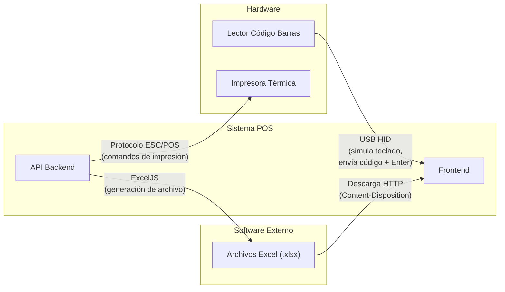

| Interfaz | Protocolo | Dirección | Descripción |
|----------|-----------|-----------|-------------|
| **Lector de Código de Barras** | USB HID (Human Interface Device) | Hardware → Frontend | El lector se comporta como un teclado: envía los dígitos del código seguidos de Enter. El campo de búsqueda del POS captura este input automáticamente |
| **Impresora Térmica** | ESC/POS sobre USB o Red | Backend → Hardware | El servidor genera los comandos ESC/POS para imprimir tickets de venta con formato (logo, líneas, totales) |
| **Exportación Excel** | HTTP File Download | Backend → Frontend | El servidor genera el archivo .xlsx usando ExcelJS y lo envía como respuesta binaria con headers de descarga |

---

## 10. Restricciones del Sistema

### 10.1 Restricciones Técnicas

| Restricción | Descripción | Impacto |
|-------------|-------------|---------|
| **Base de datos relacional** | Se requiere PostgreSQL por la naturaleza transaccional del sistema (ventas, stock) | No se puede usar NoSQL como BD principal |
| **Transacciones ACID** | Cada venta debe actualizar stock y registrar pago de forma atómica | Si falla una operación, se revierte toda la transacción |
| **Navegador moderno** | La SPA requiere Chrome 90+, Firefox 88+, Edge 90+ | No soporta Internet Explorer |
| **Conexión a red local** | El POS debe conectarse al servidor dentro de la red del negocio | Requiere servidor funcionando para operar |
| **Node.js LTS** | Se requiere Node.js v20+ LTS | Versiones anteriores pueden no soportar las APIs utilizadas |

### 10.2 Restricciones de Negocio

| Restricción | Descripción | RFs Afectados |
|-------------|-------------|---------------|
| **Integridad de inventario** | El stock nunca puede ser negativo. No se permite vender más de lo disponible | RF1, RF6, RF15 |
| **Unicidad de SKU** | Cada variante debe tener un SKU único en todo el sistema | RF7, RF13, RF14 |
| **Trazabilidad** | Toda operación debe registrar usuario, fecha y hora | RF29 |
| **Control de acceso** | Las operaciones están restringidas según el rol del usuario | RF23, RF24 |
| **Cancelaciones** | Solo se pueden cancelar ventas del día actual (configurable) | RF5 |
| **Cierre de caja** | No se puede registrar ventas si la caja no está abierta | RF30 |
| **Eliminación lógica** | Los productos y usuarios no se eliminan físicamente, se desactivan | RF9 |
| **Moneda** | El sistema opera en Córdobas Nicaragüenses (C$), con 2 decimales | RF2, RF27 |

### 10.3 Restricciones de Seguridad

| Restricción | Implementación |
|-------------|---------------|
| **Contraseñas hasheadas** | bcrypt con salt round ≥ 10 |
| **Tokens con expiración** | JWT expira en 8 horas (un turno de trabajo) |
| **Endpoints protegidos** | Todos los endpoints excepto `/auth/login` requieren JWT válido |
| **Validación de entrada** | Todos los inputs se validan y sanitizan antes de procesar |
| **CORS configurado** | Solo acepta peticiones del dominio del frontend |
| **Rate limiting** | Máximo 100 requests/minuto por IP en login (prevención fuerza bruta) |
| **Logs de auditoría** | Se registran intentos de login fallidos y operaciones críticas |

### 10.4 Restricciones de Rendimiento

| Métrica | Objetivo |
|---------|---------|
| Tiempo de respuesta API | < 200ms para operaciones comunes |
| Tiempo de carga inicial | < 3 segundos en primera carga |
| Usuarios concurrentes | Soportar mínimo 10 usuarios simultáneos |
| Registros en BD | Diseñado para hasta 100,000 ventas/año |
| Tamaño de exportación Excel | Hasta 50,000 filas sin degradación |

### 10.5 Matriz de Permisos por Rol

| Operación | Administrador | Gerente | Vendedor |
|-----------|:---:|:---:|:---:|
| Gestionar usuarios | ✅ | ❌ | ❌ |
| Gestionar roles | ✅ | ❌ | ❌ |
| Crear/editar productos | ✅ | ✅ | ❌ |
| Eliminar productos | ✅ | ❌ | ❌ |
| Registrar ventas | ✅ | ✅ | ✅ |
| Cancelar ventas | ✅ | ✅ | ❌ |
| Aplicar descuentos | ✅ | ✅ | ⚠️ (hasta 10%) |
| Registrar entradas inventario | ✅ | ✅ | ❌ |
| Gestionar proveedores | ✅ | ✅ | ❌ |
| Registrar clientes | ✅ | ✅ | ✅ |
| Ver reportes | ✅ | ✅ | ❌ |
| Exportar a Excel | ✅ | ✅ | ❌ |
| Cierre de caja | ✅ | ✅ | ✅ (solo propia) |
| Configurar precios | ✅ | ❌ | ❌ |
| Configurar impuestos | ✅ | ❌ | ❌ |

---

## Resumen del Diseño

| Aspecto | Decisión |
|---------|----------|
| **Arquitectura** | 3 capas + MVC + SPA |
| **Frontend** | React 18 + Vite + Zustand + React Router |
| **Backend** | Node.js + Express + Prisma |
| **Base de datos** | PostgreSQL 16 |
| **Autenticación** | JWT + bcrypt |
| **Tablas de BD** | 16 tablas principales |
| **Endpoints API** | ~45 endpoints REST |
| **Patrones** | MVC, Repository, Service Layer, Singleton, Strategy, Factory, Observer, Facade |
| **Pantallas UI** | ~15 pantallas principales |
| **Roles** | 3 roles + matriz de 15 permisos |
