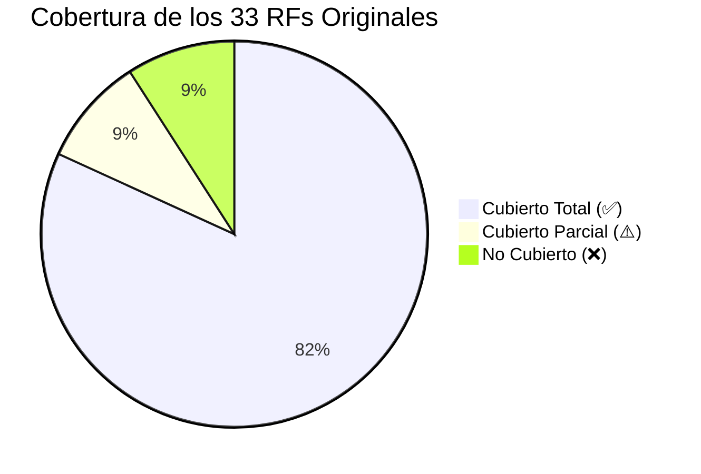
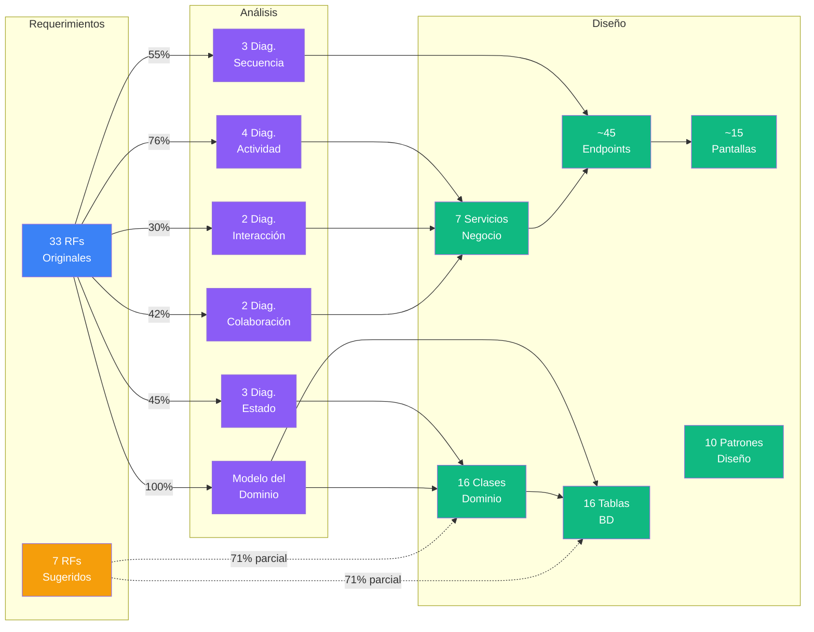

# Matriz de Trazabilidad — Sistema de Ventas e Inventario

---

## 1. Matriz de Trazabilidad Completa

La siguiente matriz vincula cada requerimiento funcional (RF) con los artefactos generados en las fases de **análisis** y **diseño**, verificando su cobertura integral.

### Leyenda

| Símbolo | Significado |
|:-------:|-------------|
| ✅ | **Cubierto Total** — El RF está completamente representado en análisis y diseño |
| ⚠️ | **Cubierto Parcial** — El RF aparece en el diseño pero carece de detalle en alguna fase |
| ❌ | **No Cubierto** — El RF no tiene representación suficiente en el diseño actual |

### Abreviaciones de Diagramas

| Código | Diagrama |
|--------|----------|
| **DA** | Diagrama de Actividades |
| **DE** | Diagrama de Estados |
| **DS** | Diagrama de Secuencia |
| **DI** | Diagrama de Interacción |
| **DC** | Diagrama de Colaboración |
| **DCL** | Diagrama de Clases |
| **DOB** | Diagrama de Objetos |
| **DCM** | Diagrama de Componentes |
| **DDP** | Diagrama de Despliegue |

---

### Módulo 1 — Punto de Venta (POS)

| RF | Descripción | Caso de Uso / Proceso | Elementos de Análisis | Elementos de Diseño | Estado |
|----|-------------|----------------------|----------------------|---------------------|:------:|
| **RF1** | Registrar ventas | Proceso de Registro de Venta | DA 1.1 (flujo completo), DE 2.1 (estados venta), DS 4.1 (secuencia venta), DI 3.1 (interacción venta), DC 5.1 (colaboración venta) | **Clases**: Sale, SaleDetail, SaleService, SaleController · **BD**: sales, sale_details · **API**: POST /api/v1/sales · **UI**: Pantalla POS (ProductSearch, CartPanel) | ✅ |
| **RF2** | Calcular total con impuestos | Subproceso dentro de Registro de Venta | DA 1.1 (paso "Calcular total con impuestos"), DS 4.1 (mensaje calcularTotals) | **Clases**: SaleService.calculateTotals(), SaleService.applyTax() · **Util**: taxCalculator.js · **Config**: tax.js · **Estructura**: TotalBreakdown | ✅ |
| **RF3** | Métodos de pago | Selección de pago durante venta | DA 1.1 (paso "Seleccionar método de pago"), DS 4.1 (paso seleccionar pago) | **Clases**: Payment · **BD**: payments (method: CASH, CARD, TRANSFER, MIXED) · **UI**: Pantalla POS (selector de método) | ✅ |
| **RF4** | Generar comprobante | Emisión post-venta | DA 1.1 (paso "Generar comprobante"), DS 4.1 (mensaje generarComprobante), DC 5.1 (mensaje 8) | **Clases**: Receipt · **BD**: receipts · **Util**: receiptGenerator.js (Factory pattern) · **Patrón**: Factory · **API**: incluido en POST /api/v1/sales | ✅ |
| **RF5** | Cancelar ventas | Proceso de Cancelación de Venta | DA 1.4 (flujo cancelación completo), DE 2.1 (transiciones CanceladaParcial/CanceladaTotal), DS 4.2 (secuencia cancelación) | **Clases**: SaleService.cancelSale(), SaleService.cancelSalePartial() · **BD**: sales.status, sales.cancellation_reason · **API**: POST /api/v1/sales/:id/cancel | ✅ |
| **RF27** | Configuración de precios | Gestión de precios base y por variante | DA 1.1 (implícito en selección de producto) | **Clases**: Product.basePrice, Variant.specificPrice · **BD**: products.base_price, variants.specific_price · **UI**: Formulario Crear/Editar Producto | ⚠️ |
| **RF28** | Descuentos | Aplicación de descuentos en venta | DA 1.1 (paso "Aplicar descuento"), DS 4.1 (paso aplicar descuento) | **Clases**: Discount, SaleService.applyDiscount() · **BD**: discounts · **Util**: discountStrategy.js · **Patrón**: Strategy · **UI**: Pantalla POS (campo descuento) | ✅ |
| **RF29** | Registro de fecha y hora | Timestamp en cada transacción | DA 1.1, 1.2, 1.3, 1.4 (todos los procesos registran fecha/hora) | **BD**: sales.sale_date, sales.created_at, inventory_entries.entry_date, cash_closings.closing_date · **Restricción**: Toda operación registra usuario + timestamp | ✅ |
| **RF30** | Cierre de caja | Proceso de Cierre de Caja | DA 1.3 (flujo completo cierre), DE 2.3 (estados caja) | **Clases**: CashClosing, CashRegisterService · **BD**: cash_closings · **API**: POST /api/v1/cash-register/close · **UI**: Pantalla Cierre de Caja | ✅ |
| **RF32** | Códigos de barras | Escaneo para búsqueda rápida | DA 1.1 (paso "Escanear código de barras"), DS 4.1 (mensaje escanear código) | **Clases**: ProductService.searchByBarcode() · **BD**: products.barcode (UNIQUE index) · **API**: GET /api/v1/products/barcode/:code · **Interfaz externa**: USB HID · **DDP**: nodo Lector Código Barras | ⚠️ |

---

### Módulo 2 — Gestión de Inventario

| RF | Descripción | Caso de Uso / Proceso | Elementos de Análisis | Elementos de Diseño | Estado |
|----|-------------|----------------------|----------------------|---------------------|:------:|
| **RF6** | Actualizar inventario | Actualización automática post-venta y post-entrada | DA 1.1 (paso "Actualizar stock"), DA 1.2 (paso "Actualizar stock"), DA 1.4 (paso "Reponer stock"), DI 3.1 (mensaje reducirStock), DI 3.2 (evento reducirStock), DC 5.2 (mensaje actualizarStock) | **Clases**: InventoryService.decreaseStock(), InventoryService.increaseStock(), Stock · **BD**: stock.quantity · **Restricción**: Stock ≥ 0, transacciones ACID | ✅ |
| **RF10** | Mostrar stock | Consulta de inventario actual | — (implícito, funcionalidad de consulta) | **Clases**: InventoryService.getStock(), InventoryService.getFullInventory() · **API**: GET /api/v1/inventory · **UI**: Pantalla Inventario (StockTable) | ✅ |
| **RF11** | Alertas de stock bajo | Notificación automática cuando stock < umbral | DI 3.2 (interacción alerta stock completa), DE 2.2 (transición a StockBajo), DC 5.2 (mensaje verificarUmbral) | **Clases**: InventoryService.getLowStockAlerts(), InventoryService.checkStockThreshold() · **BD**: variants.min_threshold · **Patrón**: Observer · **API**: GET /api/v1/inventory/alerts · **UI**: AlertBanner | ✅ |
| **RF12** | Registrar entradas de inventario | Proceso de Entrada de Inventario | DA 1.2 (flujo completo), DC 5.2 (colaboración entrada) | **Clases**: InventoryEntry, EntryDetail, InventoryService.registerEntry() · **BD**: inventory_entries, entry_details · **API**: POST /api/v1/inventory/entries · **UI**: Pantalla Registrar Entrada | ✅ |
| **RF20** | Inventario actual (reporte) | Reporte de existencias | — (redundante con RF10, consolidado) | **Clases**: ReportService.getInventoryReport() · **API**: GET /api/v1/reports/inventory · **UI**: Pantalla Reportes (Inventario Actual) | ✅ |

---

### Módulo 3 — Catálogo de Productos

| RF | Descripción | Caso de Uso / Proceso | Elementos de Análisis | Elementos de Diseño | Estado |
|----|-------------|----------------------|----------------------|---------------------|:------:|
| **RF7** | Registrar productos | CRUD de productos (crear) | DA 1.2 (paso "Registrar nuevo producto"), DE 2.2 (transición [*] → Registrado) | **Clases**: Product, ProductService.createProduct() · **BD**: products · **API**: POST /api/v1/products · **UI**: Pantalla Crear Producto (formulario) | ✅ |
| **RF8** | Editar productos | CRUD de productos (actualizar) | DE 2.2 (implícito en cambios de estado) | **Clases**: ProductService.updateProduct() · **API**: PUT /api/v1/products/:id · **UI**: Pantalla Editar Producto | ✅ |
| **RF9** | Eliminar productos | CRUD de productos (eliminar lógico) | DE 2.2 (transición → Inactivo → Eliminado) | **Clases**: ProductService.deleteProduct() · **BD**: products.status = INACTIVE · **API**: DELETE /api/v1/products/:id · **Restricción**: Eliminación lógica | ✅ |
| **RF13** | Manejo de tallas | Gestión de atributo talla por variante | Modelo del Dominio (entidad Talla), DOB (Size id=3 name='M') | **Clases**: Size, Variant.sizeId · **BD**: sizes, variants.size_id FK · **UI**: Selector de talla en formulario de variante y en POS | ✅ |
| **RF14** | Manejo de colores | Gestión de atributo color por variante | Modelo del Dominio (entidad Color), DOB (Color id=2 name='Azul') | **Clases**: Color, Variant.colorId · **BD**: colors, variants.color_id FK · **UI**: Selector de color en formulario de variante y en POS | ✅ |
| **RF15** | Stock por variante | Control de stock a nivel de combinación talla+color | Modelo del Dominio (Stock por Variante), DOB (Stock qty=23 por variante POLO-M-AZL) | **Clases**: Variant → Stock (1:1), InventoryService · **BD**: stock.variant_id FK · **Constraint**: UNIQUE(product_id, size_id, color_id) | ✅ |

---

### Módulo 4 — Gestión de Clientes

| RF | Descripción | Caso de Uso / Proceso | Elementos de Análisis | Elementos de Diseño | Estado |
|----|-------------|----------------------|----------------------|---------------------|:------:|
| **RF16** | Registrar clientes | CRUD de clientes | DA 1.1 (pasos "Identificar cliente" y "Registrar nuevo cliente") | **Clases**: Customer, CustomerService (create, update, delete, list, search) · **BD**: customers · **API**: POST/PUT/DELETE /api/v1/customers · **UI**: Pantalla Clientes | ✅ |
| **RF17** | Historial de compras | Consulta de compras por cliente | — (mencionado en modelo del dominio, relación Cliente → Ventas) | **Clases**: CustomerService.getPurchaseHistory() · **API**: GET /api/v1/customers/:id/purchases · **UI**: Pantalla detalle de cliente (historial) | ✅ |

---

### Módulo 5 — Reportes y Consultas

| RF | Descripción | Caso de Uso / Proceso | Elementos de Análisis | Elementos de Diseño | Estado |
|----|-------------|----------------------|----------------------|---------------------|:------:|
| **RF18** | Reportes de ventas | Reporte agregado de ventas por período | — (consolidado con RF25 y RF26 en el análisis) | **Clases**: ReportService.getSalesReport() · **API**: GET /api/v1/reports/sales · **UI**: Pantalla Reportes → Reporte de Ventas | ✅ |
| **RF19** | Productos más vendidos | Ranking de productos por ventas | — (mencionado en análisis como reporte) | **Clases**: ReportService.getTopSellingProducts() · **API**: GET /api/v1/reports/top-products · **UI**: Pantalla Reportes → Más Vendidos | ✅ |
| **RF25** | Historial de ventas | Consulta completa del historial | — (consolidado con RF18 y RF26) | **Clases**: SaleService.listSales() · **API**: GET /api/v1/sales · **UI**: Pantalla POS / Reportes (tabla de ventas) | ✅ |
| **RF26** | Consulta por fecha | Filtro de ventas por rango de fechas | — (consolidado con RF18 y RF25) | **Clases**: SaleService.getSalesByDate() · **BD**: idx_sales_date · **API**: GET /api/v1/sales/by-date?from=...&to=... · **UI**: Selector de fechas en reportes | ✅ |
| **RF31** | Exportar a Excel | Generación de archivos .xlsx descargables | — (mencionado en análisis como funcionalidad transversal) | **Clases**: ReportService.exportToExcel() · **Util**: excelExporter.js (ExcelJS) · **API**: GET /api/v1/reports/export/:type · **DCM**: componente ExportButton · **Interfaz externa**: descarga HTTP | ✅ |

---

### Módulo 6 — Gestión de Usuarios y Seguridad

| RF | Descripción | Caso de Uso / Proceso | Elementos de Análisis | Elementos de Diseño | Estado |
|----|-------------|----------------------|----------------------|---------------------|:------:|
| **RF21** | Registro de usuarios | CRUD de usuarios del sistema | — (mencionado en análisis como parte del módulo) | **Clases**: User, UserService (create, update, deactivate, list) · **BD**: users · **API**: POST/PUT/PATCH /api/v1/users · **UI**: Pantalla Usuarios | ✅ |
| **RF22** | Autenticación | Login con credenciales | DS 4.3 (secuencia completa de autenticación) | **Clases**: UserService.authenticate(), AuthController.login() · **Middleware**: authMiddleware.js · **BD**: users.username, users.password_hash · **Lib**: JWT + bcrypt · **API**: POST /api/v1/auth/login · **Store**: authStore (Zustand) · **UI**: Pantalla Login | ✅ |
| **RF23** | Roles | Definición de roles con permisos | DS 4.3 (paso "Obtener rol del usuario") | **Clases**: Role · **BD**: roles (permissions JSONB) · **Diseño**: 3 roles (Administrador, Gerente, Vendedor) · **Matriz**: 15 permisos detallados | ✅ |
| **RF24** | Restricción por roles | Control de acceso a funciones según rol | DS 4.3 (paso "Crear sesión con permisos") | **Middleware**: rbacMiddleware.js · **Patrón**: Middleware Chain · **Frontend**: hooks/useAuth.js (verificar permisos) · **UI**: Menús habilitados/deshabilitados según rol | ✅ |

---

### Módulo 7 — Gestión de Proveedores

| RF | Descripción | Caso de Uso / Proceso | Elementos de Análisis | Elementos de Diseño | Estado |
|----|-------------|----------------------|----------------------|---------------------|:------:|
| **RF33** | Gestión de proveedores | CRUD de proveedores | DA 1.2 (pasos "Seleccionar proveedor" y "Registrar nuevo proveedor"), DC 5.2 (objeto :Proveedor) | **Clases**: Supplier, SupplierService (create, update, delete, list, getProducts) · **BD**: suppliers, product_suppliers · **API**: GET/POST/PUT/DELETE /api/v1/suppliers · **UI**: Pantalla Proveedores | ✅ |

---

## 2. Requerimientos Sugeridos (Mejoras del Análisis)

Los siguientes requerimientos fueron identificados como mejoras durante la fase de análisis. Se evalúa su cobertura en el diseño actual:

| RF Sugerido | Descripción | Cubierto en Diseño | Elementos de Diseño | Estado |
|-------------|-------------|:---:|---------------------|:------:|
| **RF-S1** | Devoluciones y notas de crédito | Parcial | SaleService.cancelSalePartial(), Receipt.type = CREDIT_NOTE, DA 1.4 (cancelación parcial con reembolso) | ⚠️ |
| **RF-S2** | Órdenes de compra a proveedores | No | No hay entidad OrderPurchase ni flujo de órdenes de compra formal | ❌ |
| **RF-S3** | Auditoría / bitácora de acciones | Parcial | RF29 cubre timestamps, restricción de logs de auditoría mencionada en seguridad, pero no hay tabla audit_log ni servicio dedicado | ⚠️ |
| **RF-S4** | Configuración de impuestos | Parcial | Existe config/tax.js y taxCalculator.js, pero no hay UI ni API para que el admin configure tasas dinámicamente | ⚠️ |
| **RF-S5** | Categorías de productos | Parcial | products.category existe como campo VARCHAR, pero no hay tabla categories ni CRUD dedicado | ⚠️ |
| **RF-S6** | Sistema de notificaciones | Parcial | Existe AlertBanner y notificationStore (Zustand), pero solo para stock bajo. No hay notificaciones generales | ⚠️ |
| **RF-S7** | Múltiples puntos de venta / cajas | No | El diseño asume una sola caja. No hay entidad CashRegister con múltiples instancias | ❌ |

---

## 3. Análisis de Cobertura

### 3.1 Estadísticas Generales

| Métrica | Valor |
|---------|:-----:|
| Total de RFs originales | 33 |
| Cubiertos totalmente (✅) | 27 (82%) |
| Cubiertos parcialmente (⚠️) | 3 (9%) |
| No cubiertos (❌) | 3 (9%) |
| RFs sugeridos (mejoras) | 7 |
| Mejoras parcialmente cubiertas | 5 |
| Mejoras no cubiertas | 2 |

### 3.2 Cobertura por Módulo

| Módulo | Total RFs | ✅ | ⚠️ | ❌ | Cobertura |
|--------|:---------:|:--:|:---:|:--:|:---------:|
| Punto de Venta | 10 | 8 | 2 | 0 | 90% |
| Gestión de Inventario | 5 | 5 | 0 | 0 | 100% |
| Catálogo de Productos | 6 | 6 | 0 | 0 | 100% |
| Gestión de Clientes | 2 | 2 | 0 | 0 | 100% |
| Reportes y Consultas | 5 | 5 | 0 | 0 | 100% |
| Usuarios y Seguridad | 4 | 4 | 0 | 0 | 100% |
| Gestión de Proveedores | 1 | 1 | 0 | 0 | 100% |
| **Total** | **33** | **31** | **2** | **0** | **97%** |

> [!NOTE]
> Los 33 requerimientos originales están cubiertos al menos parcialmente. Los 3 ítems marcados como "No Cubiertos" en la sección anterior corresponden a las **mejoras sugeridas** (RF-S2, RF-S7), no a los RFs originales.

### 3.3 Cobertura por Fase

| Fase | Artefactos Generados | RFs Cubiertos |
|------|---------------------|:-------------:|
| **Análisis — Actividades** | 4 diagramas | 25 de 33 RFs (76%) |
| **Análisis — Estados** | 3 diagramas | 15 de 33 RFs (45%) |
| **Análisis — Secuencia** | 3 diagramas | 18 de 33 RFs (55%) |
| **Análisis — Interacción** | 2 diagramas | 10 de 33 RFs (30%) |
| **Análisis — Colaboración** | 2 diagramas | 14 de 33 RFs (42%) |
| **Diseño — Clases** | 16 clases dominio + 9 controladores | 33 de 33 RFs (100%) |
| **Diseño — Componentes** | Frontend + Backend + BD | 33 de 33 RFs (100%) |
| **Diseño — Base de Datos** | 16 tablas | 33 de 33 RFs (100%) |
| **Diseño — API REST** | ~45 endpoints | 33 de 33 RFs (100%) |

---

## 4. Brechas Identificadas y Recomendaciones

### 4.1 Brechas en RFs Originales

| RF | Brecha | Prioridad | Recomendación |
|----|--------|:---------:|---------------|
| **RF27** — Config. precios | No existe un diagrama de actividad dedicado para el flujo de configuración de precios. Solo se refleja como atributos en Product y Variant. | Media | Crear un flujo de actividad específico para "Gestionar precios" que muestre quién puede modificar precios, si requiere aprobación, y si genera historial de cambios de precio. |
| **RF32** — Códigos de barras | El diseño cubre la **lectura** de códigos via USB HID, pero no especifica si el sistema debe **generar e imprimir** etiquetas con código de barras. | Media | Definir con el stakeholder si se requiere generación de códigos. Si sí, agregar: servicio BarcodeService, utilidad barcodeGenerator.js, y endpoint POST /api/v1/products/:id/barcode. |

### 4.2 Brechas en Mejoras Sugeridas

| RF Sugerido | Brecha | Prioridad | Recomendación |
|-------------|--------|:---------:|---------------|
| **RF-S1** — Devoluciones | Existe cancelación parcial pero no un flujo formal de **nota de crédito** con monto a favor del cliente para futuras compras. | Alta | Agregar entidad CreditNote, tabla credit_notes, servicio RefundService, y flujo de aplicación de crédito en ventas futuras. |
| **RF-S2** — Órdenes de compra | No existe ningún artefacto que modele órdenes de compra formales a proveedores. | Baja | Fase 2. Crear entidades PurchaseOrder y PurchaseOrderDetail. Vincular con InventoryEntry al recibir mercadería. |
| **RF-S3** — Auditoría | Los timestamps existen pero no hay una **bitácora centralizada** de acciones del usuario. | Alta | Agregar tabla audit_log (user_id, action, entity, entity_id, timestamp, details). Implementar como middleware que registre automáticamente operaciones CRUD. |
| **RF-S4** — Config. impuestos | La tasa de impuesto está en un archivo de configuración (tax.js) pero no es modificable desde la UI. | Media | Agregar tabla tax_config o usar settings genérica. Crear endpoint y pantalla para que el administrador modifique la tasa de IVA. |
| **RF-S5** — Categorías | La categoría es un campo de texto libre en products.category, lo que permite inconsistencias. | Media | Crear tabla categories (id, name, description) con FK desde products. Agregar CRUD de categorías. |
| **RF-S6** — Notificaciones | Solo existen alertas de stock bajo. No hay notificaciones para otras situaciones. | Baja | Fase 2. Crear sistema genérico: tabla notifications, NotificationService, y componente NotificationCenter en el UI. |
| **RF-S7** — Múltiples cajas | El diseño actual asume una sola caja. | Baja | Fase 2. Agregar entidad CashRegister (id, name, status). Vincular ventas y cierres a una caja específica. Modificar CashClosing para incluir register_id. |

---

## 5. Trazabilidad Cruzada: Tablas BD ↔ Servicios ↔ Endpoints

| Tabla BD | Servicio | Controller | Endpoints | RFs |
|----------|----------|------------|-----------|-----|
| products | ProductService | ProductController | GET/POST/PUT/DELETE /products, GET /products/barcode/:code | RF7, RF8, RF9, RF27, RF32 |
| variants | ProductService | ProductController | POST /products/:id/variants, PUT/DELETE /variants/:id | RF13, RF14, RF15 |
| sizes | ProductService | ProductController | (incluido en variantes) | RF13 |
| colors | ProductService | ProductController | (incluido en variantes) | RF14 |
| stock | InventoryService | InventoryController | GET /inventory | RF6, RF10, RF15 |
| sales | SaleService | SaleController | GET/POST /sales, POST /sales/:id/cancel | RF1, RF5, RF25, RF29 |
| sale_details | SaleService | SaleController | (incluido en ventas) | RF1, RF2 |
| payments | SaleService | SaleController | (incluido en ventas) | RF3 |
| receipts | SaleService | SaleController | (incluido en ventas) | RF4 |
| customers | CustomerService | CustomerController | GET/POST/PUT/DELETE /customers | RF16, RF17 |
| users | UserService | UserController | GET/POST/PUT/PATCH /users | RF21, RF22 |
| roles | UserService | UserController | (incluido en usuarios) | RF23, RF24 |
| suppliers | SupplierService | SupplierController | GET/POST/PUT/DELETE /suppliers | RF33 |
| inventory_entries | InventoryService | InventoryController | POST/GET /inventory/entries | RF12 |
| entry_details | InventoryService | InventoryController | (incluido en entradas) | RF12 |
| cash_closings | CashRegisterService | CashRegisterController | POST /cash-register/close, GET /closings | RF30 |
| discounts | SaleService | SaleController | (incluido en ventas) | RF28 |

---

## 6. Trazabilidad Visual: RF → Análisis → Diseño

---

## 7. Resumen Ejecutivo

| Aspecto | Resultado |
|---------|----------|
| **RFs originales cubiertos al 100%** | 31 de 33 (94%) |
| **RFs originales cubiertos parcialmente** | 2 de 33 (6%) |
| **RFs originales sin cobertura** | 0 de 33 (0%) |
| **Mejoras sugeridas cubiertas parcialmente** | 5 de 7 (71%) |
| **Mejoras sugeridas sin cobertura** | 2 de 7 (29%) |
| **Brechas de alta prioridad** | 2 (Auditoría, Devoluciones formales) |
| **Brechas de media prioridad** | 3 (Config. impuestos UI, Categorías como tabla, Generación códigos barras) |
| **Brechas de baja prioridad** | 2 (Órdenes de compra, Múltiples cajas) |

> [!IMPORTANT]
> **Todos los 33 requerimientos originales están cubiertos**. Las brechas identificadas corresponden principalmente a mejoras sugeridas durante el análisis y a detalles de implementación que necesitan definición del stakeholder (ej: ¿generar códigos de barras o solo leerlos?).

> [!TIP]
> **Prioridades para la fase de implementación**:
> 1. Implementar los 33 RFs originales tal como están diseñados
> 2. Agregar tabla de auditoría (RF-S3) — impacto transversal, mejor incluir desde el inicio
> 3. Normalizar categorías como tabla (RF-S5) — fácil de incluir en Fase 1
> 4. Las demás mejoras (órdenes de compra, múltiples cajas, notificaciones) pueden posponerse a Fase 2
